# 🌟 Beginner's Guide to Peru 2040: Open-Source National Strategy

**Welcome!** This guide explains everything you need to know about contributing to Peru's national strategy - even if you've never used GitHub or heard of "open source" before.

---

## 🤔 **What is Open Source?**

Think of **open source** like a community cookbook:

### 📚 **Traditional Cookbook (Closed Source)**
- One chef writes all the recipes
- You can read the cookbook, but can't change anything
- If there's a mistake, only the chef can fix it
- Limited to the chef's knowledge and experience

### 👥 **Community Cookbook (Open Source)**  
- **Anyone can contribute** recipes and improvements
- **Everyone can see** all recipes and suggestions
- **Best ideas win** - the community decides what works
- **Mistakes get fixed quickly** by many people checking the work
- **Final result is better** because it uses everyone's knowledge

**Peru 2040 is like a community cookbook for Peru's future!**

---

## 💻 **What is GitHub?**

**GitHub** is like a **digital workspace** where people collaborate on projects. Think of it as:

### 🏢 **A Digital Office Building**

```mermaid
graph TD
    A[🏢 GitHub - The Building] --> B[📁 Peru Repository - Our Office]
    B --> C[📄 Documents - Strategy Files]
    B --> D[💬 Issues - Discussion Rooms]
    B --> E[🗣️ Discussions - Meeting Rooms]
    B --> F[📝 Pull Requests - Suggestion Box]
```

### 🗂️ **What's Inside Our "Office"**
- **📄 Documents**: The strategy documents (like Word docs, but everyone can edit)
- **💬 Issues**: Discussion rooms for specific topics (like "Energy Strategy")
- **🗣️ Discussions**: General meeting rooms for broader conversations
- **📝 Pull Requests**: Suggestion box for changes to documents
- **👥 Contributors**: List of everyone helping with the project

---

## 🚀 **How to Get Started (Step by Step)**

### **Step 1: Create Your GitHub Account (2 minutes)**

**Just like creating any online account** - email, password, username. **It's completely free!**

### **Step 2: Find Peru 2040 Project (1 minute)**

1. **Go to**: `github.com/MRCORD/peru`
2. **Click "Watch"** to get notifications about updates
3. **Click "Star"** to bookmark the project (like a Facebook "like")

### **Step 3: Start Reading and Exploring (10 minutes)**

```mermaid
graph TD
    A[📖 Start with README.md] --> B{Interested in specific topic?}
    B -->|Energy| C[🔋 Look at Issue #5-7]
    B -->|AI/Technology| D[🤖 Look at Issue #4]
    B -->|General Strategy| E[💬 Browse Discussions]
    B -->|How to Help| F[👥 Read CONTRIBUTORS.md]
```

---

## 💬 **How to Contribute (Choose Your Level)**

### **🟢 Level 1: Super Easy (5 minutes)**
**Perfect for beginners - just add your thoughts!**

#### **Comment on an Issue**

**Example**: 
- Go to Issue #5 (Energy Strategy)
- Scroll to the bottom
- Type: "I think solar energy is great for Peru because..." 
- Click "Comment"
- **Done!** You just contributed to national strategy planning!

### **🟡 Level 2: Easy (15 minutes)**
**Share your expertise or ask questions**

#### **Create a New Discussion**

**Examples of good discussions**:
- "I work in renewable energy - here's what I think about Peru's potential"
- "I'm from Arequipa - here's what would work in southern Peru"
- "I studied economics - here are some concerns about the financial projections"

### **🟠 Level 3: Intermediate (30 minutes)**
**Make specific suggestions for improvements**

#### **Create a New Issue**

**Use this when you**:
- **Spot a problem**: "The energy projections seem too optimistic"
- **Have expertise**: "As a mining engineer, I think we're missing..."
- **Know better examples**: "Singapore did this differently, and here's why..."

### **🔴 Level 4: Advanced (1+ hours)**
**Propose changes to the actual strategy documents**

#### **Submit a Pull Request**

```mermaid
graph TD
    A[Find Document to Change] --> B[Click Edit ✏️]
    B --> C[Make Your Changes]
    C --> D[Describe Changes]
    D --> E[Submit Pull Request]
    E --> F[Community Reviews]
    F --> G{Approved?}
    G -->|Yes| H[Changes Added to Strategy]
    G -->|No| I[Revise and Resubmit]
```

**Use this when you want to**:
- **Add missing information**: New data, studies, examples
- **Fix errors**: Incorrect statistics, broken links, typos
- **Improve clarity**: Better explanations, clearer language

---

## 🗣️ **Communication Guide**

### **How to Write Good Comments**

#### **✅ Good Examples**:
- **Be specific**: "Based on my experience in solar energy in Chile, Peru could achieve 15 GW solar by 2035 because..."
- **Provide evidence**: "According to this World Bank report [link], similar projects cost 20% less than estimated"
- **Ask clarifying questions**: "What assumptions are we making about copper prices in this projection?"
- **Share local knowledge**: "In Cusco, the main challenge would be transportation, not technology"

#### **❌ Avoid These**:
- **Vague criticism**: "This won't work"
- **Personal attacks**: "This person doesn't know what they're talking about"
- **Off-topic discussions**: Discussing other countries' politics
- **Unconstructive negativity**: "Peru can never do this"

### **Tags and Mentions**

#### **How to Get Attention**:
- **Tag the project owner**: `@MRCORD` - he'll respond within 48 hours
- **Tag other experts**: `@username` if you want their opinion on something
- **Use issue numbers**: "This relates to #5" - creates automatic links

#### **How to Find People**:
- **Check CONTRIBUTORS.md**: List of people by expertise area
- **Look at issue comments**: See who's active in discussions that interest you

---

## 🏷️ **Understanding Labels and Organization**

### **Issue Labels Explained**

```mermaid
graph LR
    A[🏷️ Labels] --> B[📊 Type]
    A --> C[🎯 Priority] 
    A --> D[🏭 Sector]
    A --> E[👨‍💼 Expertise]
    
    B --> B1[enhancement - improvements]
    B --> B2[question - asking for help]
    B --> B3[research - needs investigation]
    
    C --> C1[critical - very important]
    C --> C2[high - important]
    C --> C3[medium - nice to have]
    
    D --> D1[energy - power & electricity]
    D --> D2[ai-computing - technology]
    D --> D3[manufacturing - factories]
    
    E --> E1[economics - money & finance]
    E --> E2[technology - technical details]
    E --> E3[policy - government & law]
```

**Use labels to find topics you care about!**

### **How to Find Relevant Issues**

1. **Click "Issues" tab**
2. **Click "Labels"**
3. **Choose labels that match your interests**
4. **See only issues about topics you understand**

**Examples**:
- Interested in energy? Look for `sector/energy` label
- Economic background? Look for `expertise/economics` label
- Want easy tasks? Look for `good first issue` label

---

## 🤝 **Community Guidelines (Be Nice!)**

### **The Golden Rules**

#### **✅ DO**:
- **Be respectful** - treat everyone like you're having coffee together
- **Stay focused** - keep discussions about Peru's strategy
- **Provide evidence** - back up your opinions with facts
- **Ask questions** - if you don't understand something, ask!
- **Help newcomers** - remember when you were new too

#### **❌ DON'T**:
- **Attack people** - criticize ideas, not individuals
- **Spam or advertise** - this isn't for promoting your business
- **Share private information** - keep personal details private
- **Get political** - focus on technical and economic issues
- **Give up easily** - if something doesn't work, ask for help

### **What to Expect**

**Response Times**:
- **@MRCORD responds**: Within 48 hours
- **Community responses**: Usually within 1-3 days
- **Complex issues**: May take a week of discussion
- **Strategy updates**: Quarterly major revisions

---

## 🎯 **Finding Your Perfect Contribution**

### **Match Your Background to Contribution Type**

```mermaid
graph TD
    A[What's Your Background?] --> B[🎓 Academic/Research]
    A --> C[💼 Industry Professional]
    A --> D[🇵🇪 Peruvian/Local Knowledge]
    A --> E[💰 Finance/Economics]
    A --> F[🌍 International Experience]
    A --> G[🤔 Just Interested in Peru]
    
    B --> B1[Provide citations & evidence]
    B --> B2[Review technical accuracy]
    B --> B3[Create research issues]
    
    C --> C1[Validate feasibility]
    C --> C2[Share implementation challenges]
    C --> C3[Provide cost estimates]
    
    D --> D1[Cultural context]
    D --> D2[Regional differences]
    D --> D3[Political feasibility]
    
    E --> E1[Financial model review]
    E --> E2[Investment strategy]
    E --> E3[Economic projections]
    
    F --> F1[International comparisons]
    F --> F2[Best practices]
    F --> F3[Partnership opportunities]
    
    G --> G1[Ask questions]
    G --> G2[General feedback]
    G --> G3[Translation help]
```

### **Time Commitment Options**

#### **⏰ 5-15 Minutes (Casual)**
- **Read and comment** on existing issues
- **Vote/react** to comments you agree with
- **Ask clarifying questions**
- **Share quick thoughts** based on your experience

#### **⏰ 30-60 Minutes (Regular)**
- **Write detailed comments** with evidence and examples
- **Create new discussions** about important topics
- **Help answer** other people's questions
- **Review and provide feedback** on proposed changes

#### **⏰ 2-5 Hours (Active)**
- **Create comprehensive issues** with detailed analysis
- **Research and compile evidence** for specific topics
- **Lead working group discussions** on your expertise area
- **Write substantial additions** to strategy documents

#### **⏰ 10+ Hours (Core Contributor)**
- **Lead major strategic sections** in your expertise area
- **Coordinate with international experts** and organizations
- **Represent project** at conferences and meetings
- **Help manage community** and onboard new contributors

---

## 🆘 **Help & Troubleshooting**

### **Common Beginner Problems**

#### **"I can't find where to comment"**

#### **"I don't understand the technical language"**
- **Don't worry!** Ask questions like: "Can someone explain what SMR means?"
- **Look up terms** in our FAQ.md file
- **Focus on the big picture** - you don't need to understand every detail

#### **"I'm afraid to say something wrong"**
- **Everyone starts somewhere!** The community is here to help
- **Questions are valuable** - if you don't understand, others probably don't either
- **Your perspective matters** - even "simple" questions lead to important discussions

#### **"I submitted something but nothing happened"**
- **Be patient** - people respond within 1-3 days usually
- **Check notifications** - click the bell icon in top right
- **Try tagging @MRCORD** if it's been more than a week

### **Getting Help**

#### **Quick Help (Within Hours)**
- **Tag @MRCORD** in any comment
- **Ask in General Discussions** - community will help
- **Check FAQ.md** - many questions already answered

#### **Detailed Help (Within 1-2 Days)**
- **Create issue with 'question' label**
- **Email the project team** (contact info in README)
- **Join monthly community meetings** (announced in Discussions)

---

## 🎁 **What You Get from Contributing**

### **Personal Benefits**

#### **🧠 Learning & Growth**
- **Understand national development** - how countries become successful
- **Learn from global experts** - connect with professionals worldwide
- **Develop analytical skills** - practice evaluating complex strategies
- **Stay current with technology** - learn about cutting-edge developments

#### **🤝 Networking & Recognition**
- **Connect with experts** in your field from around the world
- **Build your reputation** - contributions are publicly visible
- **Speaking opportunities** - present at conferences and events
- **Career development** - association with innovative, high-impact project

#### **💪 Personal Satisfaction**
- **Make real impact** - your ideas could influence Peru's actual development
- **Help your country** (if you're Peruvian) or support development (if international)
- **Be part of history** - first open-source national strategy in the world
- **Learn collaboration** - experience working with diverse, global teams

### **Professional Benefits**

```mermaid
graph TD
    A[Your Contributions] --> B[🏆 Recognition]
    A --> C[🤝 Network]
    A --> D[📚 Learning]
    A --> E[💼 Opportunities]
    
    B --> B1[Listed in Contributors]
    B --> B2[Cited in Publications]
    B --> B3[Speaking Invitations]
    
    C --> C1[Global Experts]
    C --> C2[Policy Makers]
    C --> C3[Industry Leaders]
    
    D --> D1[Strategic Planning]
    D --> D2[International Development]
    D --> D3[Technology Trends]
    
    E --> E1[Consulting Projects]
    E --> E2[Research Collaborations]
    E --> E3[Career Advancement]
```

---

## 🚀 **Ready to Start? Your Next Steps**

### **Complete Beginner Path (30 minutes total)**

```mermaid
graph TD
    A[🎯 Step 1: Create GitHub Account] --> B[📖 Step 2: Read README.md]
    B --> C[👀 Step 3: Browse 2-3 Issues]
    C --> D[💬 Step 4: Make Your First Comment]
    D --> E[🔔 Step 5: Turn on Notifications]
    E --> F[🎉 You're Contributing!]
    
    A1[2 minutes] -.-> A
    B1[10 minutes] -.-> B
    C1[10 minutes] -.-> C
    D1[5 minutes] -.-> D
    E1[2 minutes] -.-> E
```

### **Your First Week Plan**

#### **Day 1**: Set up and explore
- Create GitHub account
- Read main strategy overview
- Browse issues that interest you

#### **Day 2-3**: Start engaging
- Make 2-3 comments on different issues
- Ask questions about things you don't understand
- Introduce yourself in Discussions

#### **Day 4-5**: Find your niche
- Identify 1-2 issues that match your expertise
- Look for ways to contribute based on your background
- Connect with other contributors in your areas

#### **Day 6-7**: Make your mark
- Create your first Discussion or Issue
- Provide substantial input on topics you know well
- Help answer other newcomers' questions

### **Ongoing Engagement**

#### **Weekly (15-30 minutes)**
- Check notifications for responses to your comments
- Comment on new issues in your areas of interest
- Read updates and new discussions

#### **Monthly (1-2 hours)**
- Participate in community meetings
- Review major strategy updates
- Contribute to important decision discussions

#### **Quarterly (3-5 hours)**
- Help with major strategy reviews
- Participate in expert working groups
- Consider taking on leadership roles in specific areas

---

## 🎊 **Welcome to the Community!**

**Congratulations!** You now know everything you need to contribute to Peru's national strategy development. 

### **Remember**:
- **Every contribution matters** - from simple questions to detailed analysis
- **Everyone started as a beginner** - the community is here to help you
- **Your perspective is valuable** - whether you're an expert or just curious
- **We're making history** - first open-source national strategy ever

### **Ready to Begin?**

1. **🔗 Go to**: [github.com/MRCORD/peru](https://github.com/MRCORD/peru)
2. **⭐ Star the project** to bookmark it
3. **👀 Watch the project** to get notifications
4. **💬 Make your first comment** on any issue that interests you

**Welcome to the future of Peru! 🇵🇪**

---

*Need help with anything in this guide? Create an issue with the 'question' label or tag @MRCORD in any comment - we're here to help!*

*Last updated: June 2025 | Updated as we learn what newcomers need most*