# # Peru 2040: Strategic Technological Sovereignty
## A Comprehensive White Paper for National Transformation

---

## Table of Contents

1. [Executive Summary](#1-executive-summary)
2. [Strategic Context and Rationale](#2-strategic-context-and-rationale)
3. [International Models and Lessons](#3-international-models-and-lessons)
4. [Peru's Strategic Advantages](#4-perus-strategic-advantages)
5. [Technological Sovereignty Framework](#5-technological-sovereignty-framework)
6. [Detailed Sector Strategies](#6-detailed-sector-strategies)
7. [Modern Soft Power Strategy](#7-modern-soft-power-strategy)
8. [Implementation Roadmap](#8-implementation-roadmap)
9. [Financial Framework](#9-financial-framework)
10. [Risk Assessment and Mitigation](#10-risk-assessment-and-mitigation)
11. [Governance and Institutional Framework](#11-governance-and-institutional-framework)
12. [Conclusion and Call to Action](#12-conclusion-and-call-to-action)

---

## 1. Executive Summary

### 1.1 Strategic Imperative

This white paper presents a comprehensive strategy for transforming Peru into Latin America's dominant technological, energy, and economic power by 2040. Drawing from successful rapid development models implemented by Saudi Arabia, Singapore, Thailand, and the UAE, this plan demonstrates that Peru can achieve technological sovereignty through massive state investment, strategic partnerships, and unwavering political commitment.

### 1.2 The Binary Choice

Peru faces a binary choice between remaining a commodity-dependent middle-income economy or becoming a high-income technological powerhouse. This white paper argues that technological sovereignty—encompassing AI capabilities, nuclear energy, and advanced manufacturing—is not optional but essential for national security and prosperity in the 21st century.

### 1.3 Key Findings

- **Resource Foundation**: Peru possesses the necessary resource base ($54.6 billion confirmed mining projects) to fund technological transformation
- **Proven Models**: International examples demonstrate rapid capability development is achievable within 15-20 years
- **Strategic Partnerships**: Technology transfer can accelerate development and reduce implementation time
- **Execution Capability**: The Chancay port success validates Peru's capacity for large-scale infrastructure execution

### 1.4 Investment Requirements

**Total Investment**: $93 billion over 15 years (equivalent to 15% of current GDP annually)

**Funding Sources**:
- Mining royalties and resource revenues: $45 billion (48%)
- Sovereign wealth fund returns: $25 billion (27%)
- Strategic international partnerships: $15 billion (16%)
- International development finance: $5 billion (5%)
- Government bond issuance: $3 billion (3%)

### 1.5 Projected Outcomes by 2040

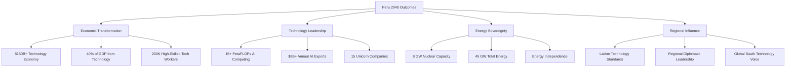

---

## 2. Strategic Context and Rationale

### 2.1 The 21st Century Reality

The global economy is undergoing a fundamental transformation driven by artificial intelligence, renewable energy, and advanced manufacturing. Nations that control these technologies will dominate global value chains, while those that remain dependent on raw material exports will face perpetual economic subordination.

### 2.2 The Commodity Trap

Peru currently finds itself at a critical juncture. Despite being among the world's top producers of copper, silver, gold, and lithium—all essential materials for the technology revolution—Peru captures minimal value from these resources.

#### 2.2.1 Current Economic Vulnerabilities

| Vulnerability | Impact | Evidence |
|---------------|--------|----------|
| **Export Dependency** | Price volatility exposure | 63.9% of exports are minerals |
| **Limited Value Addition** | Low profit margins | Most exports are raw/semi-processed |
| **Technological Dependence** | Strategic vulnerability | Critical infrastructure relies on foreign suppliers |
| **Human Capital Flight** | Reduced innovation capacity | High-skilled workforce emigrates |

### 2.3 The Strategic Imperative

Technological sovereignty has become a national security imperative. Countries without indigenous capabilities in AI, nuclear energy, and advanced manufacturing face:

#### 2.3.1 Economic Subordination
- Permanent position as raw material suppliers
- Vulnerability to commodity price volatility
- Limited policy options for economic development
- Inability to capture value from domestic resources

#### 2.3.2 Security Vulnerabilities
- Dependence on foreign technology for critical infrastructure
- Communications and data systems subject to foreign control
- Energy systems vulnerable to supply disruptions
- Defense capabilities dependent on foreign suppliers

#### 2.3.3 Political Constraints
- Limited policy autonomy due to economic dependencies
- Vulnerability to economic coercion by advanced nations
- Inability to pursue independent foreign policy
- Domestic instability due to economic underdevelopment

### 2.4 Historical Precedent for Rapid Transformation

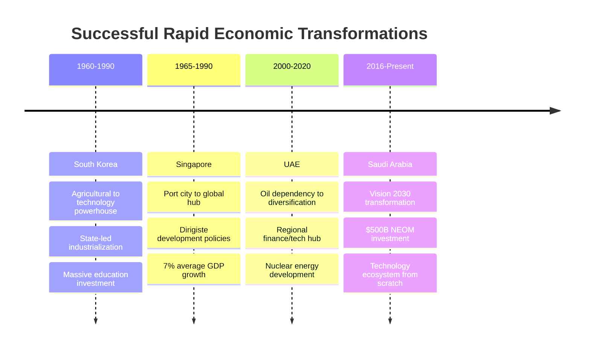

---

## 3. International Models and Lessons

### 3.1 The Saudi Arabia Model: Vision 2030 and NEOM

Saudi Arabia's Vision 2030 represents the most ambitious economic transformation program currently underway. The kingdom is investing over $500 billion in the NEOM megacity project alone, demonstrating that resource-rich nations can fund technological leapfrogging at unprecedented scale.

#### 3.1.1 Key Success Factors

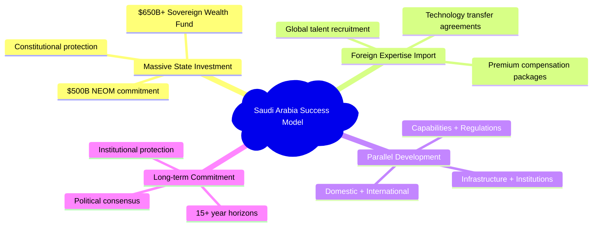

#### 3.1.2 Relevant Lessons for Peru

Saudi Arabia proves that even countries heavily dependent on single commodities can rapidly build diversified, technology-intensive economies through strategic state investment. The NEOM project specifically demonstrates that entirely new cities and economic zones can be created from scratch when sufficient capital and political will exist.

### 3.2 The Singapore Model: State-Led Technological Development

Singapore's transformation from developing to developed nation status within 25 years provides the clearest template for state-led technological development. The city-state achieved average GDP growth of 7% from independence through 2000, primarily through strategic government intervention in technology development.

#### 3.2.1 Strategic Approaches

| Approach | Implementation | Results |
|----------|----------------|---------|
| **Whole-of-Government Coordination** | Multiple agencies working toward tech objectives | Unified policy implementation |
| **Co-Investment Strategy** | Government funds + private VC | Thriving startup ecosystem |
| **Technology Adoption Leadership** | Government as first adopter | Market confidence and standards |
| **Human Capital Investment** | Education spending + foreign talent | Skilled workforce development |
| **Regulatory Innovation** | Sandbox approaches | Emerging technology facilitation |

#### 3.2.2 AI Development Strategy

Singapore allocated $18.8 billion for R&D through 2025, focusing specifically on AI capabilities:

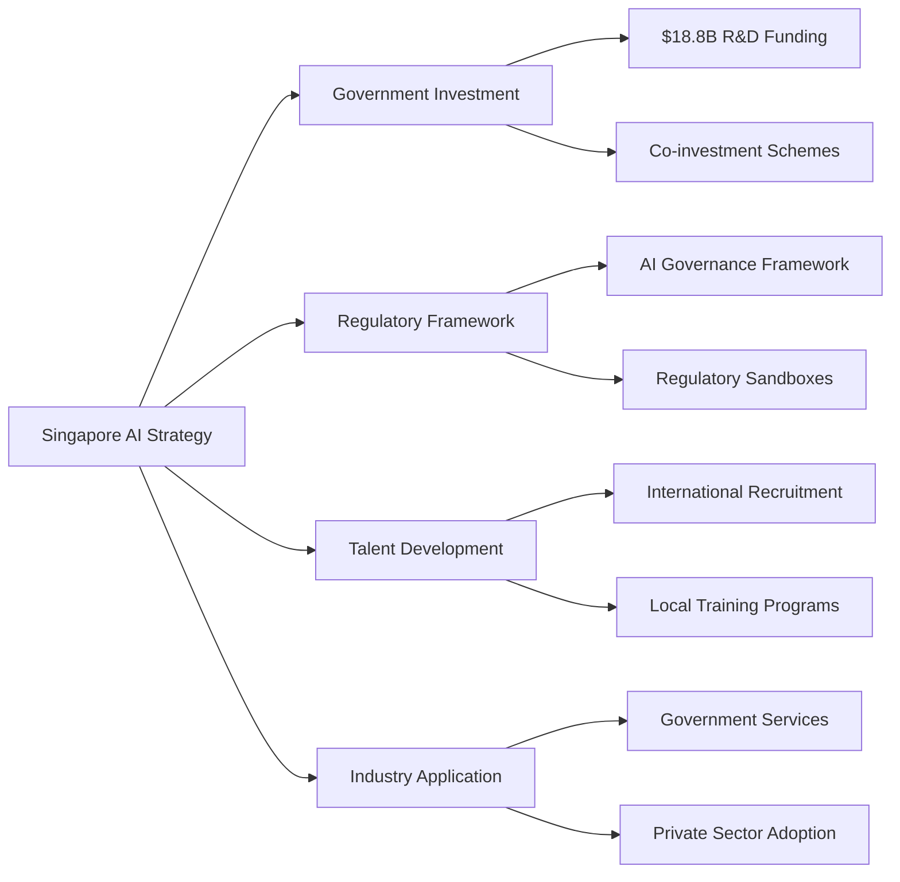

### 3.3 The Thailand 4.0 Model: Innovation-Driven Economy

Thailand's Thailand 4.0 initiative aims to transform the country from a middle-income manufacturing hub to an innovation-driven economy by 2027.

#### 3.3.1 Implementation Framework

- **Sector Focus**: 10 strategic industries including automotive technology, smart electronics, biotechnology
- **Government Investment**: $216 million across 68 government agencies for AI initiatives
- **University-Industry Integration**: Mandatory collaboration between institutions and private sector
- **Regional Development**: Eastern Economic Corridor as primary innovation hub
- **Talent Development**: STEM education and technical training emphasis

#### 3.3.2 Targets and Timeline

| Metric | 2027 Target | Investment | Status |
|--------|-------------|------------|--------|
| Innovation Enterprises | 1,000 | $2B+ | In Progress |
| Unicorn Companies | 5 | $500M+ | 2 Achieved |
| R&D Spending | 2% of GDP | Government + Private | 1.2% Current |
| Tech Employment | 500K | Education Reform | 300K Current |

### 3.4 The UAE Nuclear Model: Rapid Capability Development

The UAE's nuclear program represents the fastest successful development of nuclear capability in modern history. From initial decision in 2008 to operational reactors by 2020, the UAE achieved energy sovereignty in just 12 years.

#### 3.4.1 Success Framework

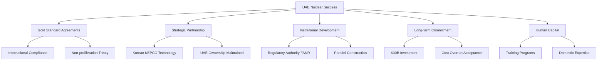

#### 3.4.2 Timeline and Achievements

- **2008**: Initial decision and policy framework
- **2009**: "Gold Standard" US-UAE 123 Agreement
- **2010**: Korean KEPCO partnership selection
- **2012**: Construction commencement
- **2020**: First reactor operational
- **2024**: All 4 reactors operational (5.6 GW capacity)

---

## 4. Peru's Strategic Advantages

### 4.1 Natural Resource Endowment

Peru possesses one of the world's most significant mineral resource bases, providing a robust foundation for funding technological transformation.

#### 4.1.1 Proven Reserves and Production

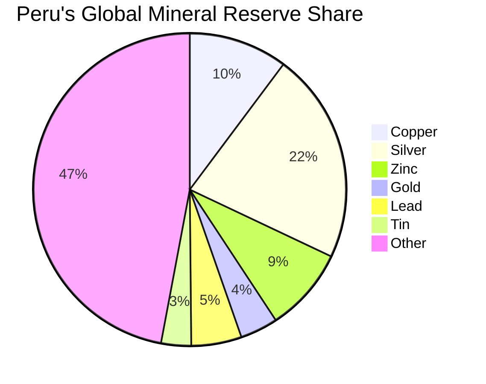

| Mineral | World Reserve Share | Global Production Rank | Annual Production |
|---------|-------------------|---------------------|------------------|
| **Copper** | 10.2% | 2nd | 2.76 million tons |
| **Silver** | 21.8% | 1st | Largest globally |
| **Gold** | 3.9% | 8th | Significant producer |
| **Zinc** | 8.7% | 2nd | Major global supplier |
| **Lithium** | 6+ million tons | Emerging | Critical for batteries |

#### 4.1.2 Investment Pipeline

**Confirmed Projects**: $54.6 billion in approved mining investments provides immediate funding source for technological transformation.

### 4.2 Geographic Strategic Position

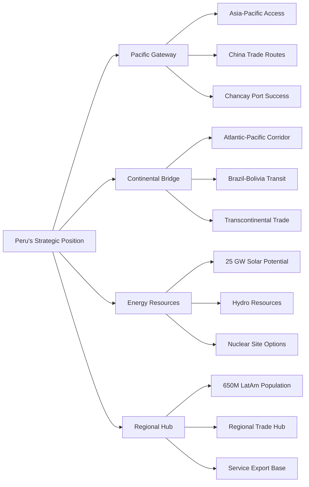

### 4.3 Proven Execution Capability

#### 4.3.1 Chancay Port Success Metrics

The successful development of Chancay port demonstrates Peru's ability to execute large-scale infrastructure projects:

| Metric | Achievement | Strategic Importance |
|--------|-------------|---------------------|
| **Investment** | $3.6 billion completed | Large-scale project management |
| **Partnership** | Chinese-Peruvian cooperation | International collaboration |
| **Timeline** | Completed on schedule | Execution reliability |
| **Revenue** | $4.5 billion annual projected | Economic impact generation |
| **Employment** | 8,000+ direct jobs | Workforce development |
| **Technology** | COSCO shipping leadership | Advanced logistics integration |

### 4.4 Existing Strategic Partnerships

Peru maintains diplomatic and economic relationships with all major technological powers:

```mermaid
graph TD
    A[Peru Strategic Partnerships] --> B[China]
    A --> C[United States]
    A --> D[Korea]
    A --> E[European Union]
    A --> F[Japan]
    
    B --> B1[$36B Annual Trade]
    B --> B2[Chancay Port Success]
    B --> B3[AI Infrastructure Potential]
    
    C --> C1[Security Cooperation]
    C --> C2[Technology Transfer]
    C --> C3[Development Finance]
    
    D --> D1[Nuclear Technology]
    D --> D2[KEPCO Partnership Model]
    D --> D3[Training Programs]
    
    E --> E1[Trade Agreements]
    E --> E2[Development Cooperation]
    E --> E3[Environmental Standards]
    
    F --> F1[Technology Investment]
    F --> F2[Manufacturing Partnership]
    F --> F3[Innovation Cooperation]
```

### 4.5 Human Capital Foundation

#### 4.5.1 Demographic and Educational Advantages

| Advantage | Current Status | Potential |
|-----------|---------------|-----------|
| **Educational Infrastructure** | Established universities | Rapid tech specialization |
| **Diaspora Network** | Large skilled population abroad | Repatriation opportunity |
| **Youth Demographics** | Median age 31 | Technology sector workforce |
| **Multilingual Capacity** | Spanish-English capability | International partnerships |
| **Cultural Diversity** | Indigenous + multicultural | Innovation and creativity |

---

## 5. Technological Sovereignty Framework

### 5.1 Defining Technological Sovereignty

Technological sovereignty encompasses the ability to independently develop, produce, and control critical technologies necessary for national security and economic development.

#### 5.1.1 Core Capabilities Framework

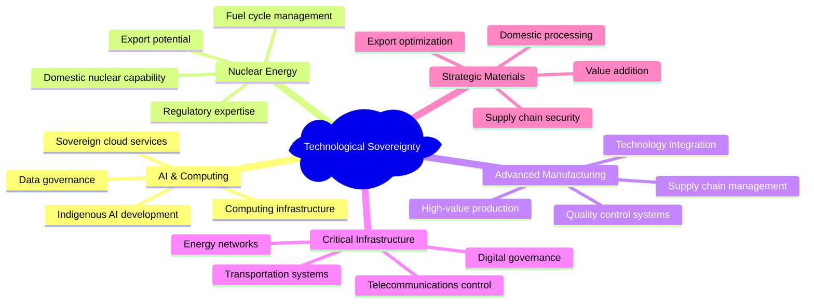

### 5.2 The Strategic Imperative Framework

Countries without indigenous technological capabilities face multi-dimensional vulnerabilities:

#### 5.2.1 Vulnerability Assessment Matrix

| Vulnerability Type | Economic Impact | Security Impact | Political Impact |
|-------------------|----------------|-----------------|------------------|
| **Technology Dependence** | Value chain subordination | Infrastructure vulnerability | Policy constraints |
| **Energy Dependence** | Import costs | Supply disruptions | Diplomatic limitations |
| **Manufacturing Dependence** | Limited employment | Defense vulnerabilities | Economic coercion risk |
| **Knowledge Dependence** | Innovation deficits | Technology gaps | Strategic disadvantage |

### 5.3 The Resource-to-Technology Conversion Engine

Peru's pathway to technological sovereignty involves systematically converting natural resource wealth into technological capabilities:

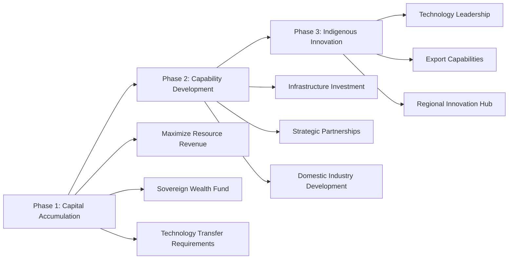

---

## 6. Detailed Sector Strategies

### 6.1 Energy Sovereignty: Nuclear + Renewable Integration

Energy independence represents the foundation of technological sovereignty. Peru's strategy combines rapid renewable energy expansion with strategic nuclear capability development.

#### 6.1.1 Nuclear Power Development Strategy

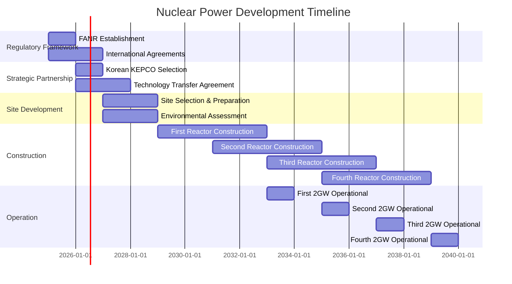

**Investment Requirements**: $25 billion over 15 years
- Reactor construction and technology transfer: $15 billion
- Regulatory infrastructure and human capital: $5 billion
- Fuel cycle and waste management: $3 billion
- Grid integration and supporting infrastructure: $2 billion

#### 6.1.2 Renewable Energy Acceleration

**Solar Energy Development**: 25 GW potential capacity
- Manufacturing localization through Chinese partnerships
- Industrial zone integration for energy-intensive industries
- Export development to neighboring countries

**Wind Energy Development**: 5+ GW coastal wind resources
- European technology partnerships (Danish Vestas, German Siemens)
- Grid integration with smart management systems

**Hydroelectric Optimization**: Expansion to 20 GW
- Modernization of existing facilities
- Small-scale Andean development
- Pumped storage for grid stability

#### 6.1.3 2040 Energy Mix Target

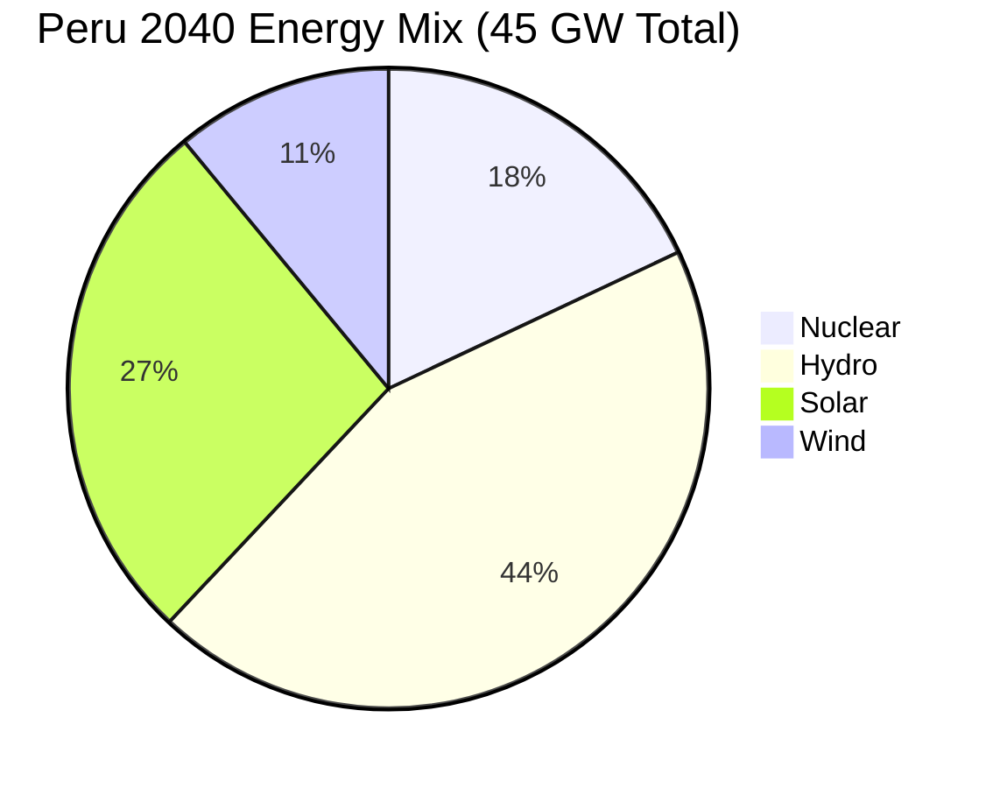

### 6.2 AI and Computing Supremacy

Artificial intelligence represents the most critical technology for 21st-century economic competitiveness. Peru's AI strategy focuses on achieving regional leadership through massive infrastructure investment and strategic talent acquisition.

#### 6.2.1 Computing Infrastructure Development Timeline

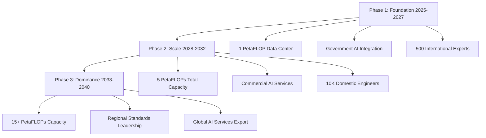

#### 6.2.2 Sovereign AI Development

**Multilingual AI Capabilities**:
- Spanish-language models for Latin American markets
- Quechua-language models (first indigenous language AI)
- Multilingual models for international applications

**Sector-Specific Applications**:

| Sector | AI Application | Market Potential |
|--------|----------------|------------------|
| **Mining** | Autonomous equipment, predictive maintenance | $2B+ regional market |
| **Agriculture** | Precision farming, crop optimization | $1B+ export markets |
| **Finance** | Payment systems, risk assessment | $3B+ LatAm market |
| **Government** | Service automation, citizen engagement | $500M+ consulting |

#### 6.2.3 AI Export Strategy Revenue Projections

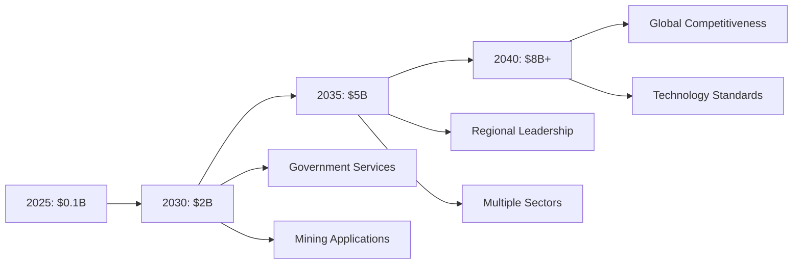

### 6.3 Innovation Ecosystem Development

Creating a thriving startup ecosystem requires coordinated investment in entrepreneurship infrastructure, venture capital, and regulatory frameworks.

#### 6.3.1 Startup Development Strategy

**Quantitative Targets by 2040**:
- 5,000 active startups
- 15 unicorn companies (valuation >$1 billion)
- $50 billion total ecosystem valuation
- 200,000 technology sector employees

#### 6.3.2 Sector Focus Areas

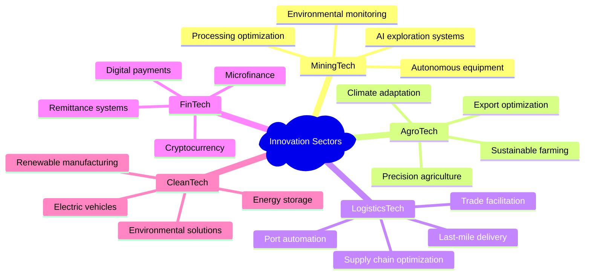

#### 6.3.3 Venture Capital Ecosystem

**National Growth Fund**: $5 billion government fund structure

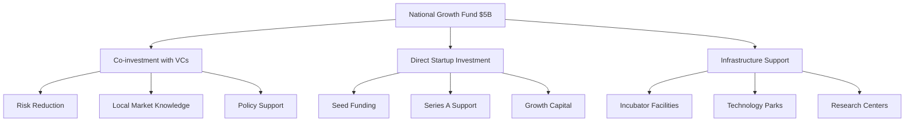

### 6.4 Advanced Manufacturing and Industrial Development

Transitioning from raw material exports to high-value manufacturing requires strategic investment in industrial capabilities and technology transfer.

#### 6.4.1 Value-Added Mining and Metallurgy

**Strategic Objective**: Process 80% of mineral production domestically by 2040

| Mineral | Current Processing | 2040 Target | Investment Required |
|---------|-------------------|-------------|-------------------|
| **Copper** | 40% domestic | 90% domestic | $3B smelting/refining |
| **Lithium** | 10% domestic | 80% domestic | $2B battery production |
| **Rare Earths** | 5% domestic | 70% domestic | $2B extraction/refining |
| **Silver** | 60% domestic | 95% domestic | $1B advanced processing |

#### 6.4.2 High-Technology Manufacturing

**Electronics Manufacturing**:
- Smartphone and tablet assembly for Latin American markets
- Computer and server assembly for regional data centers
- Renewable energy equipment manufacturing

**Automotive and Transportation**:
- Electric vehicle assembly and manufacturing
- Battery production for vehicles and energy storage
- Autonomous vehicle technology development

**Aerospace and Defense**:
- Satellite manufacturing and space technology
- Unmanned aerial vehicle (drone) manufacturing
- Defense electronics and communications equipment

---

## 7. Modern Soft Power Strategy

Traditional soft power approaches focusing on folklore and historical tourism are insufficient for 21st-century global influence. Peru's modern soft power strategy must project technological sophistication, cultural dynamism, and strategic leadership.

### 7.1 Cultural and Creative Industries Transformation

#### 7.1.1 Redefining Peruvian Identity

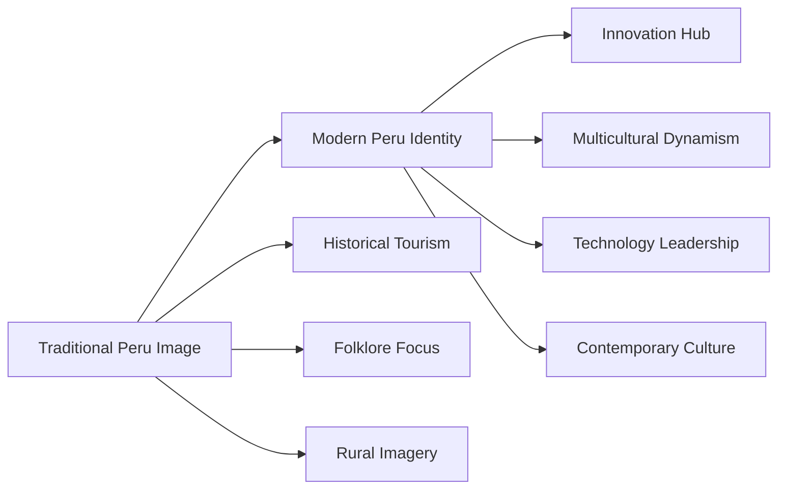

**Contemporary Cultural Expression**:
- Support modern Peruvian artists blending traditional and contemporary elements
- Promote Peru as multicultural innovation hub (Indigenous + Asian + African + European)
- Export creative content reflecting modern urban Peru rather than tourist-focused imagery

**Digital Cultural Preservation**:
- Blockchain technology for immutable indigenous language records
- Virtual reality experiences showcasing cultural diversity and technological capabilities
- Digital archives and interactive platforms for global cultural exchange

#### 7.1.2 Fashion and Design Leadership

**Strategic Objectives**:
- Establish Peru as Latin American fashion capital
- Support designers incorporating traditional textiles with modern aesthetics
- Develop luxury goods sector using traditional materials (alpaca, vicuña)
- Export Peruvian design aesthetics through technology and luxury goods

### 7.2 Media and Entertainment Industry

#### 7.2.1 Film and Television Production

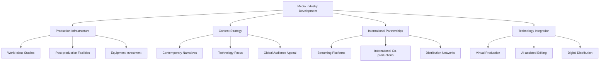

**Content Strategy Focus**:
- Contemporary stories showcasing Peru's diversity and technological advancement
- Science fiction, thriller, and drama genres projecting technological sophistication
- International co-productions for global reach
- Avoid historical or poverty-focused narratives

#### 7.2.2 Music and Audio Content

- Support contemporary Peruvian musicians blending traditional and modern elements
- Develop podcast and audio content industries for Latin American markets
- Create music technology and audio production capabilities
- Export Peruvian musical styles globally through digital platforms

### 7.3 Technology Diplomacy and Standards Leadership

#### 7.3.1 AI Governance Leadership

Position Peru as Latin America's leader in artificial intelligence governance:

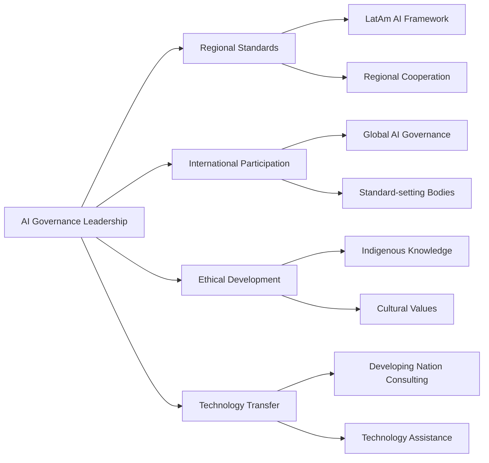

#### 7.3.2 Digital Government Excellence

Transform Peru's government services into a global model:

| Service Area | Technology Application | Global Export Potential |
|--------------|----------------------|------------------------|
| **E-Government** | 100% digital services | $200M+ consulting market |
| **Transparency** | Blockchain + AI | Anti-corruption technology |
| **Citizen Engagement** | AI chatbots in multiple languages | Multilingual government tech |
| **Service Delivery** | AI-powered automation | Efficiency technology export |

### 7.4 Educational and Scientific Soft Power

#### 7.4.1 University and Research Excellence

**Peru Technology University**: World-class institution attracting regional students
- International faculty recruitment
- Research publication leadership
- Student exchange programs
- Technology commercialization

#### 7.4.2 Scientific Leadership Areas

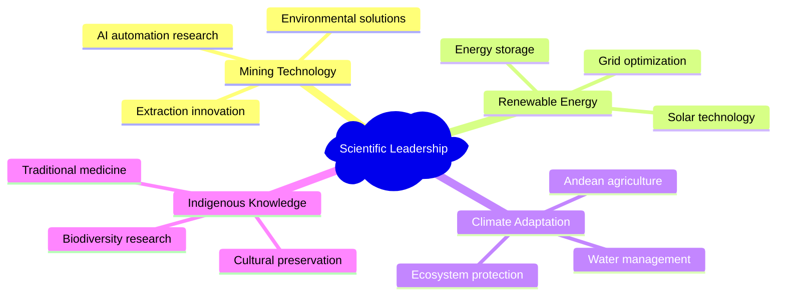

### 7.5 Diplomatic and Economic Soft Power

#### 7.5.1 Regional Technology Leadership

Use technological capabilities to enhance diplomatic influence:

- **Technology Assistance**: Provide AI, renewable energy, and digital government help
- **Regional Integration**: Lead LatAm technology cooperation initiatives
- **Global South Leadership**: Advocate developing nation interests in tech governance
- **Strategic Autonomy**: Demonstrate technological independence possibilities

#### 7.5.2 Economic Model Export

Export Peru's resource-to-technology transformation model:

| Service | Target Market | Revenue Potential |
|---------|---------------|------------------|
| **Development Consulting** | Resource-rich countries | $100M+ annually |
| **Technology Transfer** | Mining/energy sectors | $200M+ licensing |
| **Partnership Facilitation** | Developing nations | $50M+ advisory |
| **Financial Services** | Regional development | $300M+ fund management |

### 7.6 Tourism and Hospitality Evolution

#### 7.6.1 Technology-Enhanced Tourism

**Innovation Tourism Development**:
- Augmented reality at archaeological sites
- Technology conference destinations
- Business innovation tours
- Sustainable tourism technology

### 7.7 Global Peruvian Network Activation

#### 7.7.1 Diaspora Engagement Strategy

```mermaid
graph TD
    A[Diaspora Engagement] --> B[Professional Networks]
    A --> C[Investment Facilitation]
    A --> D[Cultural Ambassadors]
    A --> E[Return Migration]
    
    B --> B1[Tech Professionals]
    B --> B2[Finance Experts]
    B --> B3[Academic Leaders]
    
    C --> C1[Venture Capital]
    C --> C2[Technology Investment]
    C --> C3[Infrastructure Funding]
    
    D --> D1[Cultural Promotion]
    D --> D2[Economic Advocacy]
    D --> D3[Tourism Attraction]
    
    E --> E1[Competitive Packages]
    E --> E2[Fast-track Visas]
    E --> E3[Career Development]
```

---

## 8. Implementation Roadmap

### 8.1 Three-Phase Implementation Strategy

```mermaid
timeline
    title Peru 2040 Implementation Timeline
    
    2025-2027 : Phase 1 Foundation
              : Constitutional amendments
              : $5B Sovereign Wealth Fund
              : Nuclear regulatory framework
              : 500 international experts
              : First AI data center
    
    2028-2032 : Phase 2 Acceleration
              : Nuclear construction
              : 5 PetaFLOPs AI capacity
              : 1000 startups funded
              : $25B Sovereign Wealth Fund
              : First unicorn companies
    
    2033-2040 : Phase 3 Dominance
              : 8 GW nuclear operational
              : 15+ PetaFLOPs AI capacity
              : Regional technology leadership
              : $75B Sovereign Wealth Fund
              : 15 unicorn companies
```

### 8.2 Phase 1: Foundation and Institutional Development (2025-2027)

The initial phase focuses on establishing institutional frameworks, securing funding, and beginning infrastructure development.

#### 8.2.1 Year 1 (2025): Constitutional and Legal Framework

```mermaid
gantt
    title Year 1 (2025) Critical Actions
    dateFormat  YYYY-MM
    section Constitutional Reform
    Amendment Drafting    :a1, 2025-01, 3M
    Congressional Approval :a2, 2025-04, 6M
    Regional Ratification :a3, 2025-10, 3M
    section Institutional Setup
    Ministry Creation    :b1, 2025-01, 6M
    SWF Establishment   :b2, 2025-03, 3M
    Nuclear Commission  :b3, 2025-06, 6M
    section Investment
    SWF Capitalization :c1, 2025-01, 12M
    Emergency Tech Fund :c2, 2025-02, 2M
    Partnership Negotiations :c3, 2025-01, 12M
```

**Constitutional Amendment Process**:
- Technology development as constitutional right and state obligation
- Sovereign wealth fund constitutional protection
- Long-term development planning requirements
- Regional development equity mandates

**Legislative Framework**:
- National Technology Development Act
- Sovereign Wealth Fund Act
- Foreign Investment in Strategic Technologies Act
- Nuclear Energy Development Act

**Institutional Establishment**:
- Ministry of Technology and Innovation (cabinet-level)
- National AI Authority
- Nuclear Energy Commission
- Sovereign Wealth Fund Authority

**Initial Investment Mobilization**:
- $5 billion sovereign wealth fund capitalization
- $2 billion emergency technology infrastructure appropriation
- International partnership negotiations (Korea, China, Singapore, UAE)

#### 8.2.2 Year 2 (2026): Infrastructure Foundation

**Physical Infrastructure Development**:
- Lima Technology Zone construction commencement
- First AI data center (1 PetaFLOP facility)
- Nuclear site preparation
- 2 GW renewable energy construction

**Human Capital Foundation**:
- 500 international experts recruitment
- Peru Technology University establishment
- 5 universities conversion to technology focus
- National coding education program launch

**Regulatory Framework Implementation**:
- AI governance framework (Singapore/EU model)
- Nuclear regulatory authority (UAE/Korean assistance)
- Startup-friendly registration and tax systems
- Government procurement domestic preference rules

#### 8.2.3 Year 3 (2027): Acceleration and Partnership Solidification

**International Partnership Formalization**:

```mermaid
graph LR
    A[2027 Partnerships] --> B[Korea Nuclear]
    A --> C[Singapore Finance]
    A --> D[China AI]
    A --> E[UAE Energy]
    
    B --> B1[8 GW Nuclear Agreement]
    B --> B2[Technology Transfer]
    B --> B3[Training Programs]
    
    C --> C1[FinTech Development]
    C --> C2[Regulatory Cooperation]
    C --> C3[Investment Management]
    
    D --> D1[Infrastructure Technology]
    D --> D2[Manufacturing Localization]
    D --> D3[Computing Hardware]
    
    E --> E1[Renewable Development]
    E --> E2[Nuclear Expertise]
    E --> E3[Energy Technology]
```

**Domestic Capability Development**:
- Second AI data center (additional 2 PetaFLOPs)
- First 100 startups funded
- Nuclear construction commencement
- 5 GW renewable energy operational

### 8.3 Phase 2: Acceleration and Scaling (2028-2032)

#### 8.3.1 Technology Infrastructure Scaling (2028-2030)

**AI and Computing Expansion**:
- Deploy additional 4 PetaFLOPs across regional centers
- Launch commercial AI services for Latin American markets
- Begin sovereign LLM development (Spanish/Quechua)
- Establish Peru as regional AI training hub

**Nuclear Power Development**:
- Complete first 2 GW reactor construction and testing
- Commence second nuclear facility construction
- Develop domestic nuclear engineering expertise
- Establish fuel cycle and waste management infrastructure

**Manufacturing Capability Development**:
- Electronics manufacturing facilities operational
- Solar panel manufacturing for domestic/export markets
- Battery manufacturing for EV and energy storage
- Rare earth processing facilities

#### 8.3.2 Economic Transformation (2030-2032)

**Startup Ecosystem Maturation**:

```mermaid
graph LR
    A[Startup Milestones 2030-2032] --> B[1000 Active Startups]
    A --> C[5 Unicorn Companies]
    A --> D[$10B Ecosystem Value]
    A --> E[International VC Presence]
    
    B --> B1[MiningTech Leaders]
    B --> B2[FinTech Innovators]
    B --> B3[LogisticsTech Solutions]
    
    C --> C1[Mining AI]
    C --> C2[Payment Systems]
    C --> C3[Supply Chain Optimization]
    
    D --> D1[Venture Capital Funds]
    D --> D2[Strategic Investments]
    D --> D3[IPO Preparations]
```

**Export Revenue Diversification**:
- AI services exports: $2 billion annually
- High-value manufactured goods: $5 billion annually
- Technology consulting and services: Regional leadership
- Reduced raw material export dependency

### 8.4 Phase 3: Regional Leadership and Global Competitiveness (2033-2040)

#### 8.4.1 Technological Leadership Consolidation (2033-2035)

**AI and Computing Dominance**:
- 10+ PetaFLOPs making Peru Latin America's AI hub
- Sovereign AI models competitive globally
- Regional AI standards leadership
- $5 billion annual AI services exports

**Nuclear Energy Maturity**:
- 4 GW nuclear capacity operational (12% of electricity)
- Second generation nuclear facility construction
- Nuclear technology export to regional markets
- Small modular reactor (SMR) development

#### 8.4.2 Global Integration and Leadership (2035-2040)

**International Technology Leadership**:

```mermaid
mindmap
  root)Peru 2040 Global Position(
    Technology Leadership
      LatAm AI Standards
      Global South Advocacy
      Innovation Hub Status
    
    Economic Transformation
      40% GDP from Technology
      $8B+ Annual Tech Exports
      Upper-income Status
    
    Energy Sovereignty
      8 GW Nuclear Capacity
      Regional Energy Exporter
      Technology Provider
    
    Diplomatic Influence
      Technology Diplomacy
      Regional Coalition Builder
      Development Model Export
```

---

## 9. Financial Framework

### 9.1 Total Investment Requirements

**Total Investment**: $93 billion over 15 years (15% of current annual GDP)

### 9.2 Investment Allocation by Sector

```mermaid
pie title Investment Allocation ($93B Total)
    "Energy Infrastructure $35B" : 38
    "AI & Computing $20B" : 22
    "Logistics $15B" : 16
    "Manufacturing $10B" : 11
    "Innovation Ecosystem $8B" : 9
    "Human Capital $3B" : 3
    "Soft Power $2B" : 2
```

#### 9.2.1 Detailed Sector Breakdown

| Sector | Investment | Percentage | Key Components |
|--------|------------|------------|----------------|
| **Energy Infrastructure** | $35B | 38% | Nuclear ($25B), Renewables ($8B), Grid ($2B) |
| **AI & Computing** | $20B | 22% | Data centers ($15B), Software ($3B), R&D ($2B) |
| **Logistics & Transport** | $15B | 16% | Ports ($8B), Dry canal ($6B), Digital systems ($1B) |
| **Advanced Manufacturing** | $10B | 11% | Electronics ($5B), Minerals ($3B), Automotive ($2B) |
| **Innovation Ecosystem** | $8B | 9% | Startup funding ($5B), Universities ($2B), Incubators ($1B) |
| **Human Capital** | $3B | 3% | Talent recruitment ($1.5B), Training ($1B), Diaspora ($0.5B) |
| **Soft Power & Culture** | $2B | 2% | Media ($1B), Culture ($0.5B), Diplomacy ($0.5B) |

### 9.3 Funding Sources and Financial Strategy

#### 9.3.1 Primary Funding Sources

```mermaid
graph LR
    A[Total Funding $93B] --> B[Mining Royalties $45B]
    A --> C[Sovereign Wealth Fund $25B]
    A --> D[International Partnerships $15B]
    A --> E[Development Finance $5B]
    A --> F[Bond Issuance $3B]
    
    B --> B1[48% of Total]
    B --> B2[Resource Revenue]
    B --> B3[Royalty Optimization]
    
    C --> C1[27% of Total]
    C --> C2[Investment Returns]
    C --> C3[Compound Growth]
    
    D --> D1[16% of Total]
    D --> D2[Technology Transfer]
    D --> D3[Joint Ventures]
```

#### 9.3.2 Mining Royalties and Resource Revenues: $45 billion (48%)

**Revenue Optimization Strategy**:
- Increase royalty rates from 1-3% to 5-8% of gross revenue
- Implement windfall profit taxes during high commodity prices
- Mandate domestic processing for strategic minerals
- Negotiate revenue-sharing for infrastructure development

#### 9.3.3 Sovereign Wealth Fund Investment Returns: $25 billion (27%)

**Fund Growth Trajectory**:

```mermaid
graph LR
    A[2025: $5B] --> B[2030: $25B] --> C[2035: $50B] --> D[2040: $75B]
    
    A --> A1[Initial Capitalization]
    B --> B1[12% Annual Returns]
    C --> C1[Compound Growth]
    D --> D1[$9B Annual Capacity]
```

**Investment Strategy**:
- International equity investments: 40%
- Domestic strategic investments: 30%
- Fixed income and alternatives: 20%
- Strategic technology investments: 10%

#### 9.3.4 Strategic International Partnerships: $15 billion (16%)

| Partner | Investment | Focus Area | Technology Transfer |
|---------|------------|------------|-------------------|
| **Korea** | $8B | Nuclear development | Reactor technology, training |
| **China** | $4B | AI infrastructure | Manufacturing, computing |
| **UAE** | $2B | Energy cooperation | Renewable, nuclear expertise |
| **Singapore** | $1B | Financial services | FinTech, fund management |

### 9.4 Economic Impact Projections

#### 9.4.1 GDP Transformation Timeline

```mermaid
graph LR
    A[2025: 5% Tech GDP] --> B[2030: 15% Tech GDP] --> C[2035: 25% Tech GDP] --> D[2040: 40% Tech GDP]
    
    A --> A1[$12B Technology]
    B --> B1[$50B Technology]
    C --> C1[$100B Technology]
    D --> D1[$150B+ Technology]
```

#### 9.4.2 Employment Creation Impact

| Category | Direct Jobs | Indirect Jobs | Service Jobs | Total Impact |
|----------|-------------|---------------|--------------|--------------|
| **Technology Sector** | 200,000 | 500,000 | 300,000 | 1,000,000+ |
| **Average Salary** | $25,000 | $15,000 | $12,000 | $17,000 |
| **Total Payroll** | $5B | $7.5B | $3.6B | $16.1B |

#### 9.4.3 Export Diversification

```mermaid
graph TD
    A[Export Transformation] --> B[2025 Current]
    A --> C[2040 Target]
    
    B --> B1[64% Minerals]
    B --> B2[20% Agriculture]
    B --> B3[10% Manufacturing]
    B --> B4[6% Services]
    
    C --> C1[35% Minerals]
    C --> C2[20% Technology]
    C --> C3[25% Manufacturing]
    C --> C4[20% Services]
```

### 9.5 Return on Investment Analysis

#### 9.5.1 Economic Multiplier Effects

Each dollar invested generates 3-4 dollars in economic output through:
- Direct infrastructure and capability investment
- Private sector induced investment
- High-skilled employment consumption effects
- Export revenue and import substitution

#### 9.5.2 Sector-Specific Returns

| Sector | Annual ROI | Payback Period | Strategic Value |
|--------|-----------|----------------|-----------------|
| **Technology Development** | 15-20% | 5-7 years | Technology sovereignty |
| **Energy Infrastructure** | 12-15% | 7-10 years | Energy independence |
| **Manufacturing** | 10-15% | 8-12 years | Value chain integration |
| **Education/Training** | 12-18% | 10-15 years | Long-term capability |

---

## 10. Risk Assessment and Mitigation

### 10.1 Risk Assessment Framework

```mermaid
graph TD
    A[Peru 2040 Risk Categories] --> B[Political Risks]
    A --> C[Economic Risks]
    A --> D[Technology Risks]
    A --> E[Social Risks]
    A --> F[Geopolitical Risks]
    
    B --> B1[Political Continuity]
    B --> B2[Institutional Capacity]
    B --> B3[Corruption Vulnerabilities]
    
    C --> C1[Commodity Volatility]
    C --> C2[Currency Risk]
    C --> C3[Financing Availability]
    
    D --> D1[Technology Transfer]
    D --> D2[Cybersecurity]
    D --> D3[Innovation Capacity]
    
    E --> E1[Social Acceptance]
    E --> E2[Environmental Impact]
    E --> E3[Inequality Concerns]
    
    F --> F1[Great Power Competition]
    F --> F2[Regional Competition]
    F --> F3[Trade Disruptions]
```

### 10.2 Political and Governance Risks

#### 10.2.1 Political Continuity Risk

**Risk Level**: HIGH
**Impact**: Program cancellation, partnership disruption, investment flight

**Mitigation Strategies**:

```mermaid
graph LR
    A[Political Continuity Mitigation] --> B[Constitutional Protection]
    A --> C[Cross-Party Consensus]
    A --> D[Regional Benefits]
    A --> E[Institutional Autonomy]
    
    B --> B1[Constitutional Amendments]
    B --> B2[Supermajority Required]
    B --> B3[Legal Protection]
    
    C --> C1[National Technology Council]
    C --> C2[All-Party Representation]
    C --> C3[Consensus Building]
    
    D --> D1[Every Region Benefits]
    D --> D2[Local Constituencies]
    D --> D3[Employment Creation]
    
    E --> E1[Independent Institutions]
    E --> E2[Professional Management]
    E --> E3[Legal Insulation]
```

#### 10.2.2 Corruption and Governance Risk

**Risk Level**: MEDIUM-HIGH
**Impact**: Resource misallocation, cost inflation, partnership damage

**Mitigation Strategies**:
- Blockchain transparency for all transactions
- International oversight mechanisms
- Performance-based contract structures
- Independent audit institutions
- Civil society monitoring roles

### 10.3 Economic and Financial Risks

#### 10.3.1 Commodity Price Volatility Risk

**Risk Level**: MEDIUM
**Impact**: Reduced funding, program scaling requirements

```mermaid
graph LR
    A[Commodity Risk Mitigation] --> B[Price Hedging]
    A --> C[SWF Buffer]
    A --> D[Revenue Diversification]
    A --> E[Flexible Scheduling]
    
    B --> B1[Financial Instruments]
    B --> B2[Forward Contracts]
    
    C --> C1[Countercyclical Investment]
    C --> C2[Reserve Building]
    
    D --> D1[Technology Exports]
    D --> D2[Service Revenue]
    
    E --> E1[Accelerate in High Prices]
    E --> E2[Slow in Low Prices]
```

#### 10.3.2 Exchange Rate and Currency Risk

**Risk Level**: MEDIUM
**Impact**: 20-30% cost increases, reduced competitiveness

**Mitigation Strategies**:
- Foreign currency reserves through SWF
- Natural hedging through technology exports
- Domestic content requirements
- Multi-currency financing structures

### 10.4 Technology and Partnership Risks

#### 10.4.1 Technology Transfer Risk

**Risk Level**: HIGH
**Impact**: Continued foreign dependence, capability gaps

```mermaid
mindmap
  root)Technology Transfer Mitigation(
    Multiple Partnerships
      US Technology
      Chinese Infrastructure
      Korean Nuclear
      European Innovation
    
    Incremental Acquisition
      Milestone-based Transfer
      Legal Protections
      Performance Requirements
    
    Indigenous Innovation
      Domestic R&D Investment
      University Research
      Startup Development
    
    Strategic Control
      Majority Ownership
      Critical Asset Control
      IP Protection
```

#### 10.4.2 Cybersecurity Risk

**Risk Level**: HIGH
**Impact**: Infrastructure compromise, data theft, service disruption

**Mitigation Strategies**:
- Heavy cybersecurity infrastructure investment
- International cooperation agreements
- Redundant system design
- Domestic cybersecurity industry development
- Regular security audits and testing

### 10.5 Social and Environmental Risks

#### 10.5.1 Social Acceptance Risk

**Risk Level**: MEDIUM
**Impact**: Project delays, social conflicts, political opposition

```mermaid
graph TD
    A[Social Acceptance Strategy] --> B[Community Benefits]
    A --> C[Transparent Communication]
    A --> D[Indigenous Rights]
    A --> E[Environmental Standards]
    
    B --> B1[Local Employment]
    B --> B2[Infrastructure Investment]
    B --> B3[Revenue Sharing]
    
    C --> C1[Multiple Languages]
    C --> C2[Multiple Channels]
    C --> C3[Regular Updates]
    
    D --> D1[Consultation Protocols]
    D --> D2[Traditional Knowledge]
    D --> D3[Cultural Protection]
    
    E --> E1[International Standards]
    E --> E2[Environmental Excellence]
    E --> E3[Monitoring Systems]
```

### 10.6 Regional and International Risks

#### 10.6.1 Geopolitical Competition Risk

**Risk Level**: MEDIUM-HIGH
**Impact**: Partnership disruption, technology access limitations

**Mitigation Strategies**:
- Strategic autonomy maintenance
- Diversified partnership portfolio
- Regional leadership development
- Critical technology independence
- International law compliance

#### 10.6.2 Regional Competition Risk

**Risk Level**: MEDIUM
**Impact**: Reduced regional leadership, investment diversion

**Mitigation Strategies**:
- First-mover advantage acceleration
- Comparative advantage focus
- Regional cooperation leadership
- Innovation ecosystem quality
- Strategic asset control

---

## 11. Governance and Institutional Framework

### 11.1 Constitutional and Legal Framework

#### 11.1.1 Constitutional Amendment Requirements

```mermaid
graph TD
    A[Constitutional Amendments] --> B[Technology Rights]
    A --> C[Sovereign Wealth Fund]
    A --> D[Regional Equity]
    
    B --> B1[Individual Access Rights]
    B --> B2[State Investment Obligations]
    B --> B3[Resource Allocation Requirements]
    B --> B4[International Cooperation Framework]
    
    C --> C1[Political Independence]
    C --> C2[Professional Management]
    C --> C3[Withdrawal Restrictions]
    C --> C4[Transparency Requirements]
    
    D --> D1[Regional Investment Quotas]
    D --> D2[Infrastructure Access Rights]
    D --> D3[Employment Distribution]
    D --> D4[Cultural Protection]
```

#### 11.1.2 Legislative Framework Development

**Key Laws Required**:
- National Technology Development Act
- Sovereign Wealth Fund Act
- Strategic Industries Protection Act
- Nuclear Energy Development Act
- AI Governance and Ethics Act

### 11.2 Institutional Architecture

#### 11.2.1 Executive Branch Structure

```mermaid
graph TD
    A[President] --> B[Ministry of Technology & Innovation]
    A --> C[Ministry of Energy & Mines]
    A --> D[Ministry of Economy & Finance]
    
    B --> B1[Technology Policy Directorate]
    B --> B2[Innovation Promotion Directorate]
    B --> B3[International Cooperation Directorate]
    B --> B4[Human Capital Development Directorate]
    B --> B5[Strategic Industries Directorate]
    
    C --> C1[Nuclear Energy Commission]
    C --> C2[Renewable Energy Authority]
    C --> C3[Mining Technology Division]
    
    D --> D1[Sovereign Wealth Fund Authority]
    D --> D2[Strategic Investment Unit]
    D --> D3[Development Finance Corporation]
```

#### 11.2.2 Independent Authorities

**National Technology Development Council**:
- Government ministers
- Legislative representatives from all parties
- Private sector leaders
- University presidents
- Civil society representatives

**Sovereign Wealth Fund Authority**:
- International investment professionals
- Independent board of directors
- Professional fund managers
- Risk management experts
- Public accountability mechanisms

**Nuclear Regulatory Authority** (FANR Model):
- Nuclear safety regulation
- Environmental protection oversight
- Security and safeguards management
- Licensing and permitting
- Emergency response coordination

**AI Governance Authority**:
- AI development promotion
- Ethics and safety standards
- Regulatory framework development
- International cooperation
- Education and training coordination

### 11.3 Regional and Local Governance

#### 11.3.1 Technology Special Economic Zones

```mermaid
graph LR
    A[Technology Zones] --> B[Lima Tech Zone]
    A --> C[Regional Hubs]
    
    B --> B1[10,000 Hectares]
    B --> B2[Autonomous Administration]
    B --> B3[Special Tax Regime]
    B --> B4[Advanced Infrastructure]
    B --> B5[International Partnerships]
    
    C --> C1[Arequipa Innovation Hub]
    C --> C2[Trujillo Renewable Center]
    C --> C3[Cusco Cultural Tech]
    C --> C4[Iquitos Amazon Institute]
```

#### 11.3.2 Regional Coordination Mechanisms

- Regional technology development councils
- Coordination with national programs
- University and research partnerships
- Regional workforce development
- Local government integration

### 11.4 International Cooperation Framework

#### 11.4.1 Strategic Partnership Management

```mermaid
graph TD
    A[International Partnerships] --> B[Bilateral Agreements]
    A --> C[Multilateral Participation]
    A --> D[Technical Cooperation]
    
    B --> B1[Korea Nuclear Partnership]
    B --> B2[China AI Infrastructure]
    B --> B3[Singapore Financial Services]
    B --> B4[UAE Energy Cooperation]
    
    C --> C1[OECD Technology Committee]
    C --> C2[UN AI Governance]
    C --> C3[International Energy Agency]
    C --> C4[Regional Organizations]
    
    D --> D1[Technical Working Groups]
    D --> D2[Knowledge Exchange]
    D --> D3[Training Programs]
    D --> D4[Joint Research Projects]
```

---

## 12. Conclusion and Call to Action

### 12.1 The Historical Moment

Peru stands at a defining moment in its history. The convergence of abundant natural resources, proven execution capability, available international partnerships, and global technology transformation creates an unprecedented opportunity for national transformation.

### 12.2 The Binary Choice

```mermaid
graph LR
    A[Peru's Choice] --> B[Path 1: Incremental Development]
    A --> C[Path 2: Strategic Imperative]
    
    B --> B1[Commodity Dependence]
    B --> B2[Middle-Income Trap]
    B --> B3[Technology Dependence]
    B --> B4[Regional Follower]
    
    C --> C1[Technology Sovereignty]
    C --> C2[High-Income Status]
    C --> C3[Regional Leadership]
    C --> C4[Global Influence]
```

### 12.3 The Evidence for Success

International examples demonstrate the viability of Peru's transformation:

- **Saudi Arabia**: $500 billion NEOM investment proving resource-to-technology conversion
- **Singapore**: State-led development achieving 7% growth over 25 years
- **Thailand**: Innovation-driven economy transformation in single decade
- **UAE**: Nuclear capability achieved in 12 years through strategic partnerships

### 12.4 Peru's Unique Advantages

Peru possesses advantages these successful countries lacked:

```mermaid
mindmap
  root)Peru's Advantages(
    Resource Endowment
      $54.6B Mining Pipeline
      Strategic Minerals
      Energy Resources
    
    Geographic Position
      Pacific Gateway
      Regional Hub Location
      Continental Bridge
    
    Execution Capability
      Chancay Port Success
      Infrastructure Experience
      International Partnerships
    
    Strategic Relationships
      China Partnership
      US Cooperation
      Korean Technology
      European Development
```

### 12.5 The Implementation Imperative

#### 12.5.1 Immediate Action Requirements (2025)

**Political Leadership**:
- Presidential championship of technological sovereignty
- Constitutional amendment process initiation
- Cross-party consensus building
- Public education and support

**Institutional Framework**:
- Ministry of Technology and Innovation establishment
- Sovereign wealth fund creation ($5B initial)
- Nuclear regulatory authority setup
- AI governance framework development

**International Partnerships**:
- Korea nuclear technology negotiations
- China AI infrastructure agreements
- Singapore financial services cooperation
- UAE energy partnership development

#### 12.5.2 Long-term Commitment Requirements

```mermaid
timeline
    title Implementation Commitment Timeline
    
    2025 : Constitutional Protection
         : Political Consensus
         : Institutional Framework
    
    2030 : $25B Sovereign Wealth Fund
         : 5 PetaFLOPs AI Capacity
         : Nuclear Construction
    
    2035 : Regional Technology Leadership
         : $50B Sovereign Wealth Fund
         : Energy Independence
    
    2040 : Global Technology Influence
         : $75B Sovereign Wealth Fund
         : High-Income Status
```

### 12.6 The Vision Realized: Peru 2040

By 2040, successful implementation will transform Peru into:

#### 12.6.1 Economic Transformation

```mermaid
pie title Peru 2040 Economic Structure
    "Technology Sector" : 40
    "Advanced Manufacturing" : 25
    "Traditional Mining" : 20
    "Agriculture & Services" : 15
```

#### 12.6.2 Regional and Global Position

- **Latin America's Technology Leader**: Dominant AI services, mining technology, digital government
- **Energy Independent Nation**: 8 GW nuclear + 37 GW renewable capacity
- **High-Income Economy**: GDP per capita >$25,000 through technology development
- **Regional Diplomatic Leader**: Technology governance, Global South advocacy
- **Innovation Powerhouse**: 15 unicorns, 200K tech workers, world-class research

### 12.7 The Call to Action

#### 12.7.1 Government Leaders

- Commit to constitutional amendments and institutional frameworks
- Approve $93 billion investment program over 15 years
- Negotiate strategic international partnerships
- Ensure regional benefit distribution and social acceptance

#### 12.7.2 Business Leaders

- Engage in strategic partnerships and joint ventures
- Invest in technology sector development
- Support workforce development initiatives
- Champion innovation ecosystem growth

#### 12.7.3 Academic Leaders

- Transform educational institutions for technology focus
- Develop research collaboration programs
- Support international partnership development
- Create technology commercialization capabilities

#### 12.7.4 Civil Society Leaders

- Build public understanding of transformation necessity
- Ensure community benefits and environmental protection
- Monitor transparency and accountability
- Support inclusive development approaches

#### 12.7.5 International Partners

- Engage in mutually beneficial technology partnerships
- Respect Peru's sovereignty while enabling capability development
- Provide financing and technical assistance
- Support Peru's regional leadership role

### 12.8 Final Statement: The Choice is Now

```mermaid
graph TD
    A[The Choice Facing Peru] --> B[Act Now]
    A --> C[Accept Status Quo]
    
    B --> B1[Constitutional Protection]
    B --> B2[Massive Investment]
    B --> B3[Strategic Partnerships]
    B --> B4[Technology Sovereignty]
    B --> B5[Regional Leadership]
    
    C --> C1[Commodity Dependence]
    C --> C2[Technology Subordination]
    C --> C3[Middle-Income Trap]
    C --> C4[Regional Follower]
    C --> C5[Declining Relevance]
```

Peru faces the most important strategic decision in its modern history. The choice between technological sovereignty and continued dependence will determine Peru's trajectory for the next century.

**The resources exist. The models are proven. The partnerships are available.**

The only question is whether Peru has the political will to commit to its own technological and economic independence.

This white paper provides the roadmap. Implementation requires only the courage to pursue Peru's national destiny rather than accept its current limitations.

**The choice is binary. The time is now.**

Peru's future as a technological powerhouse or continued commodity dependence will be determined by decisions made in the next five years.

### 12.9 Peru 2040: The Transformation Promise

**Technological Sovereignty. Regional Leadership. National Destiny.**

The path forward is clear. The choice belongs to Peru.

---

*This white paper represents a comprehensive strategy for Peru's technological and economic transformation based on international best practices, proven development models, and Peru's unique advantages and capabilities. Implementation success requires sustained political commitment, strategic partnerships, and national consensus supporting long-term development over short-term political considerations.*

---

**Document Information**:
- **Title**: Peru 2040: Strategic Technological Sovereignty White Paper
- **Version**: 1.0
- **Date**: December 2024
- **Total Investment Required**: $93 billion over 15 years
- **Target Completion**: 2040
- **Expected Outcome**: Latin America's leading technology economy
