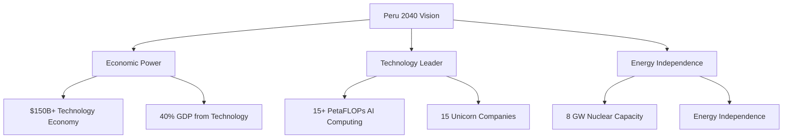

# Peru 2040: Strategic Technological Sovereignty

> **An open-source national strategy for transforming Peru into Latin America's leading technology powerhouse by 2040**

## 🎯 What is Peru 2040?

Peru 2040 is a comprehensive strategic framework to transform Peru from a commodity-dependent economy into a high-technology, high-income nation by 2040. This open-source approach enables collaborative development of national strategy through evidence-based planning and transparent governance.

**Key Transformation Areas:**
- 🤖 Artificial Intelligence & Computing Infrastructure  
- ⚡ Nuclear Energy & Renewable Systems
- 🏭 Advanced Manufacturing & Materials
- 🌍 Modern Soft Power & Cultural Exports
- 💰 $93B Investment Framework over 15 years

## 📋 Quick Navigation

| Document | Description |
|----------|-------------|
| [**📖 Full White Paper**](docs/peru-2040-white-paper.md) | Complete strategic plan (2,376 pages) |
| [**🚀 Getting Started**](BEGINNER_GUIDE.md) | New contributor guide |
| [**🤝 Contributing**](CONTRIBUTING.md) | How to contribute |
| [**❓ FAQ**](FAQ.md) | Frequently asked questions |
| [**🗺️ Roadmap**](ROADMAP.md) | Implementation timeline |

## 🎯 Target Outcomes by 2040

## 🚀 How to Get Involved

### For Policy Experts & Researchers
- Review and enhance the [strategic framework](docs/peru-2040-white-paper.md)
- Contribute economic modeling and benchmarking data
- Provide international case studies and best practices

### For Technologists
- Design implementation frameworks for AI and computing infrastructure
- Contribute to energy transition planning
- Develop governance models for emerging technologies

### For Economists & Analysts  
- Validate financial projections and investment models
- Enhance risk assessment frameworks
- Contribute comparative economic analysis

### For All Contributors
- Join discussions in [Issues](../../issues)
- Improve documentation and accessibility
- Share insights from your expertise area

## 📚 Key Documents

### Core Strategy
- [📄 Executive Summary](docs/executive-summary.md) - 5-page overview
- [📊 Financial Framework](docs/financial/investment-model.md) - $93B investment plan
- [⚡ Energy Strategy](docs/sectors/energy-sovereignty.md) - Nuclear + renewables
- [🤖 AI Strategy](docs/sectors/ai-computing.md) - Computing infrastructure plan

### Implementation
- [📅 Phase 1: Foundation (2025-2027)](docs/implementation/phase-1-foundation.md)
- [🏛️ Governance Framework](docs/governance/institutional-framework.md)
- [💼 International Partnerships](docs/international-partnerships.md)

## 🌟 Why Open Source Strategy?

Traditional national planning happens behind closed doors. We believe:

- **Transparency** builds public trust and accountability
- **Collaboration** leverages global expertise and best practices  
- **Evidence-based** approach ensures realistic, achievable goals
- **Democratic participation** strengthens implementation legitimacy

## 🤝 Community

- **💬 Discussions**: Share ideas and ask questions
- **🐛 Issues**: Report problems or suggest improvements
- **🔧 Pull Requests**: Contribute directly to the strategy
- **📧 Contact**: Create an issue or tag [@MRCORD](https://github.com/MRCORD) for direct contact

## 📈 Current Status

- **Phase**: Strategy Development & Community Building
- **Contributors**: [See Contributors](CONTRIBUTORS.md)
- **Last Updated**: December 2024
- **Next Milestone**: Phase 1 Implementation Plan (Q1 2025)

## 📜 License

This project is licensed under the [MIT License](LICENSE) - see the file for details.

## 🏆 Recognition

*Peru 2040 represents one of the first open-source approaches to national strategic planning, demonstrating how democratic participation and transparency can enhance policy development.*

---

**Ready to help transform Peru's future?** [Start here](BEGINNER_GUIDE.md) | [Read the full strategy](docs/peru-2040-white-paper.md) | [Join the discussion](../../discussions) 