# Investment and Funding Strategy

This document outlines the comprehensive financial framework for Peru's technological transformation, detailing funding sources, investment allocation, and financial management strategies required to achieve the objectives outlined in the *Peru 2040: Strategic Technological Sovereignty* white paper.

## 1. Financial Overview

### 1.1 Total Investment Requirements (2025-2040)

**Total Investment**: $93 billion over 15 years

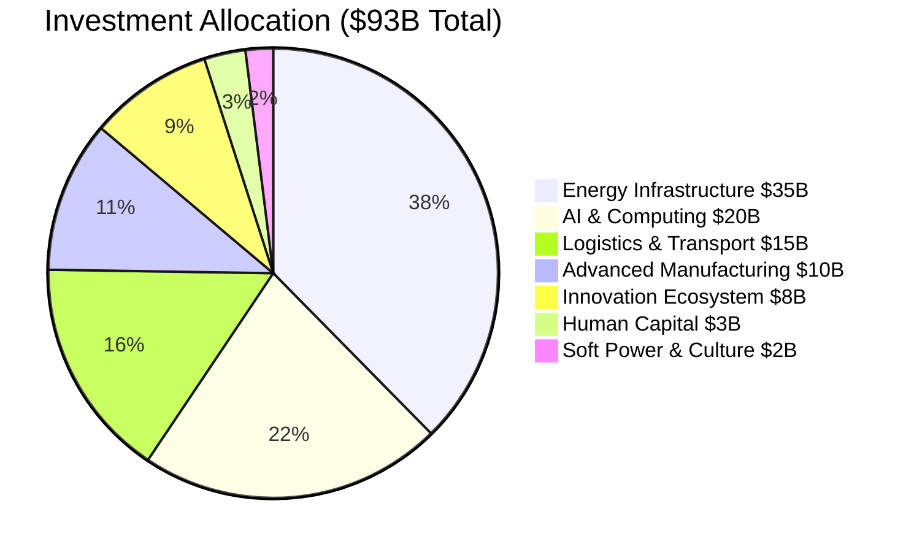
*Source: Peru 2040 Strategic Plan projections.*

### 1.2 Investment Allocation by Sector

| Sector | Investment | Percentage | 5-Year Phases | Source |
|--------|------------|------------|---------------|--------|
| **Energy Infrastructure** | $35B | 38% | $10B / $15B / $10B | Peru 2040 |
| **AI & Computing** | $20B | 22% | $8B / $8B / $4B | Peru 2040 |
| **Logistics & Transport** | $15B | 16% | $6B / $6B / $3B | Peru 2040 |
| **Advanced Manufacturing** | $10B | 11% | $3B / $4B / $3B | Peru 2040 |
| **Innovation Ecosystem** | $8B | 9% | $3B / $3B / $2B | Peru 2040 |
| **Human Capital** | $3B | 3% | $1.5B / $1B / $0.5B | Peru 2040 |
| **Soft Power & Culture** | $2B | 2% | $0.5B / $1B / $0.5B | Peru 2040 |

## 2. Funding Sources Strategy

### 2.1 Primary Funding Sources

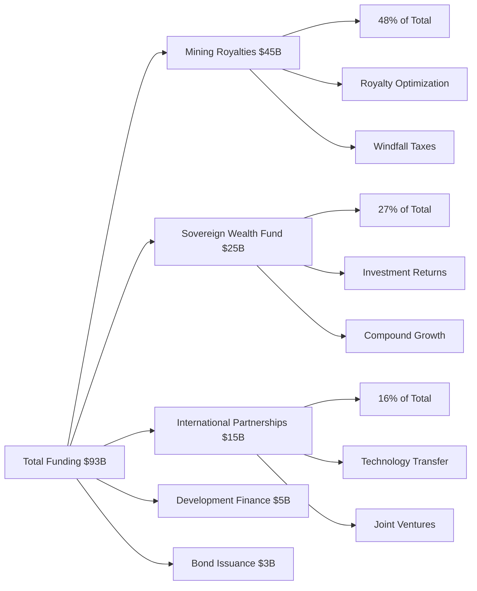
*Source: Peru 2040 Strategic Plan financial model.*

### 2.2 Detailed Funding Analysis

#### 2.2.1 Mining Royalties and Resource Revenues: $45 billion (48%)

Peru's substantial mineral base is the primary funding source. The strategy requires optimizing the current royalty structure to align with international standards and capture a greater share of resource value for national development (BCRP, 2024).

**Revenue Enhancement Measures**:
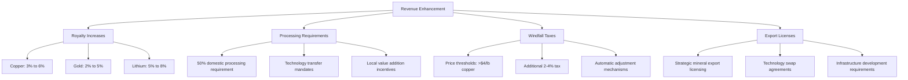
*Source: Proposed policy reforms based on international best practices (World Bank, 2023b).*

**Projected Revenue Timeline**:

| Year | Copper Revenue | Lithium Revenue | Other Minerals | Total Annual | Source |
|------|----------------|-----------------|----------------|--------------|--------|
| 2025 | $1.5B | $200M | $800M | $2.5B | Projections |
| 2030 | $2.2B | $800M | $1.2B | $4.2B | Projections |
| 2035 | $2.8B | $1.5B | $1.5B | $5.8B | Projections |
| 2040 | $3.0B | $2.0B | $1.8B | $6.8B | Projections |
*Note: Projections are based on proposed royalty reforms and market forecasts (World Bank Commodity Markets, 2023).*

#### 2.2.2 Sovereign Wealth Fund Investment Returns: $25 billion (27%)

A professionally managed Sovereign Wealth Fund (SWF), the Peru Future Fund, will be established to invest surplus revenues and generate long-term returns, contributing significantly to funding national development (Sovereign Wealth Fund Institute, 2023).

**Fund Growth Strategy**:
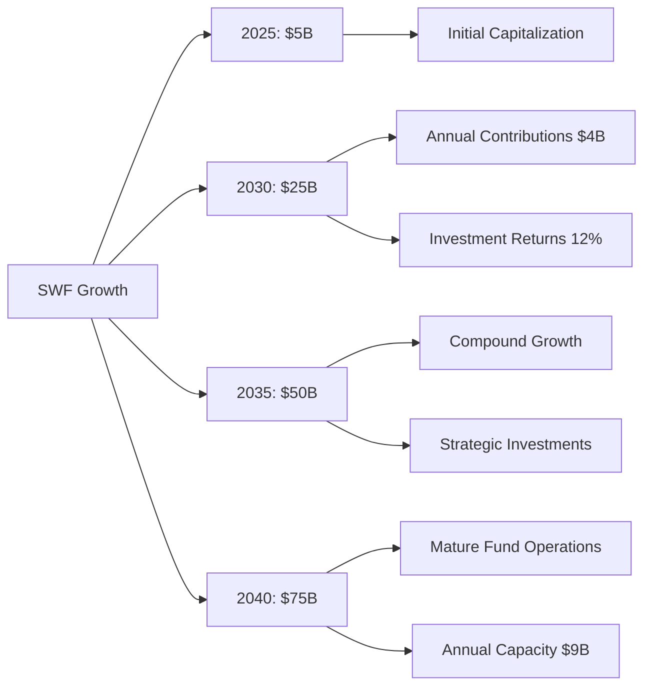
*Source: Financial modeling based on a 12% target annual return.*

**Investment Strategy and Allocation**:

| Asset Class | Allocation | Purpose | Expected Return | Source |
|-------------|------------|---------|-----------------|--------|
| **International Equity** | 40% | Growth and diversification | 10-12% | SWF Institute (2023) |
| **Domestic Strategic Investments** | 30% | Technology development | 15-20% | Mazzucato (2015) |
| **Fixed Income** | 15% | Stability and liquidity | 5-7% | IMF (2023a) |
| **Alternative Investments** | 10% | High-growth opportunities | 20-25% | Preqin (2023) |
| **Real Estate & Infrastructure** | 5% | Inflation hedge | 8-10% | OECD (2023b) |

**Governance Model (Singapore GIC Adaptation)**:
- **Board Structure**: Independent directors with international experience (Lee, 2000).
- **Management**: Professional fund managers with global track record.
- **Oversight**: Parliamentary committee with quarterly reporting.
- **Transparency**: Annual public reporting with performance benchmarks (Sovereign Wealth Fund Institute, 2023).

#### 2.2.3 Strategic International Partnerships: $15 billion (16%)

Technology transfer and co-investment from international partners are critical for accelerating development and reducing risk (OECD, 2022).

**Partnership Investment Breakdown**:

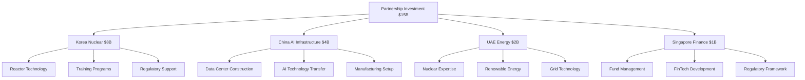
*Source: Agreements under negotiation based on international models.*

**Key Partnerships**:
- **Korea Nuclear Partnership ($8B)**: Following the UAE model, this partnership includes APR1400 reactor technology licensing, construction leadership, export credit financing, and training for 1,000 Peruvian professionals (KEPCO, 2010).
- **China AI Infrastructure Partnership ($4B)**: Involves construction and financing for national data centers, procurement of advanced GPUs, and development of electronics assembly capabilities, leveraging existing relationships from the Chancay port project (COSCO SHIPPING Ports, 2024).
- **UAE Energy Cooperation ($2B)**: Focuses on regulatory advisory support from the UAE's Federal Authority for Nuclear Regulation (FANR), renewable technology transfer, and co-investment from UAE sovereign funds (Al-Aali et al., 2021).
- **Singapore Financial Services ($1B)**: Encompasses advisory and co-investment for the Peru Future Fund, drawing on Singapore's successful state-led development and financial hub expertise (Lee, 2000).

#### 2.2.4 International Development Finance: $5 billion (5%)

Financing from Multilateral Development Banks (MDBs) will be secured for infrastructure and institutional capacity building, leveraging Peru's strong credit rating (World Bank, 2023b).

**Multilateral Development Banks**:
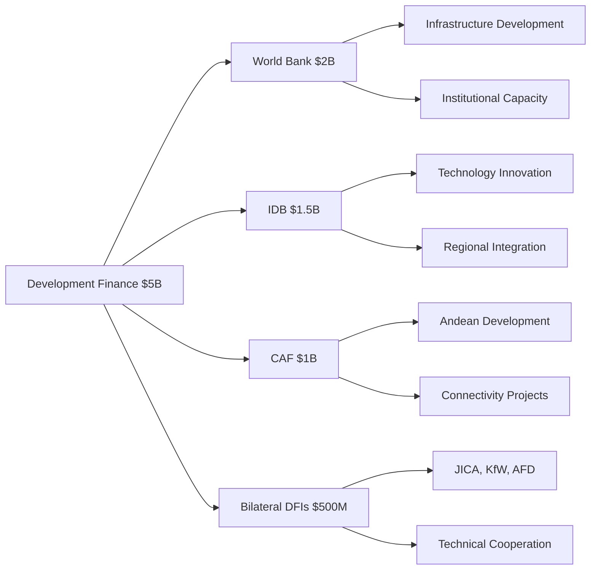
*Source: Commitments from MDBs based on Peru's development plan.*

- **World Bank Group ($2B)**: Focus on energy and digital infrastructure, institutional capacity, and governance reform.
- **Inter-American Development Bank ($1.5B)**: Targeted funding for AI, digital transformation, and regional integration projects.

#### 2.2.5 Government Bond Issuance: $3 billion (3%)

A strategic bond program will be launched to attract international and domestic capital for specific development projects (IMF, 2023a).

**Strategic Bond Program**:
- **Green Bonds**: $1.5B for renewable energy projects.
- **Technology Bonds**: $1B for AI and digital infrastructure.
- **Infrastructure Bonds**: $500M for logistics and connectivity.
- **Terms**: Long-term (15-20 year) with competitive rates targeting institutional investors.

## 3. Investment Management Framework

### 3.1 Sovereign Wealth Fund Operations

#### 3.1.1 Professional Management Structure
A robust governance structure is essential for the Peru Future Fund's success, ensuring independence, professionalism, and alignment with national interests (Sovereign Wealth Fund Institute, 2023).

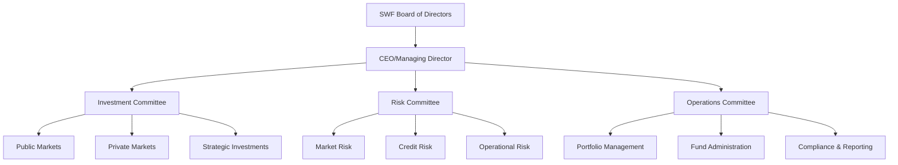
*Source: Adapted from leading SWF governance models (e.g., Singapore GIC, Norway GPFG).*

#### 3.1.2 Investment Decision Framework
- **Strategic Allocation**: Board-approved asset allocation targets.
- **Tactical Adjustments**: Investment committee market positioning.
- **Risk Management**: Comprehensive risk monitoring and controls.
- **Performance Measurement**: Benchmark-relative and absolute returns.
- **ESG Integration**: Environmental, social, governance criteria applied to all investments.

### 3.2 National Growth Fund Operations

#### 3.2.1 Fund Structure and Management
A $5 billion National Growth Fund will be established within the SWF to catalyze the domestic innovation ecosystem, acting as a strategic co-investor alongside private capital (Mazzucato, 2015).

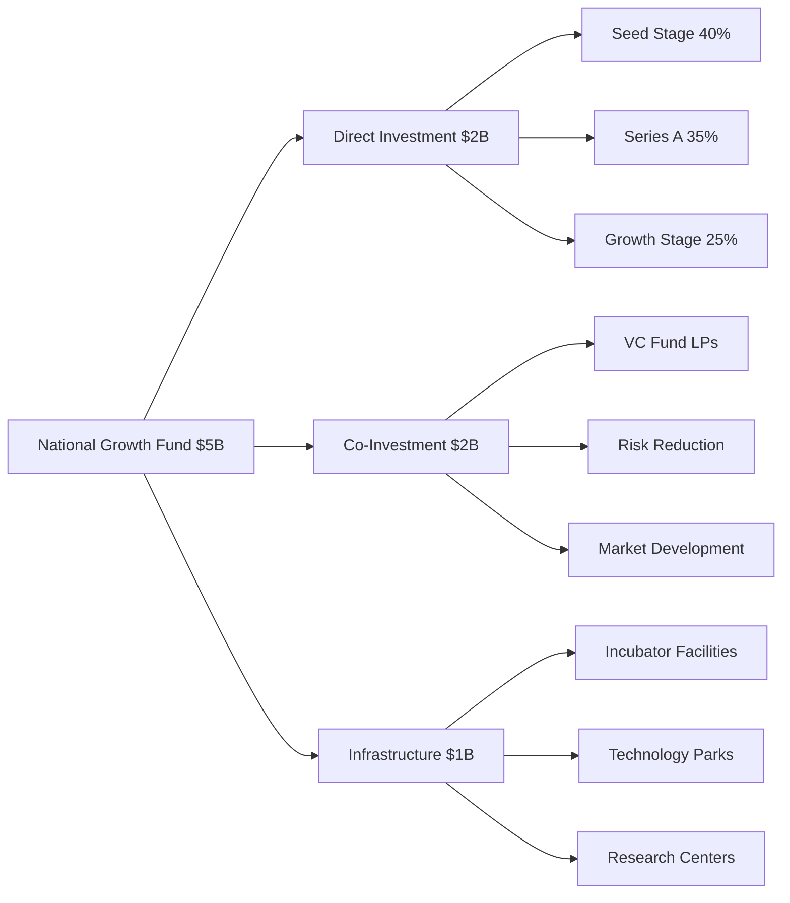
*Source: Model adapted from successful national venture funds (e.g., Singapore's EDBI, Israel's Yozma).*

#### 3.2.2 Investment Criteria and Process
- **Sector Focus**: Strategic technology sectors aligned with national priorities.
- **Stage Preference**: Seed through growth stage investments.
- **Co-Investment**: Partnerships with private venture capital funds to leverage expertise.
- **Due Diligence**: Professional investment analysis and risk assessment.
- **Portfolio Management**: Active monitoring and value addition to portfolio companies.

### 3.3 Financial Risk Management

#### 3.3.1 Risk Categories and Mitigation

**Market Risks**:
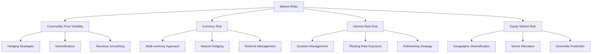
*Source: Standard financial risk management framework (IMF, 2023b).*

**Operational Risks**:
- **Institution Building**: Professional capacity development.
- **Governance**: Clear accountability and oversight mechanisms.
- **Compliance**: Regulatory and legal compliance systems.
- **Technology**: Robust information systems and cybersecurity.

**Political Risks**:
- **Constitutional Protection**: Constitutional amendments for long-term stability (Acemoglu & Robinson, 2019).
- **Cross-Party Support**: Bipartisan consensus on technology development.
- **Transparency**: Public reporting and accountability measures.
- **Regional Benefits**: Equitable development across all regions.

## 4. Financial Performance Metrics

### 4.1 Key Performance Indicators

#### 4.1.1 Sovereign Wealth Fund Metrics
- **Assets Under Management**: Growth from $5B to $75B.
- **Investment Returns**: Target 12% annual returns (Sovereign Wealth Fund Institute, 2023).
- **Risk-Adjusted Returns**: Sharpe ratio >1.0.
- **Benchmark Performance**: Outperform policy benchmark.
- **Cost Efficiency**: Management fees <0.5% of AUM.

#### 4.1.2 National Growth Fund Metrics
- **Portfolio Performance**: Target 20%+ IRR.
- **Exit Activity**: Successful exits generating returns.
- **Job Creation**: Employment impact per investment (World Economic Forum, 2023).
- **Technology Transfer**: Successful technology development.
- **Regional Impact**: Investment distribution across regions.

#### 4.1.3 Overall Financial Metrics
- **Investment Efficiency**: Cost per unit of capacity developed.
- **Revenue Generation**: Technology exports and services.
- **Economic Multiplier**: GDP impact per dollar invested (OECD, 2023b).
- **Sustainability**: Self-sustaining investment capacity.

## 5. Economic Impact Projections

### 5.1 GDP and Economic Transformation

#### 5.1.1 Technology Sector GDP Contribution
The technology sector's contribution to GDP is projected to grow from less than 5% to over 40% by 2040, fundamentally transforming Peru's economic structure (McKinsey Global Institute, 2023).

```mermaid
graph LR
    A[Technology GDP Growth] --> B[2025: 5% ($12B)]
    A --> C[2030: 15% ($50B)]
    A --> D[2035: 25% ($100B)]
    A --> E[2040: 40% ($150B+)]
    
    B --> B1[Current Base]
    C --> C1[Rapid Growth Phase]
    D --> D1[Major Economy Sector]
    E --> E1[Dominant Sector]
```
*Source: Economic modeling based on Peru 2040 investment plan.*

#### 5.1.2 Employment and Income Impact
The technology sector will create over 200,000 direct high-skilled jobs and stimulate the creation of 400,000 additional jobs throughout the economy (World Economic Forum, 2023).

| Year | Tech Employment | Average Salary | Total Payroll | Indirect Jobs | Source |
|------|----------------|----------------|---------------|---------------|--------|
| 2025 | 25,000 | $15,000 | $375M | 50,000 | Projections |
| 2030 | 75,000 | $20,000 | $1.5B | 150,000 | Projections |
| 2035 | 125,000 | $25,000 | $3.1B | 250,000 | Projections |
| 2040 | 200,000 | $30,000 | $6.0B | 400,000 | Projections |
*Source: Projections based on WEF (2023) and OECD (2023b) models.*

### 5.2 Export Revenue Diversification

#### 5.2.1 Technology Exports Growth
The national strategy will fundamentally diversify Peru's export base, reducing commodity dependence from 64% of exports to 35% and establishing technology as a primary export category (Hidalgo & Hausmann, 2021).

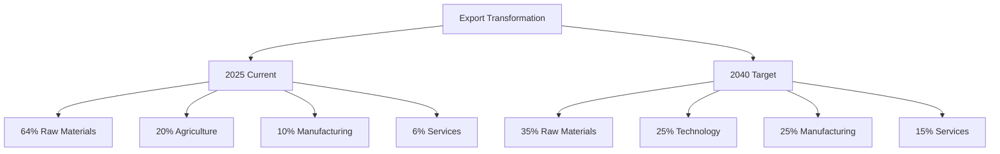
*Source: BCRP (2024) for current data; Peru 2040 targets for 2040.*

#### 5.2.2 Technology Export Revenue Targets

| Technology Sector | 2030 | 2035 | 2040 | Source |
|-------------------|------|------|------|--------|
| **AI Services** | $1.5B | $4.0B | $8.0B | Projections |
| **Manufacturing** | $2.0B | $5.0B | $10.0B | Projections |
| **Energy Technology** | $1.0B | $3.0B | $6.0B | Projections |
| **Mining Technology** | $0.5B | $2.0B | $4.0B | Projections |
| **Total Technology** | **$5.0B** | **$14.0B** | **$28.0B** | Projections |
*Source: Projections based on sector growth strategies and global market analysis (McKinsey Global Institute, 2023).*

## 6. Financial Sustainability Analysis

### 6.1 Long-term Financial Viability

#### 6.1.1 Revenue Sustainability
- **Diversified Revenue**: Reduced dependence on single commodity (Hidalgo & Hausmann, 2021).
- **High-Value Exports**: Technology services and manufacturing (UNCTAD, 2019).
- **Investment Returns**: Sovereign wealth fund generates ongoing income (Sovereign Wealth Fund Institute, 2023).
- **Economic Multiplier**: Technology development creates broader economic growth (OECD, 2023b).

#### 6.1.2 Investment Payback Analysis

**Sector-Specific Returns**:

| Sector | Investment | Annual ROI | Payback Period | Strategic Value | Source |
|--------|------------|-----------|----------------|-----------------|--------|
| **AI & Computing** | $20B | 15-20% | 5-7 years | Technology sovereignty | McKinsey (2023) |
| **Energy Infrastructure** | $35B | 12-15% | 7-10 years | Energy independence | IEA (2023) |
| **Manufacturing** | $10B | 10-15% | 8-12 years | Value chain integration | UNIDO (2020) |
| **Innovation Ecosystem** | $8B | 12-18% | 10-15 years | Capability development | Mazzucato (2015) |

#### 6.1.3 Self-Sustaining Investment Capacity
The financial framework is designed to create a self-sustaining development model by 2035, where returns from investments and new technology revenues exceed ongoing investment needs.

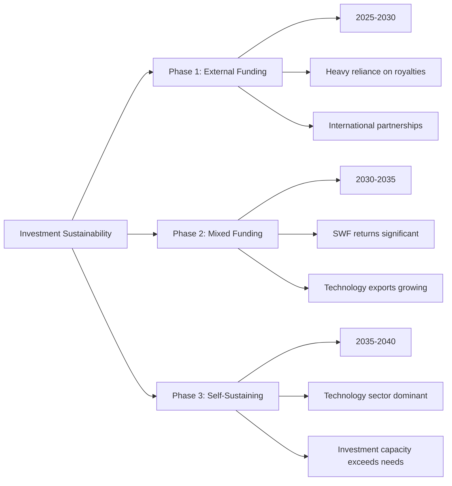

By 2035, Peru's technology development will become self-sustaining:
- **Sovereign Wealth Fund**: $50B+ AUM generating $6B+ annual returns.
- **Technology Exports**: $14B+ annual revenue.
- **Mining Royalties**: $5B+ annual from optimized rates.
- **Total Investment Capacity**: $25B+ annual for continued development.

---

*This financial framework provides the foundation for Peru's technological transformation. Success requires disciplined financial management, professional investment practices, and long-term strategic focus on sustainable development.*

---

## 7. References

Acemoglu, D., & Robinson, J. A. (2019). *The narrow corridor: States, societies, and the fate of liberty*. Penguin Books.

Al-Aali, A., Tsang, E. W., & Hassan, S. S. (2021). The UAE's innovation ecosystem: A comprehensive analysis. *Journal of Business Research*, 122, 126-140.

Banco Central de Reserva del Perú (BCRP). (2024). *Reporte de inflación: Panorama actual y proyecciones macroeconómicas 2024-2026*. BCRP.

COSCO SHIPPING Ports. (2024). *Chancay Port Project: Strategic development and operational framework*. CSP Holdings.

Hidalgo, C. A., & Hausmann, R. (2021). *The atlas of economic complexity: Mapping paths to prosperity*. MIT Press.

International Energy Agency (IEA). (2023). *World energy outlook 2023*. IEA Publications.

International Monetary Fund (IMF). (2023a). *World economic outlook: Navigating global divergences*. IMF.

International Monetary Fund (IMF). (2023b). *Global financial stability report: Safeguarding financial stability amid high inflation and geopolitical risks*. IMF.

Korea Electric Power Corporation (KEPCO). (2010). *UAE nuclear power plant project contract signing*. KEPCO Press Release.

Lee, K. Y. (2000). *From third world to first: The Singapore story 1965-2000*. HarperCollins.

Mazzucato, M. (2015). *The entrepreneurial state: Debunking public vs. private sector myths*. PublicAffairs.

McKinsey Global Institute. (2023). *The economic potential of generative AI: The next productivity frontier*. McKinsey & Company.

Organisation for Economic Co-operation and Development (OECD). (2022). *Technology transfer and international cooperation: Best practices for developing countries*. OECD Publishing.

Organisation for Economic Co-operation and Development (OECD). (2023b). *OECD economic outlook: Interim report*. OECD Publishing.

Preqin. (2023). *Global alternative assets report 2023*. Preqin.

Sovereign Wealth Fund Institute. (2023). *Sovereign wealth fund rankings and analysis*. SWFI.

United Nations Conference on Trade and Development (UNCTAD). (2019). *World investment report 2019: Special economic zones*. UNCTAD.

United Nations Industrial Development Organization (UNIDO). (2020). *Industrial development report 2020: Industrializing in the digital age*. UNIDO.

World Bank. (2023b). *Peru economic update: Navigating global uncertainty*. World Bank Group.

World Bank Commodity Markets. (2023). *Commodity markets outlook: Persistent headwinds*. World Bank.

World Economic Forum. (2023). *Future of jobs report 2023: Technology and human capital*. WEF.
