# Investment and Funding Strategy

This document outlines the comprehensive financial framework for Peru's technological transformation, detailing funding sources, investment allocation, and financial management strategies.

## Financial Overview

### Total Investment Requirements (2025-2040)

**Total Investment**: $93 billion over 15 years

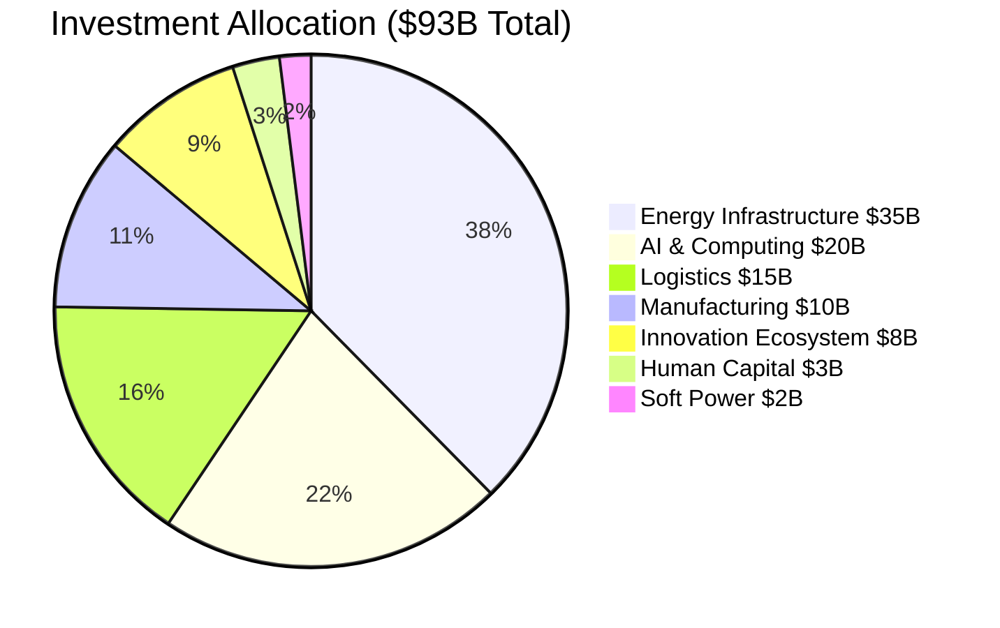

### Investment Allocation by Sector

| Sector | Investment | Percentage | 5-Year Phases |
|--------|------------|------------|---------------|
| **Energy Infrastructure** | $35B | 38% | $10B / $15B / $10B |
| **AI & Computing** | $20B | 22% | $8B / $8B / $4B |
| **Logistics & Transport** | $15B | 16% | $6B / $6B / $3B |
| **Advanced Manufacturing** | $10B | 11% | $3B / $4B / $3B |
| **Innovation Ecosystem** | $8B | 9% | $3B / $3B / $2B |
| **Human Capital** | $3B | 3% | $1.5B / $1B / $0.5B |
| **Soft Power & Culture** | $2B | 2% | $0.5B / $1B / $0.5B |

## Funding Sources Strategy

### Primary Funding Sources

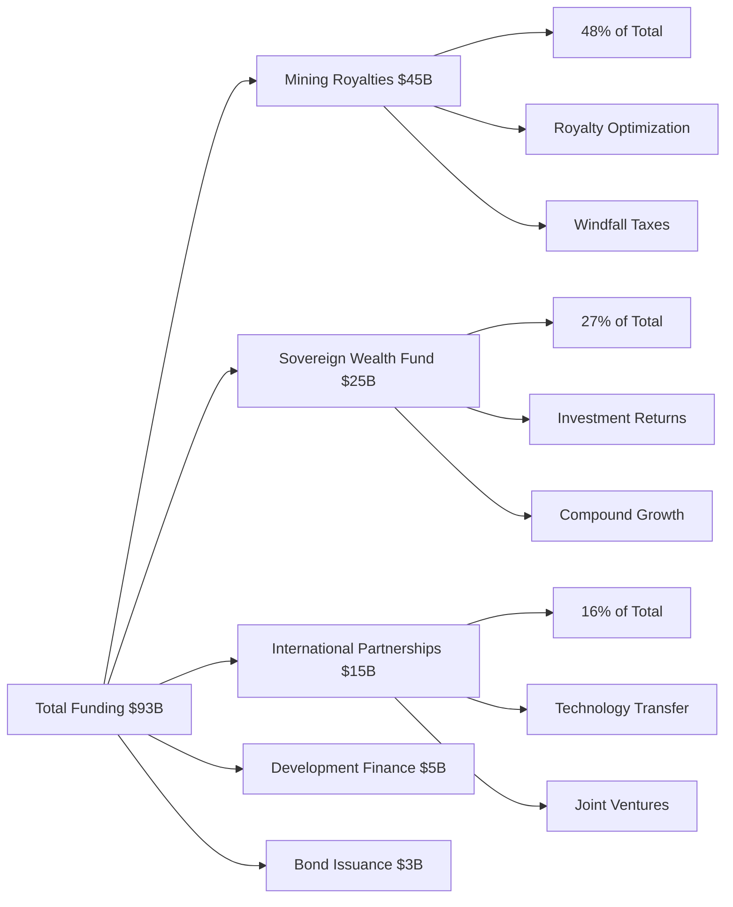

### Detailed Funding Analysis

#### 1. Mining Royalties and Resource Revenues: $45 billion (48%)

**Current Royalty Structure Optimization**:
- Increase royalty rates from current 1-3% to 5-8% of gross revenue
- Implement progressive royalty structure based on commodity prices
- Add windfall profit taxes during high price periods
- Mandate domestic processing requirements for strategic minerals

**Revenue Enhancement Measures**:
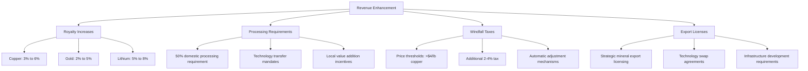

**Projected Revenue Timeline**:

| Year | Copper Revenue | Lithium Revenue | Other Minerals | Total Annual |
|------|----------------|-----------------|----------------|--------------|
| 2025 | $1.5B | $200M | $800M | $2.5B |
| 2030 | $2.2B | $800M | $1.2B | $4.2B |
| 2035 | $2.8B | $1.5B | $1.5B | $5.8B |
| 2040 | $3.0B | $2.0B | $1.8B | $6.8B |

#### 2. Sovereign Wealth Fund Investment Returns: $25 billion (27%)

**Fund Growth Strategy**:
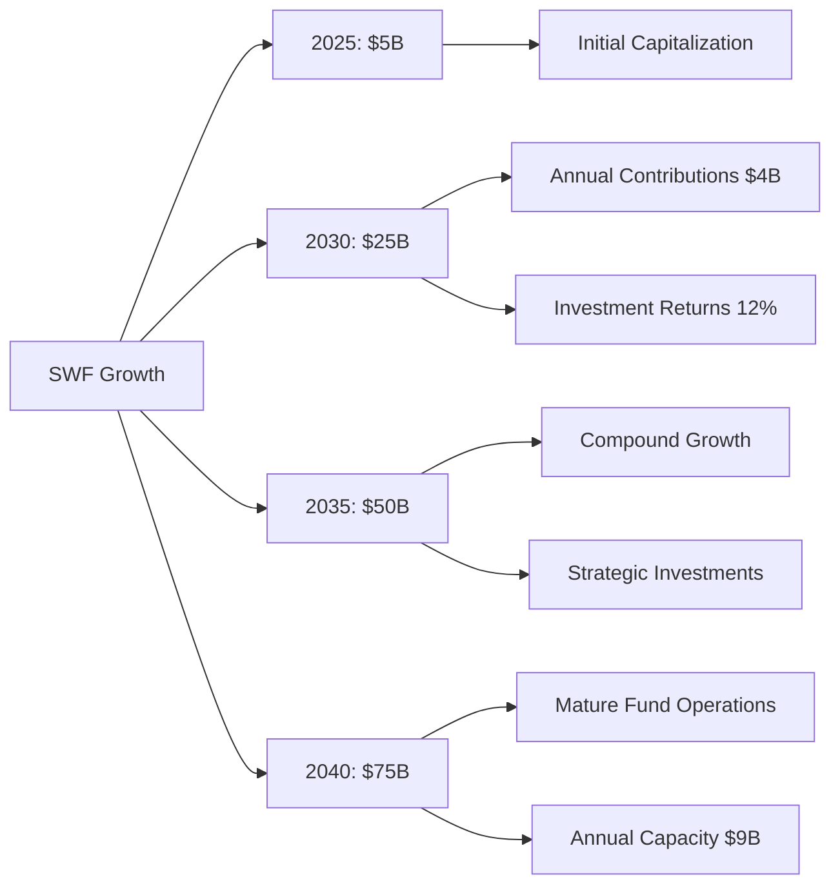

**Investment Strategy and Allocation**:

| Asset Class | Allocation | Purpose | Expected Return |
|-------------|------------|---------|-----------------|
| **International Equity** | 40% | Growth and diversification | 10-12% |
| **Domestic Strategic Investments** | 30% | Technology development | 15-20% |
| **Fixed Income** | 15% | Stability and liquidity | 5-7% |
| **Alternative Investments** | 10% | High-growth opportunities | 20-25% |
| **Real Estate & Infrastructure** | 5% | Inflation hedge | 8-10% |

**Governance Model (Singapore GIC Adaptation)**:
- **Board Structure**: Independent directors with international experience
- **Management**: Professional fund managers with global track record
- **Oversight**: Parliamentary committee with quarterly reporting
- **Transparency**: Annual public reporting with performance benchmarks

#### 3. Strategic International Partnerships: $15 billion (16%)

**Partnership Investment Breakdown**:

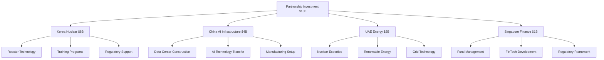

**Korea Nuclear Partnership ($8B)**:
- **Technology Transfer**: APR1400 reactor technology licensing
- **Construction**: Korean companies lead reactor construction
- **Financing**: Korean export credit agency financing
- **Training**: 1,000 Peruvian nuclear professionals
- **Timeline**: 8-year partnership with technology transfer

**China AI Infrastructure Partnership ($4B)**:
- **Data Centers**: Construction and equipment financing
- **Technology**: GPU procurement and AI software
- **Manufacturing**: Electronics assembly and components
- **Market Access**: Chinese market entry for Peruvian AI services

**UAE Energy Cooperation ($2B)**:
- **Nuclear Expertise**: FANR regulatory advisory support
- **Renewable Energy**: Solar and wind technology transfer
- **Grid Integration**: Smart grid and storage systems
- **Investment**: UAE sovereign fund co-investment

**Singapore Financial Services ($1B)**:
- **Fund Management**: SWF advisory and co-investment
- **FinTech**: Technology transfer and market development
- **Regulatory**: Financial services regulatory cooperation
- **Talent**: Professional development and exchange

#### 4. International Development Finance: $5 billion (5%)

**Multilateral Development Banks**:
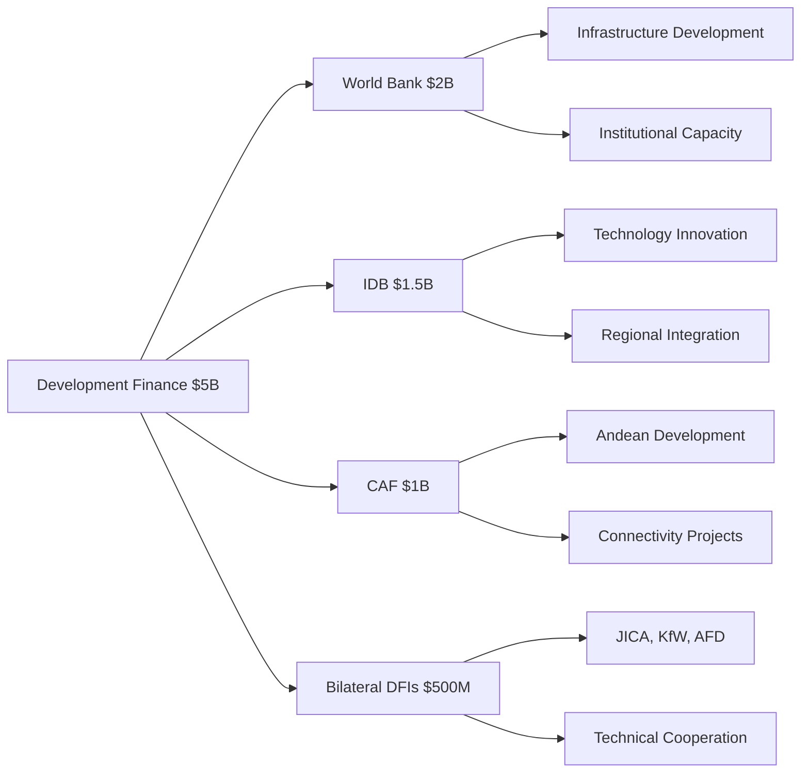

**World Bank Group ($2B)**:
- **Infrastructure**: Energy and digital infrastructure loans
- **Capacity Building**: Institutional development support
- **Policy Reform**: Governance and regulatory framework
- **Innovation**: Technology development and startup ecosystem

**Inter-American Development Bank ($1.5B)**:
- **Technology Innovation**: AI and digital transformation
- **Regional Integration**: Cross-border connectivity projects
- **Climate Finance**: Renewable energy and efficiency
- **Private Sector**: SME and startup financing

#### 5. Government Bond Issuance: $3 billion (3%)

**Strategic Bond Program**:
- **Green Bonds**: $1.5B for renewable energy projects
- **Technology Bonds**: $1B for AI and digital infrastructure
- **Infrastructure Bonds**: $500M for logistics and connectivity
- **Terms**: Long-term (15-20 year) with competitive rates
- **Market**: International and domestic institutional investors

## Investment Management Framework

### Sovereign Wealth Fund Operations

#### Professional Management Structure
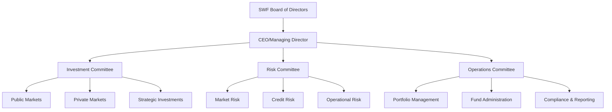

#### Investment Decision Framework
- **Strategic Allocation**: Board-approved asset allocation targets
- **Tactical Adjustments**: Investment committee market positioning
- **Risk Management**: Comprehensive risk monitoring and controls
- **Performance Measurement**: Benchmark-relative and absolute returns
- **ESG Integration**: Environmental, social, governance criteria

### National Growth Fund Operations

#### Fund Structure and Management
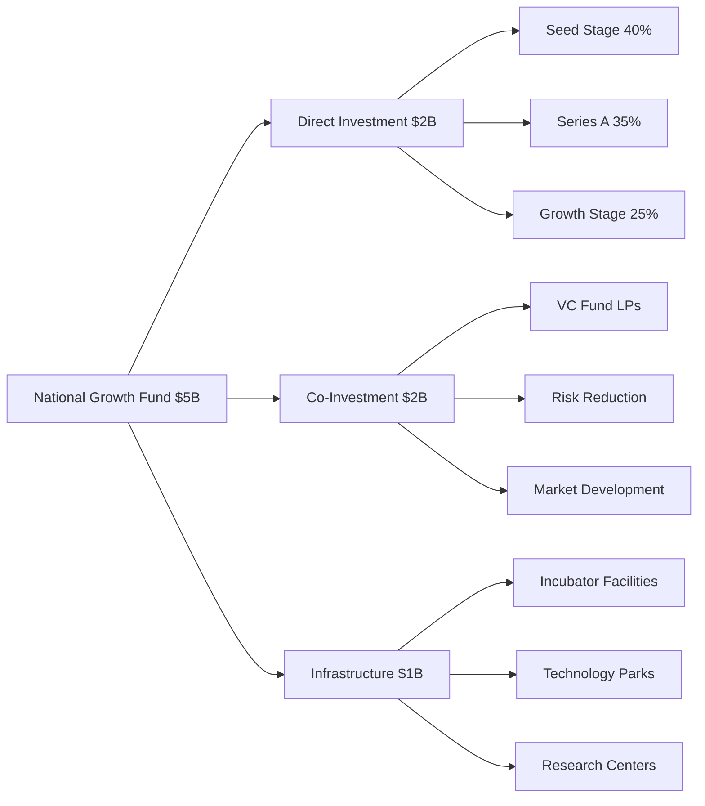

#### Investment Criteria and Process
- **Sector Focus**: Strategic technology sectors aligned with national priorities
- **Stage Preference**: Seed through growth stage investments
- **Co-Investment**: Partnerships with private venture capital funds
- **Due Diligence**: Professional investment analysis and risk assessment
- **Portfolio Management**: Active monitoring and value addition

### Financial Risk Management

#### Risk Categories and Mitigation

**Market Risks**:
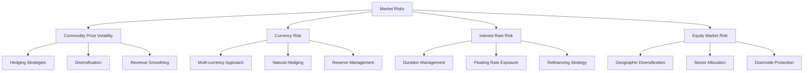

**Operational Risks**:
- **Institution Building**: Professional capacity development
- **Governance**: Clear accountability and oversight mechanisms
- **Compliance**: Regulatory and legal compliance systems
- **Technology**: Robust information systems and cybersecurity

**Political Risks**:
- **Constitutional Protection**: Constitutional amendments for long-term stability
- **Cross-Party Support**: Bipartisan consensus on technology development
- **Transparency**: Public reporting and accountability measures
- **Regional Benefits**: Equitable development across all regions

### Financial Performance Metrics

#### Key Performance Indicators

**Sovereign Wealth Fund Metrics**:
- **Assets Under Management**: Growth from $5B to $75B
- **Investment Returns**: Target 12% annual returns
- **Risk-Adjusted Returns**: Sharpe ratio >1.0
- **Benchmark Performance**: Outperform policy benchmark
- **Cost Efficiency**: Management fees <0.5% of AUM

**National Growth Fund Metrics**:
- **Portfolio Performance**: Target 20%+ IRR
- **Exit Activity**: Successful exits generating returns
- **Job Creation**: Employment impact per investment
- **Technology Transfer**: Successful technology development
- **Regional Impact**: Investment distribution across regions

**Overall Financial Metrics**:
- **Investment Efficiency**: Cost per unit of capacity developed
- **Revenue Generation**: Technology exports and services
- **Economic Multiplier**: GDP impact per dollar invested
- **Sustainability**: Self-sustaining investment capacity

## Economic Impact Projections

### GDP and Economic Transformation

#### Technology Sector GDP Contribution
```mermaid
graph LR
    A[Technology GDP Growth] --> B[2025: 5% ($12B)]
    A --> C[2030: 15% ($50B)]
    A --> D[2035: 25% ($100B)]
    A --> E[2040: 40% ($150B+)]
    
    B --> B1[Current Base]
    C --> C1[Rapid Growth Phase]
    D --> D1[Major Economy Sector]
    E --> E1[Dominant Sector]
```

#### Employment and Income Impact

| Year | Tech Employment | Average Salary | Total Payroll | Indirect Jobs |
|------|----------------|----------------|---------------|---------------|
| 2025 | 25,000 | $15,000 | $375M | 50,000 |
| 2030 | 75,000 | $20,000 | $1.5B | 150,000 |
| 2035 | 125,000 | $25,000 | $3.1B | 250,000 |
| 2040 | 200,000 | $30,000 | $6.0B | 400,000 |

### Export Revenue Diversification

#### Technology Exports Growth
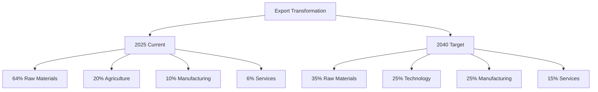

#### Technology Export Revenue Targets

| Technology Sector | 2030 | 2035 | 2040 |
|-------------------|------|------|------|
| **AI Services** | $1.5B | $4.0B | $8.0B |
| **Manufacturing** | $2.0B | $5.0B | $10.0B |
| **Energy Technology** | $1.0B | $3.0B | $6.0B |
| **Mining Technology** | $0.5B | $2.0B | $4.0B |
| **Total Technology** | **$5.0B** | **$14.0B** | **$28.0B** |

## Financial Sustainability Analysis

### Long-term Financial Viability

#### Revenue Sustainability
- **Diversified Revenue**: Reduced dependence on single commodity
- **High-Value Exports**: Technology services and manufacturing
- **Investment Returns**: Sovereign wealth fund generates ongoing income
- **Economic Multiplier**: Technology development creates broader economic growth

#### Investment Payback Analysis

**Sector-Specific Returns**:
| Sector | Investment | Annual ROI | Payback Period | Strategic Value |
|--------|------------|-----------|----------------|-----------------|
| **AI & Computing** | $20B | 15-20% | 5-7 years | Technology sovereignty |
| **Energy Infrastructure** | $35B | 12-15% | 7-10 years | Energy independence |
| **Manufacturing** | $10B | 10-15% | 8-12 years | Value chain integration |
| **Innovation Ecosystem** | $8B | 12-18% | 10-15 years | Capability development |

#### Self-Sustaining Investment Capacity
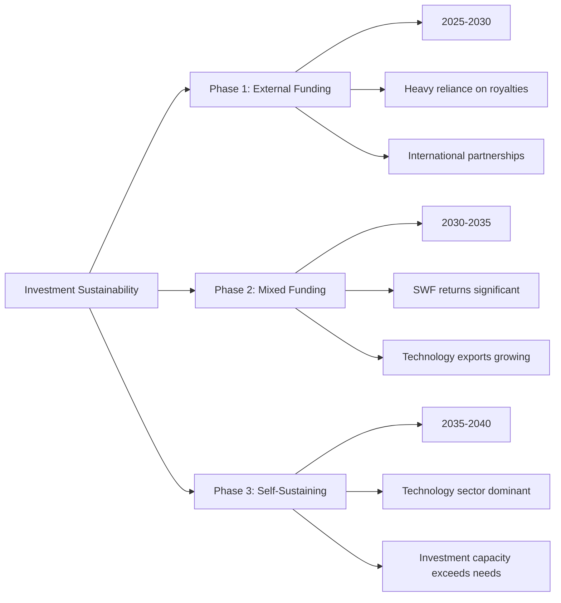

By 2035, Peru's technology development will become self-sustaining:
- **Sovereign Wealth Fund**: $50B+ AUM generating $6B+ annual returns
- **Technology Exports**: $14B+ annual revenue
- **Mining Royalties**: $5B+ annual from optimized rates
- **Total Investment Capacity**: $25B+ annual for continued development

---

*This financial framework provides the foundation for Peru's technological transformation. Success requires disciplined financial management, professional investment practices, and long-term strategic focus on sustainable development.*
