# Institutional Framework and Governance

This document outlines the comprehensive governance structure and institutional framework required to implement Peru's technological transformation strategy.

## Constitutional and Legal Foundation

### Constitutional Amendments Framework

#### Technology Rights and State Obligations
```mermaid
graph TD
    A[Constitutional Framework] --> B[Individual Rights]
    A --> C[State Obligations]
    A --> D[Institutional Protection]
    A --> E[Regional Equity]
    
    B --> B1[Right to technological development]
    B --> B2[Digital access and literacy]
    B --> B3[Innovation and entrepreneurship]
    B --> B4[Technology education]
    
    C --> C1[Technology investment obligation]
    C --> C2[Innovation ecosystem development]
    C --> C3[International cooperation]
    C --> C4[Regional development equity]
    
    D --> D1[Sovereign Wealth Fund protection]
    D --> D2[Long-term planning requirements]
    D --> D3[Professional management mandates]
    D --> D4[Transparency obligations]
    
    E --> E1[Regional investment quotas]
    E --> E2[Infrastructure access rights]
    E --> E3[Cultural preservation]
    E --> E4[Indigenous technology rights]
```

#### Article 58-A: Technology Development Rights
*"The State guarantees the right of all Peruvians to participate in technological development and innovation. The State has the obligation to promote, finance, and facilitate access to modern technology, digital infrastructure, and innovation opportunities throughout the national territory."*

#### Article 58-B: Sovereign Wealth Fund
*"The Peru Sovereign Wealth Fund is hereby established as a constitutionally protected institution for long-term national development. The Fund shall be managed by independent professionals according to international best practices, with transparency and accountability to Congress and the Peruvian people."*

#### Article 58-C: Long-term Development Planning
*"The State shall maintain and implement long-term strategic development plans with horizons of not less than fifteen years. These plans shall prioritize technological sovereignty, innovation capacity, and sustainable economic transformation."*

### Legislative Framework

#### Key Laws and Regulations

**National Technology Development Act**
- Technology development as national priority and constitutional right
- Government investment obligations and spending requirements
- Private sector participation incentives and frameworks
- International cooperation authorities and limitations
- Regional development mandates and equity requirements
- Innovation ecosystem protection and promotion

**Sovereign Wealth Fund Act**
- Fund establishment, governance, and constitutional protection
- Professional management requirements and board structure
- Investment mandate, restrictions, and performance standards
- Transparency, reporting, and accountability mechanisms
- Parliamentary oversight and public disclosure requirements
- Withdrawal limitations and emergency provisions

**Strategic Industries Protection Act**
- Critical technology sectors definition and protection
- Foreign investment screening and approval processes
- Technology transfer requirements and monitoring
- National security review and safeguard mechanisms
- Ownership and control restrictions and exceptions
- Strategic asset protection and sovereign control

## Executive Branch Structure

### Ministry of Technology and Innovation

#### Organizational Structure
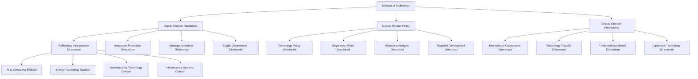

#### Ministry Responsibilities and Functions

**Technology Infrastructure Directorate**
- AI and computing infrastructure development and oversight
- Energy technology planning, implementation, and regulation
- Manufacturing technology promotion and industrial policy
- Digital infrastructure standards and deployment coordination

**Innovation Promotion Directorate**
- Startup ecosystem development and venture capital promotion
- University-industry collaboration and technology transfer
- Innovation park development and management oversight
- Entrepreneurship education and skill development programs

**Strategic Industries Directorate**
- Mining technology advancement and automation promotion
- Defense technology development and strategic capabilities
- Critical infrastructure protection and cybersecurity coordination
- Strategic asset management and sovereign control enforcement

**Technology Policy Directorate**
- National technology strategy development and implementation
- Regulatory framework design and coordination with other ministries
- Economic impact analysis and policy evaluation
- Technology foresight and strategic planning

### Independent Authorities and Agencies

#### National AI Authority
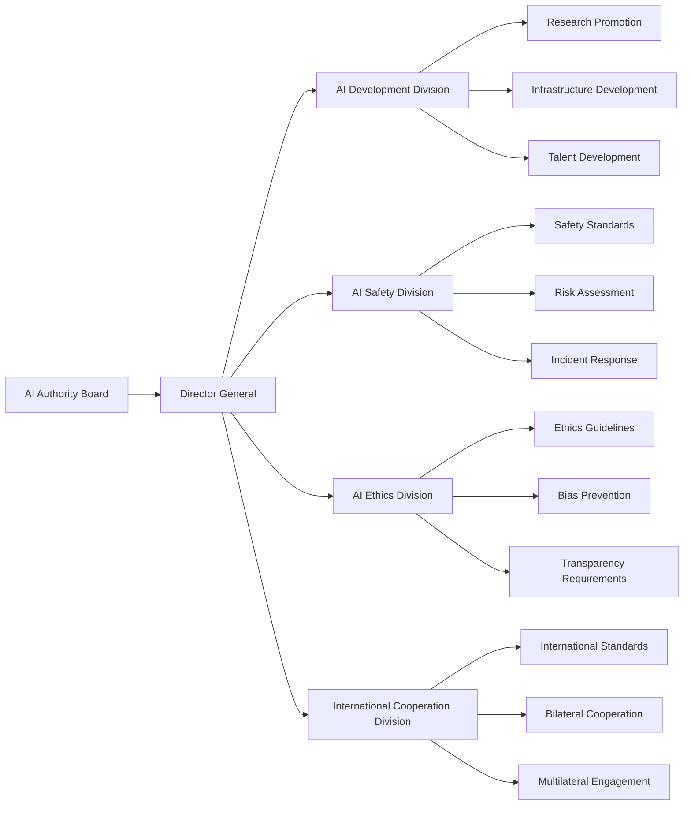

**Governance Structure**:
- **Board Composition**: 7 members (3 government, 2 industry, 2 academic)
- **Director General**: International AI expert with 5-year term
- **Advisory Council**: Representatives from all stakeholder groups
- **Budget**: $100M annual budget for operations and programs
- **Staff**: 300 professionals by 2030

**Key Responsibilities**:
- AI development strategy and implementation coordination
- Safety standards development and enforcement
- Ethics guidelines and bias prevention protocols
- International cooperation and standards participation

#### Nuclear Regulatory Authority (FANR Model)
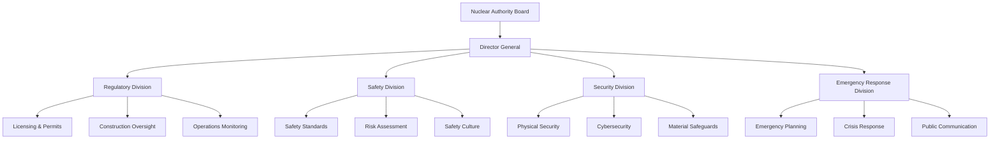

**International Advisory Support**:
- **UAE FANR**: Regulatory framework development assistance
- **Korean KINS**: Safety review and oversight support
- **IAEA**: International standards and best practices
- **US NRC**: Advanced safety technologies and procedures

#### Sovereign Wealth Fund Authority
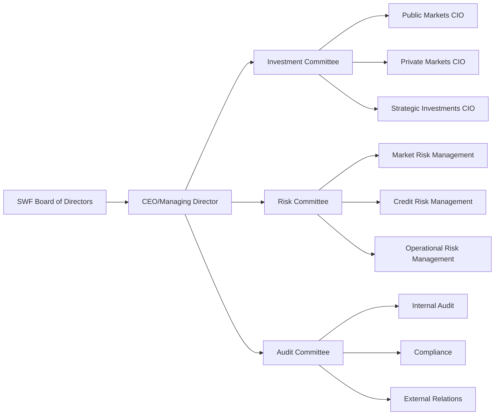

**Governance Model (Singapore GIC Adaptation)**:
- **Board Independence**: Independent directors with international experience
- **Professional Management**: Fund managers with global institutional experience
- **Performance Standards**: Benchmark-relative and absolute return targets
- **Risk Management**: Comprehensive risk framework and monitoring
- **Transparency**: Annual public reporting with international standards

## Legislative Branch Integration

### National Technology Development Council

#### Composition and Structure
```mermaid
graph TD
    A[National Technology Council] --> B[Government Representatives]
    A --> C[Legislative Representatives]
    A --> D[Private Sector Leaders]
    A --> E[Academic Representatives]
    A --> F[Civil Society Representatives]
    
    B --> B1[Minister of Technology]
    B --> B2[Minister of Economy]
    B --> B3[Minister of Energy]
    B --> B4[Minister of Education]
    
    C --> C1[Congress Technology Committee Chair]
    C --> C2[Opposition Technology Spokesperson]
    C --> C3[Regional Representative]
    C --> C4[Indigenous Representative]
    
    D --> D1[Major Corporation CEOs]
    D --> D2[Startup Ecosystem Leaders]
    D --> D3[International Investors]
    D --> D4[Technology Entrepreneurs]
    
    E --> E1[University Rectors]
    E --> E2[Research Institute Directors]
    E --> E3[International Academic Advisors]
    E --> E4[Innovation Center Leaders]
```

#### Functions and Responsibilities
- **Strategic Oversight**: Long-term technology strategy review and approval
- **Cross-Party Consensus**: Bipartisan support for technology development
- **Resource Allocation**: Major investment decision review and recommendation
- **Performance Monitoring**: Progress assessment and course correction
- **International Coordination**: Strategic partnership evaluation and approval

### Congressional Oversight Mechanisms

#### Technology Development Committee
- **Membership**: 15 members (8 majority, 7 minority)
- **Jurisdiction**: Technology policy, innovation funding, regulatory oversight
- **Powers**: Budget approval, ministry oversight, international agreement review
- **Meetings**: Monthly sessions with quarterly public hearings
- **Staff**: 25 professional staff with technology expertise

#### Sovereign Wealth Fund Oversight Committee
- **Membership**: 9 members (5 majority, 4 minority)
- **Jurisdiction**: Fund performance, investment strategy, risk management
- **Powers**: Quarterly reporting review, management evaluation, policy guidance
- **Meetings**: Quarterly sessions with annual public assessment
- **Independence**: Access to independent financial and performance analysis

## Judicial Branch Framework

### Technology Court System

#### Specialized Technology Courts
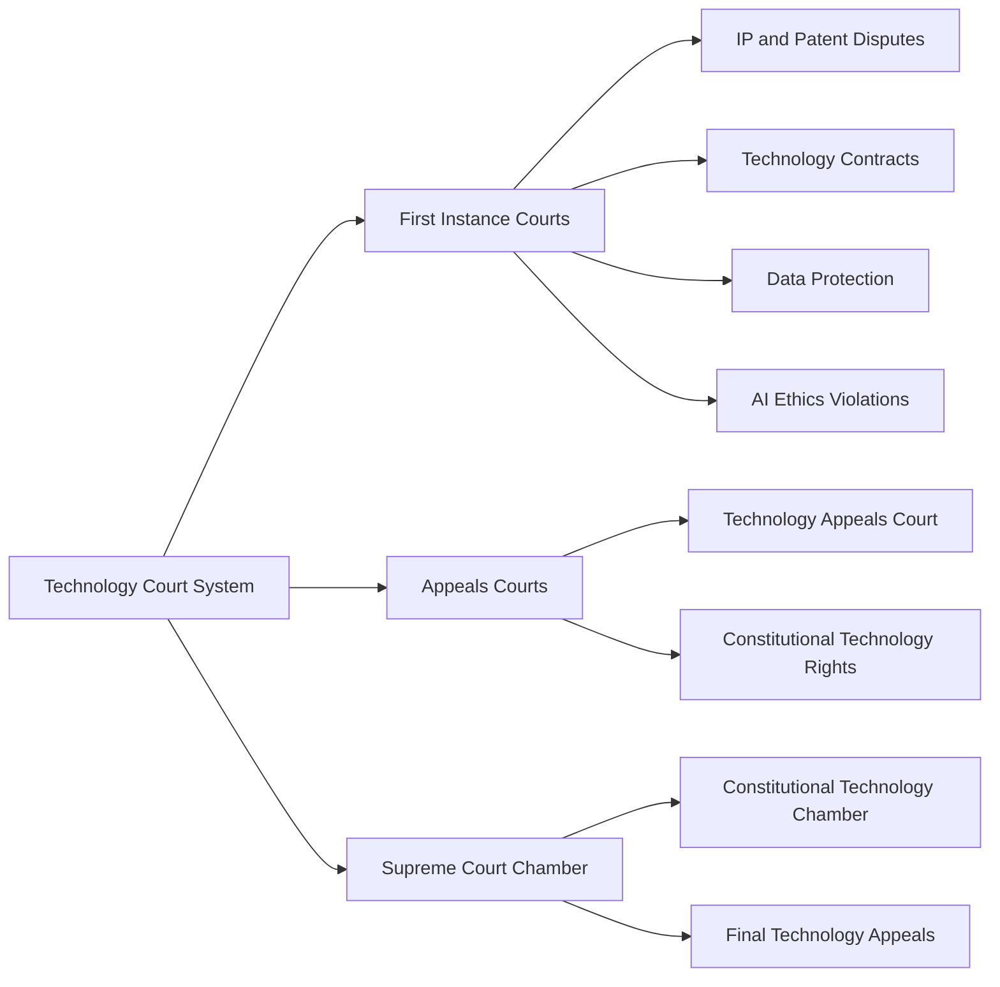

#### Judicial Expertise Development
- **Specialized Training**: Technology law and policy education for judges
- **International Exchange**: Best practices from technology courts globally
- **Technical Advisors**: Expert witnesses and technical advisory panels
- **Continuous Education**: Regular updates on technology developments

### Constitutional Court Technology Chamber

#### Technology Rights Protection
- **Constitutional Review**: Technology-related legislation and policy review
- **Rights Enforcement**: Individual and collective technology rights protection
- **Institutional Protection**: Sovereign Wealth Fund and institution safeguards
- **International Compliance**: Treaty and agreement constitutional compatibility

## Regional and Local Governance

### Regional Technology Development Councils

#### Regional Governance Structure
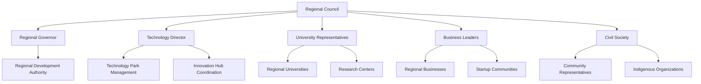

#### Regional Responsibilities
- **Implementation Coordination**: National strategy regional adaptation
- **Resource Allocation**: Regional technology investment distribution
- **University Integration**: Regional higher education coordination
- **Community Engagement**: Local stakeholder participation and consultation
- **Cultural Integration**: Indigenous knowledge and cultural preservation

### Technology Special Economic Zones

#### Lima Innovation District
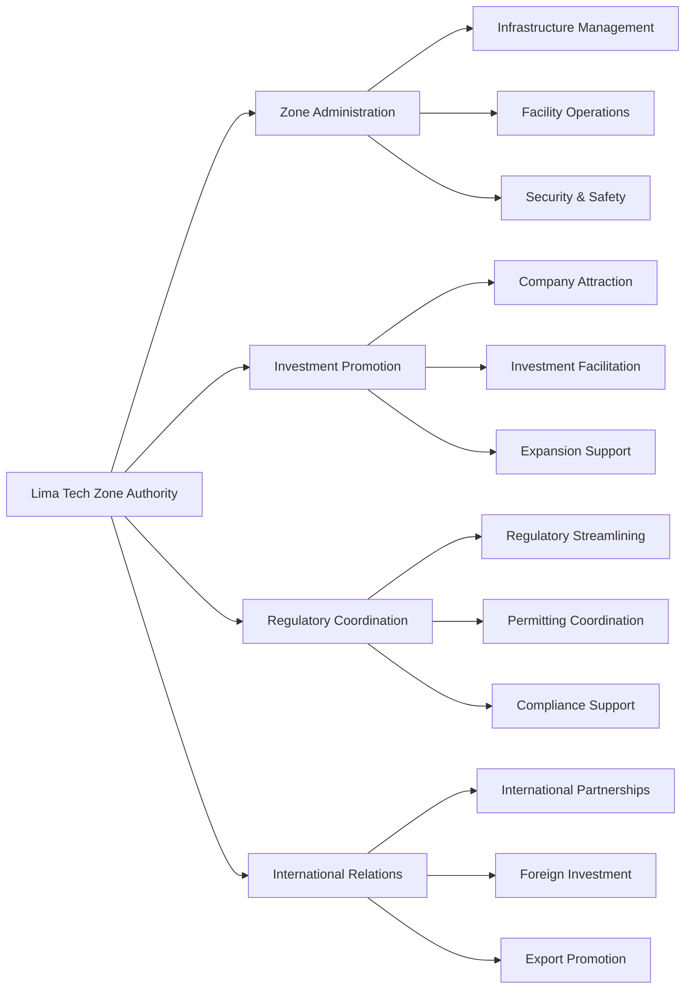

**Governance Features**:
- **Autonomous Administration**: Independent zone management authority
- **One-Stop Service**: Integrated government services and permitting
- **Special Regulations**: Streamlined procedures and requirements
- **Tax Incentives**: Reduced corporate and personal tax rates
- **Infrastructure**: World-class digital and physical infrastructure

## International Cooperation Framework

### Bilateral Technology Partnership Management

#### Strategic Partnership Coordination
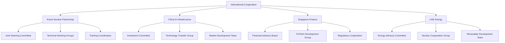

#### Partnership Governance Mechanisms
- **Joint Steering Committees**: High-level strategic coordination
- **Technical Working Groups**: Operational implementation oversight
- **Regular Reviews**: Annual partnership assessment and adjustment
- **Dispute Resolution**: Mechanisms for partnership conflict resolution
- **Performance Monitoring**: Objective metrics and accountability systems

### Multilateral Engagement Strategy

#### International Organization Participation
- **OECD Technology Committee**: Advanced economy technology cooperation
- **UN AI Governance**: Global AI governance standards development
- **International Energy Agency**: Energy technology cooperation
- **WTO Technology Trade**: Technology trade rules and dispute resolution

#### Regional Leadership Initiatives
- **Latin American AI Council**: Regional AI development coordination
- **Pacific Alliance Innovation**: Technology cooperation framework
- **Andean Technology Integration**: Regional technology standards harmonization
- **Global South Technology Forum**: Developing country technology advocacy

## Accountability and Transparency Framework

### Public Accountability Mechanisms

#### Transparency Requirements
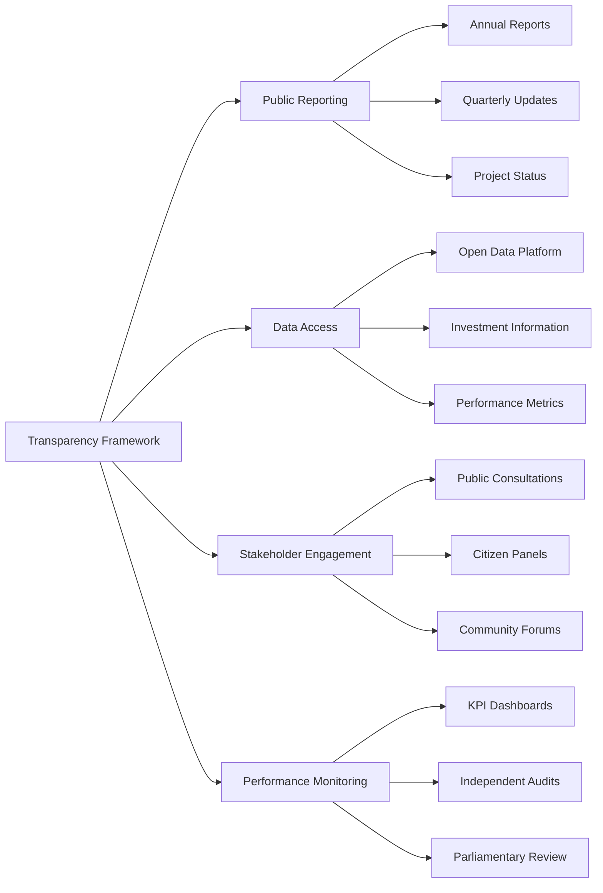

#### Performance Measurement and Evaluation
- **Key Performance Indicators**: Quantitative metrics for all major initiatives
- **Independent Evaluation**: External assessment by international experts
- **Public Dashboards**: Real-time progress monitoring and public access
- **Annual Parliamentary Review**: Comprehensive congressional assessment
- **Citizen Feedback**: Mechanisms for public input and complaint resolution

### Anti-Corruption and Integrity Framework

#### Integrity Safeguards
- **Blockchain Transparency**: All major transactions recorded on blockchain
- **International Oversight**: Independent monitoring by international organizations
- **Professional Standards**: International best practices for public service
- **Whistleblower Protection**: Legal protection for corruption reporting
- **Regular Audits**: Continuous internal and external audit programs

## Risk Management and Crisis Response

### Institutional Risk Management

#### Political Risk Mitigation
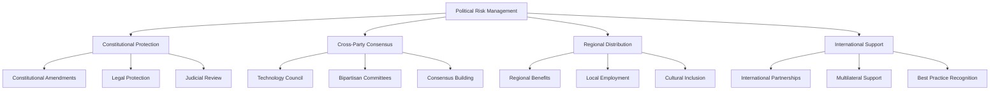

#### Crisis Response Protocols
- **Economic Crisis**: Counter-cyclical investment and support mechanisms
- **Political Instability**: Constitutional protection and international support
- **Technology Disruption**: Adaptive capacity and continuous innovation
- **Security Threats**: Cybersecurity and physical security protocols
- **Natural Disasters**: Business continuity and disaster recovery plans

### Institutional Adaptation and Evolution

#### Continuous Improvement Framework
- **Regular Review**: Annual institutional performance assessment
- **International Benchmarking**: Comparison with global best practices
- **Stakeholder Feedback**: Regular consultation with all stakeholder groups
- **Adaptive Management**: Flexibility to adjust to changing circumstances
- **Innovation Culture**: Continuous improvement and innovation in governance

---

*This institutional framework provides the governance foundation for Peru's technological transformation. Success requires strong institutions, transparent processes, and sustained political commitment to long-term development goals.*
