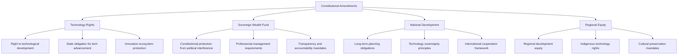
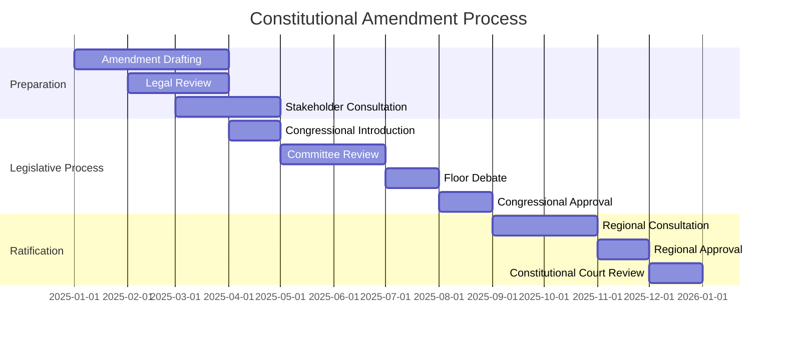
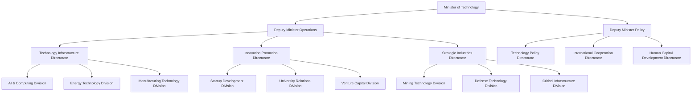
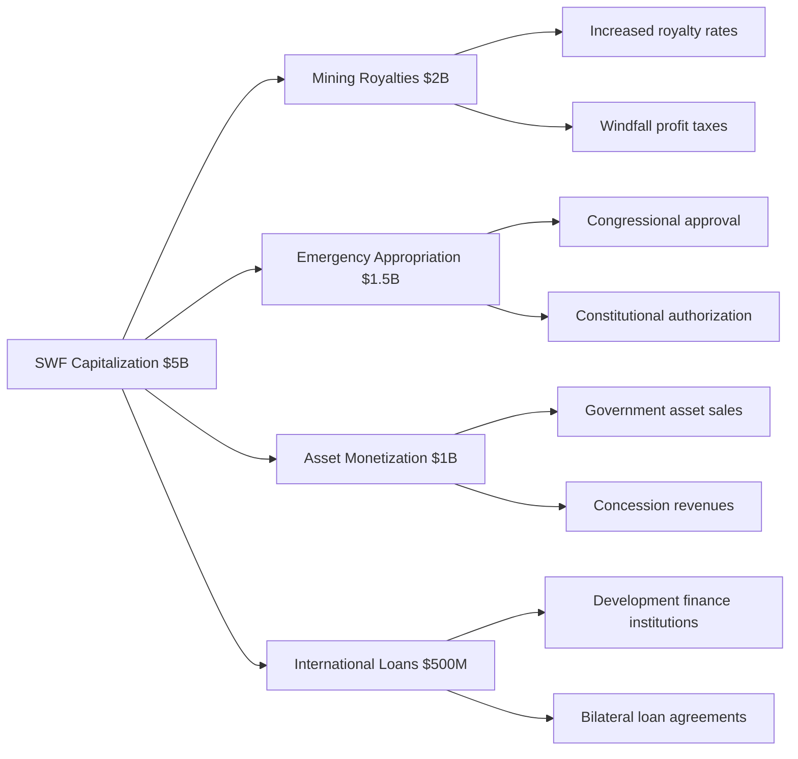
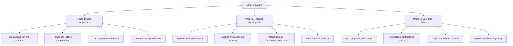
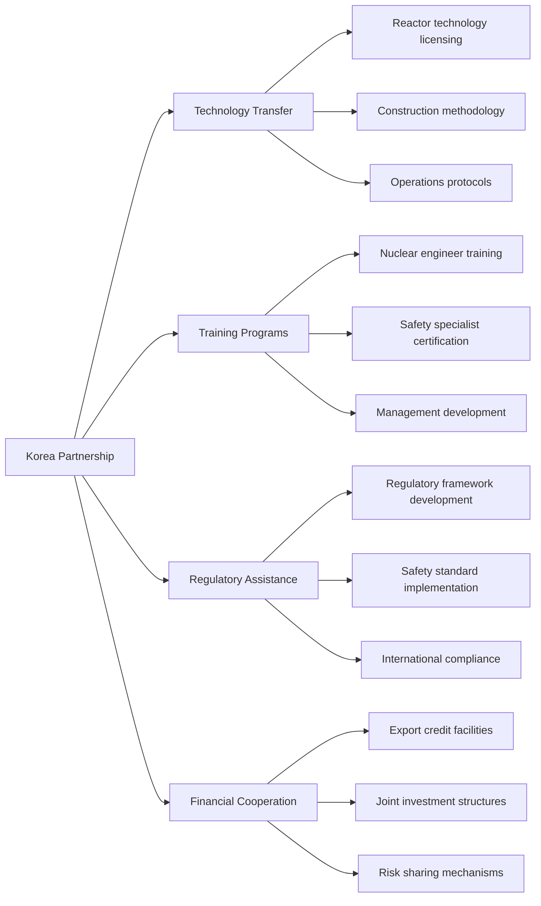
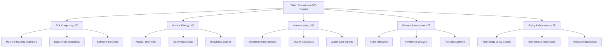
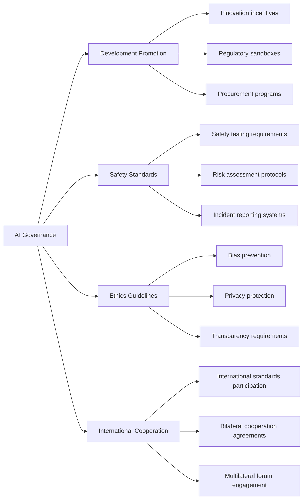
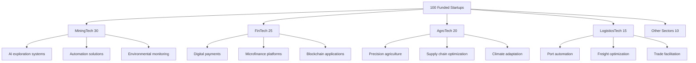

# Phase 1: Foundation and Institutional Development (2025-2027)

This document outlines the critical first phase of Peru's technological transformation, establishing the institutional, legal, and financial foundations necessary for long-term success.

## Strategic Objectives

### Primary Goals
- **Constitutional Protection**: Embed technological sovereignty in national constitution
- **Institutional Framework**: Create robust institutions for technology development
- **Financial Foundation**: Establish and capitalize Sovereign Wealth Fund
- **International Partnerships**: Secure strategic technology transfer agreements
- **Infrastructure Initiation**: Begin critical infrastructure development

### Success Metrics by 2027
- Constitutional amendments ratified
- $5B Sovereign Wealth Fund operational
- Nuclear regulatory framework established
- 500 international experts recruited
- First AI data center operational (1 PetaFLOP)
- 2 GW renewable energy under construction

## Year 1 (2025): Legal and Institutional Foundation

### Constitutional Amendment Process

#### Amendment Content Framework

#### Amendment Timeline (2025)

### Legislative Framework Development

#### Key Legislation Required

**National Technology Development Act**
- Technology development as national priority
- Government investment obligations and limits
- Private sector participation frameworks
- International cooperation authorities
- Regional development requirements

**Sovereign Wealth Fund Act**
- Fund establishment and governance structure
- Investment mandate and restrictions
- Professional management requirements
- Transparency and reporting obligations
- Parliamentary oversight mechanisms

**Foreign Investment in Strategic Technologies Act**
- Strategic sector definitions and protections
- Foreign investment screening processes
- Technology transfer requirements
- National security safeguards
- Ownership and control regulations

**Nuclear Energy Development Act**
- Nuclear regulatory authority establishment
- Safety and security standards
- International cooperation frameworks
- Waste management and disposal
- Emergency response protocols

### Institutional Establishment

#### Ministry of Technology and Innovation

#### National AI Authority
- **Mission**: Coordinate national AI development and governance
- **Structure**: Autonomous agency under Technology Ministry
- **Leadership**: International AI expert with domestic deputy
- **Budget**: $500M initial capitalization for 2025-2027
- **Staff**: 200 professionals by end of 2025

#### Nuclear Energy Commission (FANR Model)
- **Mission**: Nuclear safety regulation and development promotion
- **Structure**: Independent regulatory authority
- **Leadership**: Nuclear safety expert with international experience
- **International Support**: The commission's establishment will be supported by advisory assistance from the UAE's Federal Authority for Nuclear Regulation (FANR), leveraging its globally recognized experience in rapidly developing a safe and secure nuclear program (IAEA, 2018).
- **Staff**: 100 nuclear professionals by 2027

#### Sovereign Wealth Fund Authority
- **Mission**: Professional management of national investment fund
- **Structure**: Independent authority with board governance
- **Leadership**: International fund management professionals
- **Governance**: The governance structure will be adapted from Singapore's GIC model, which is recognized for its professional management and adherence to the Santiago Principles for transparency and accountability (GIC, 2023; IFSWF, 2008).
- **Initial Capitalization**: $5B from mining royalties and emergency appropriation

### Initial Investment Mobilization

#### Sovereign Wealth Fund Capitalization Strategy

#### Emergency Technology Infrastructure Appropriation
- **Total Amount**: $2B special appropriation
- **AI Infrastructure**: $800M for first data center
- **Nuclear Preparation**: $500M for regulatory and site development
- **Renewable Energy**: $400M for initial projects
- **Human Capital**: $300M for talent recruitment and training

## Year 2 (2026): Infrastructure Foundation and Partnerships

### Physical Infrastructure Development

#### Lima Technology Zone Development

#### First AI Data Center (1 PetaFLOP)
- **Location**: Lima Technology Zone
- **Capacity**: 1 PetaFLOP initial capacity
- **Power**: 50 MW dedicated renewable energy connection
- **Investment**: $800M construction and equipment
- **Timeline**: 18 months construction, operational by end 2026
- **Technology Partners**: This partnership leverages China's extensive experience in large-scale infrastructure construction and NVIDIA's market-leading GPU technology, which is critical for high-performance AI data centers (IoT Analytics, 2025).

#### Nuclear Site Preparation
- **Site Selection**: Coastal location with seismic safety
- **Environmental Assessment**: International standards compliance
- **Infrastructure Development**: Access roads, utilities, security
- **Regulatory Preparation**: Licensing and approval processes
- **Community Engagement**: Local consultation and benefit sharing

### International Partnership Formalization

#### Korea Nuclear Technology Partnership
The partnership centers on the APR1400 reactor, a Generation III+ design with advanced safety features that has been successfully licensed and deployed in multiple countries (KEPCO, n.d.).

**Agreement Structure**:
- **Technology Transfer**: $8B investment over 10 years
- **Capacity Building**: 1,000 Peruvian nuclear professionals trained
- **Regulatory Support**: KEPCO regulatory advisory services
- **Financial Terms**: Export credit with technology transfer requirements

#### China AI Infrastructure Partnership
- **Infrastructure Investment**: $4B Chinese investment commitment
- **Technology Transfer**: Data center construction, GPU procurement
- **Market Access**: Chinese companies Peru operations authorization
- **Knowledge Exchange**: Technical training, best practices sharing
- **Timeline**: 5-year strategic partnership with renewal options

#### Singapore Financial Services Cooperation
This cooperation leverages Singapore's status as a leading global financial hub and its expertise in FinTech development, cultivated through forward-looking regulation and strong government support (PwC, 2023).
- **Sovereign Wealth Fund**: Management advisory and co-investment
- **FinTech Development**: Technology transfer and market access
- **Regulatory Cooperation**: Financial services regulatory harmonization
- **Talent Exchange**: Professional development and knowledge sharing
- **Investment**: $1B Singapore investment fund commitment

### Human Capital Foundation

#### International Talent Recruitment Program

**Recruitment Strategy**:
- **Compensation**: Singapore/UAE competitive levels
- **Benefits**: Housing allowances, education support, tax incentives
- **Visa Process**: Fast-track work permits and residence
- **Career Development**: Leadership opportunities, equity participation

#### Peru Technology University Establishment
- **Mission**: World-class technology education and research
- **Structure**: Autonomous university with international partnerships
- **Programs**: Engineering, computer science, AI, nuclear engineering
- **Faculty**: 50% international, 50% domestic with international training
- **Students**: 5,000 students by 2027, merit-based admission
- **Research**: Applied research with industry partnerships

### Regulatory Framework Implementation

#### AI Governance Framework

#### Nuclear Regulatory Authority Operations
- **Licensing**: Nuclear facility licensing procedures
- **Safety Oversight**: Construction and operational safety monitoring
- **Security**: Nuclear material security and safeguards
- **Emergency Response**: Incident response and crisis management
- **International Compliance**: IAEA and bilateral agreement compliance

#### Startup-Friendly Business Environment
- **Company Registration**: 24-hour online incorporation
- **Tax Structure**: Progressive taxation with R&D incentives
- **Employment Law**: Flexible contracts for technology companies
- **IP Protection**: Fast-track patent and trademark registration
- **Government Procurement**: Startup participation preferences

## Year 3 (2027): Acceleration and Scale-Up

### Domestic Capability Expansion

#### Second AI Data Center (Additional 2 PetaFLOPs)
- **Location**: Regional hub (Arequipa or Trujillo)
- **Capacity**: 2 PetaFLOP capacity expansion
- **Specialization**: Commercial AI services, regional connectivity
- **Investment**: $1.2B including regional infrastructure
- **Timeline**: Operational by end 2027

#### First 100 Startups Funded

**Funding Structure**:
- **Average Investment**: $500K per startup
- **Total Funding**: $50M from National Growth Fund
- **Selection Criteria**: Market potential, team quality, technology innovation
- **Support Services**: Mentorship, market access, follow-on funding

#### Nuclear Construction Commencement
- **First Reactor**: Construction start for 2 GW reactor
- **Technology**: Korean APR1400 reactor technology
- **Timeline**: 6-year construction schedule
- **Employment**: 5,000 construction jobs, 500 permanent operations
- **Safety**: International oversight and monitoring

### Renewable Energy Development
- **Solar Projects**: 2 GW solar capacity under construction
- **Wind Projects**: 1 GW wind capacity development
- **Grid Integration**: Smart grid infrastructure development
- **Storage**: Battery storage pilot projects
- **Export Potential**: Regional energy trade preparation

### International Recognition and Cooperation

#### Regional Leadership Establishment
- **Latin American AI Council**: Peru leadership role
- **Pacific Alliance**: Technology cooperation initiatives
- **OECD Engagement**: Technology committee participation
- **UN Forums**: Digital governance and AI ethics leadership

#### Investment Attraction
- **Foreign Direct Investment**: $2B+ technology sector FDI
- **Venture Capital**: International VC fund establishment
- **Strategic Partnerships**: Corporate R&D center establishment
- **Diaspora Investment**: Return migration and investment programs

## Success Metrics and Evaluation

### 2027 Targets Achievement Assessment

#### Institutional Metrics
- **Constitutional Protection**: Amendments ratified and implemented
- **Sovereign Wealth Fund**: $5B AUM with professional management
- **Regulatory Framework**: All key institutions operational
- **International Partnerships**: 4+ strategic partnerships formalized

#### Infrastructure Metrics
- **Computing Capacity**: 3 PetaFLOPs operational
- **Energy Development**: 5 GW renewable capacity under development
- **Nuclear Progress**: Construction commenced, regulatory framework complete
- **Technology Zones**: Lima zone operational, regional sites prepared

#### Human Capital Metrics
- **International Experts**: 500 recruited and operational
- **University Programs**: Technology university operational
- **Student Pipeline**: 5,000 students in technology programs
- **Training Programs**: 10,000 professionals in training pipeline

#### Economic Metrics
- **Startup Ecosystem**: 100 funded startups, 3+ accelerators operational
- **Investment Attraction**: $5B+ total investment mobilized
- **Employment Creation**: 25,000 technology sector jobs
- **Export Development**: First AI services exports commenced

### Risk Mitigation Assessment

#### Political Stability
- **Constitutional Protection**: Achieved through amendment process
- **Cross-party Support**: Bipartisan technology development council
- **Regional Benefits**: All regions participating in development
- **Public Support**: Communication and education programs

#### Financial Sustainability
- **Revenue Sources**: Diversified funding portfolio established
- **International Support**: Multiple partnership commitments secured
- **Private Investment**: Co-investment structures operational
- **Cost Control**: Professional management and oversight systems

#### Implementation Capacity
- **Institutional Capability**: Professional institutions operational
- **Technical Expertise**: International and domestic talent combined
- **Project Management**: Proven delivery through initial projects
- **International Support**: Advisory and technical assistance secured

## Phase 1 Conclusion and Phase 2 Preparation

### Foundation Achievement Summary
By end of 2027, Peru will have established:
- **Constitutional and legal framework** protecting technological development
- **Professional institutions** capable of managing long-term development
- **Financial foundation** with $5B+ investment capacity
- **International partnerships** providing technology and investment
- **Initial infrastructure** demonstrating delivery capability
- **Human capital pipeline** for sustained development

### Phase 2 Preparation (2028-2032)
- **Scaling Strategy**: Infrastructure expansion and capability building
- **Market Development**: Commercial AI services and technology exports
- **Regional Leadership**: Latin American technology hub establishment
- **Economic Transformation**: GDP structure shift toward technology

---

## References

GIC. (2023). _Our Investment & Management Framework_. GIC.

International Atomic Energy Agency. (2018). _IAEA Integrated Nuclear Infrastructure Review (INIR) Mission to the United Arab Emirates_. IAEA.

International Forum of Sovereign Wealth Funds. (2008). _Sovereign Wealth Funds: Generally Accepted Principles and Practices ("Santiago Principles")_.

IoT Analytics. (2025). _Generative AI Market Report 2025–2030_.

Korea Electric Power Corporation. (n.d.). _The APR1400 Reactor_. KEPCO. Retrieved from https://home.kepco.co.kr/kepco/EN/G/htmlView/ENGBHP00102.do

PwC. (2023). _FinTech innovation in Singapore: Sustaining growth in uncertain times_. PwC Singapore.

*This document establishes the foundation for Peru's technological transformation. Success in Phase 1 is critical for achieving the ambitious goals of technological sovereignty and economic transformation outlined in the Peru 2040 strategy.*
