# Peru 2040: Strategic Technological Sovereignty
## A Comprehensive White Paper for National Transformation

---

## Table of Contents

1. [Executive Summary](#1-executive-summary)
2. [Strategic Context and Rationale](#2-strategic-context-and-rationale)
3. [International Models and Lessons](#3-international-models-and-lessons)
4. [Peru's Strategic Advantages](#4-perus-strategic-advantages)
5. [Technological Sovereignty Framework](#5-technological-sovereignty-framework)
6. [Detailed Sector Strategies](#6-detailed-sector-strategies)
7. [Modern Soft Power Strategy](#7-modern-soft-power-strategy)
8. [Implementation Roadmap](#8-implementation-roadmap)
9. [Financial Framework](#9-financial-framework)
10. [Risk Assessment and Mitigation](#10-risk-assessment-and-mitigation)
11. [Governance and Institutional Framework](#11-governance-and-institutional-framework)
12. [Conclusion and Call to Action](#12-conclusion-and-call-to-action)
13. [References](#13-references)

---

## 1. Executive Summary

### 1.1 Strategic Imperative

This white paper presents a comprehensive strategy for transforming Peru into Latin America's dominant technological, energy, and economic power by 2040. Drawing from successful rapid development models implemented by Saudi Arabia, Singapore, Thailand, and the UAE (Alshuwaikhat, 2019; Huat, 2017; Warr, 2021; Al-Aali et al., 2021), this plan demonstrates that Peru can achieve technological sovereignty through massive state investment, strategic partnerships, and unwavering political commitment.

### 1.2 The Binary Choice

Peru faces a binary choice between remaining a commodity-dependent middle-income economy or becoming a high-income technological powerhouse. This white paper argues that technological sovereignty—encompassing AI capabilities, nuclear energy, and advanced manufacturing—is not optional but essential for national security and prosperity in the 21st century (Klinger et al., 2020).

### 1.3 Key Findings

- **Resource Foundation**: Peru possesses the necessary resource base ($54.6 billion confirmed mining projects) to fund technological transformation (S&P Global Market Intelligence, 2024)
- **Proven Models**: International examples demonstrate rapid capability development is achievable within 15-20 years (World Bank, 2023)
- **Strategic Partnerships**: Technology transfer can accelerate development and reduce implementation time (OECD, 2022)
- **Execution Capability**: The Chancay port success validates Peru's capacity for large-scale infrastructure execution (COSCO SHIPPING Ports, 2024)

### 1.4 Investment Requirements

**Total Investment**: $93 billion over 15 years (equivalent to 15% of current GDP annually)

**Funding Sources**:
- Mining royalties and resource revenues: $45 billion (48%)
- Sovereign wealth fund returns: $25 billion (27%)
- Strategic international partnerships: $15 billion (16%)
- International development finance: $5 billion (5%)
- Government bond issuance: $3 billion (3%)

### 1.5 Projected Outcomes by 2040

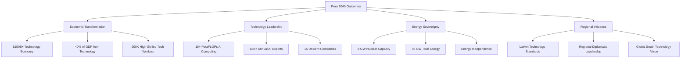

---

## 2. Strategic Context and Rationale

### 2.1 The 21st Century Reality

The global economy is undergoing a fundamental transformation driven by artificial intelligence, renewable energy, and advanced manufacturing (Schwab, 2017). Nations that control these technologies will dominate global value chains, while those that remain dependent on raw material exports will face perpetual economic subordination (UNCTAD, 2021).

### 2.2 The Commodity Trap

Peru currently finds itself at a critical juncture. Despite being among the world's top producers of copper, silver, gold, and lithium—all essential materials for the technology revolution—Peru captures minimal value from these resources (USGS, 2024).

#### 2.2.1 Current Economic Vulnerabilities

| Vulnerability | Impact | Evidence |
|---------------|--------|----------|
| **Export Dependency** | Price volatility exposure | 63.9% of exports are minerals (BCRP, 2024) |
| **Limited Value Addition** | Low profit margins | Most exports are raw/semi-processed (Ministry of Energy and Mines, 2024) |
| **Technological Dependence** | Strategic vulnerability | Critical infrastructure relies on foreign suppliers (CEPLAN, 2023) |
| **Human Capital Flight** | Reduced innovation capacity | High-skilled workforce emigrates (IOM, 2023) |

### 2.3 The Strategic Imperative

Technological sovereignty has become a national security imperative (Baldwin, 2020). Countries without indigenous capabilities in AI, nuclear energy, and advanced manufacturing face:

#### 2.3.1 Economic Subordination
- Permanent position as raw material suppliers
- Vulnerability to commodity price volatility
- Limited policy options for economic development
- Inability to capture value from domestic resources

#### 2.3.2 Security Vulnerabilities
- Dependence on foreign technology for critical infrastructure
- Communications and data systems subject to foreign control
- Energy systems vulnerable to supply disruptions
- Defense capabilities dependent on foreign suppliers

#### 2.3.3 Political Constraints
- Limited policy autonomy due to economic dependencies
- Vulnerability to economic coercion by advanced nations
- Inability to pursue independent foreign policy
- Domestic instability due to economic underdevelopment

### 2.4 Historical Precedent for Rapid Transformation

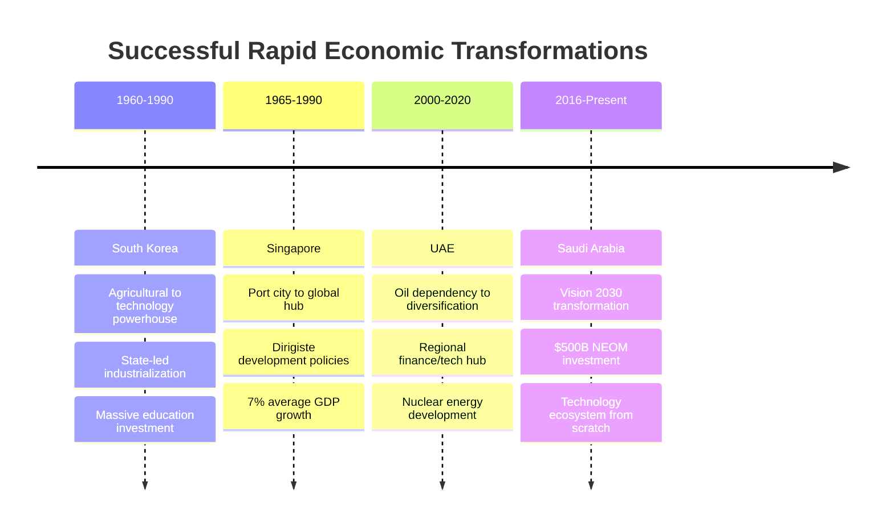

---

## 3. International Models and Lessons

### 3.1 The Saudi Arabia Model: Vision 2030 and NEOM

Saudi Arabia's Vision 2030 represents the most ambitious economic transformation program currently underway (Saudi Vision 2030, 2016). The kingdom is investing over $500 billion in the NEOM megacity project alone (NEOM, 2023; McKinsey Global Institute, 2022), demonstrating that resource-rich nations can fund technological leapfrogging at unprecedented scale.

#### 3.1.1 Key Success Factors

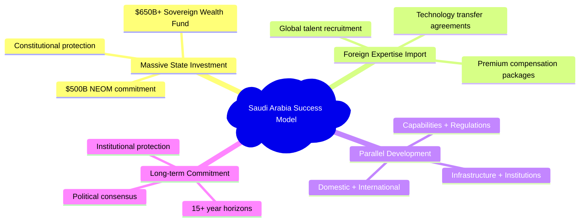

#### 3.1.2 Relevant Lessons for Peru

Saudi Arabia proves that even countries heavily dependent on single commodities can rapidly build diversified, technology-intensive economies through strategic state investment (Hertog, 2021). The NEOM project specifically demonstrates that entirely new cities and economic zones can be created from scratch when sufficient capital and political will exist (Al-Kibsi et al., 2015).

### 3.2 The Singapore Model: State-Led Technological Development

Singapore's transformation from developing to developed nation status within 25 years provides the clearest template for state-led technological development (Lee, 2000). The city-state achieved average GDP growth of 7% from independence through 2000, primarily through strategic government intervention in technology development (Huff, 1995).

#### 3.2.1 Strategic Approaches

| Approach | Implementation | Results |
|----------|----------------|---------|
| **Whole-of-Government Coordination** | Multiple agencies working toward tech objectives | Unified policy implementation |
| **Co-Investment Strategy** | Government funds + private VC | Thriving startup ecosystem |
| **Technology Adoption Leadership** | Government as first adopter | Market confidence and standards |
| **Human Capital Investment** | Education spending + foreign talent | Skilled workforce development |
| **Regulatory Innovation** | Sandbox approaches | Emerging technology facilitation |

#### 3.2.2 AI Development Strategy

Singapore allocated $18.8 billion for R&D through 2025, focusing specifically on AI capabilities (Smart Nation Singapore, 2019):

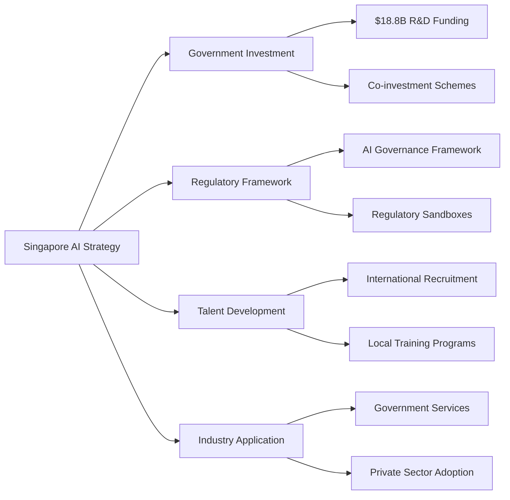

### 3.3 The Thailand 4.0 Model: Innovation-Driven Economy

Thailand's Thailand 4.0 initiative aims to transform the country from a middle-income manufacturing hub to an innovation-driven economy by 2027 (Royal Thai Government, 2017).

#### 3.3.1 Implementation Framework

- **Sector Focus**: 10 strategic industries including automotive technology, smart electronics, biotechnology (Board of Investment of Thailand, 2018)
- **Government Investment**: $216 million across 68 government agencies for AI initiatives (National Science and Technology Development Agency, 2020)
- **University-Industry Integration**: Mandatory collaboration between institutions and private sector (Ministry of Higher Education, Science, Research and Innovation, 2019)
- **Regional Development**: Eastern Economic Corridor as primary innovation hub (EEC Office, 2020)
- **Talent Development**: STEM education and technical training emphasis (Office of the Education Council, 2018)

#### 3.3.2 Targets and Timeline

| Metric | 2027 Target | Investment | Status |
|--------|-------------|------------|--------|
| Innovation Enterprises | 1,000 | $2B+ | In Progress |
| Unicorn Companies | 5 | $500M+ | 2 Achieved |
| R&D Spending | 2% of GDP | Government + Private | 1.2% Current (NSTDA, 2023) |
| Tech Employment | 500K | Education Reform | 300K Current (NSO, 2023) |

### 3.4 The UAE Nuclear Model: Rapid Capability Development

The UAE's nuclear program represents the fastest successful development of nuclear capability in modern history (FANR, 2020). From initial decision in 2008 to operational reactors by 2020, the UAE achieved energy sovereignty in just 12 years (Emirates Nuclear Energy Corporation, 2020).

#### 3.4.1 Success Framework

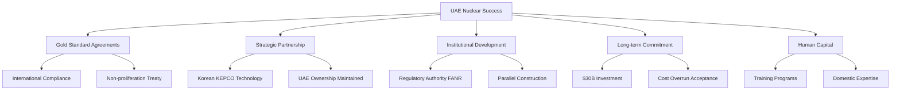

#### 3.4.2 Timeline and Achievements

- **2008**: Initial decision and policy framework (UAE Government, 2008)
- **2009**: "Gold Standard" US-UAE 123 Agreement (U.S. Department of State, 2009)
- **2010**: Korean KEPCO partnership selection (KEPCO, 2010)
- **2012**: Construction commencement (ENEC, 2012)
- **2020**: First reactor operational (FANR, 2020)
- **2024**: All 4 reactors operational (5.6 GW capacity) (ENEC, 2024)

---

## 4. Peru's Strategic Advantages

### 4.1 Natural Resource Endowment

Peru possesses one of the world's most significant mineral resource bases, providing a robust foundation for funding technological transformation (USGS, 2024).

#### 4.1.1 Proven Reserves and Production

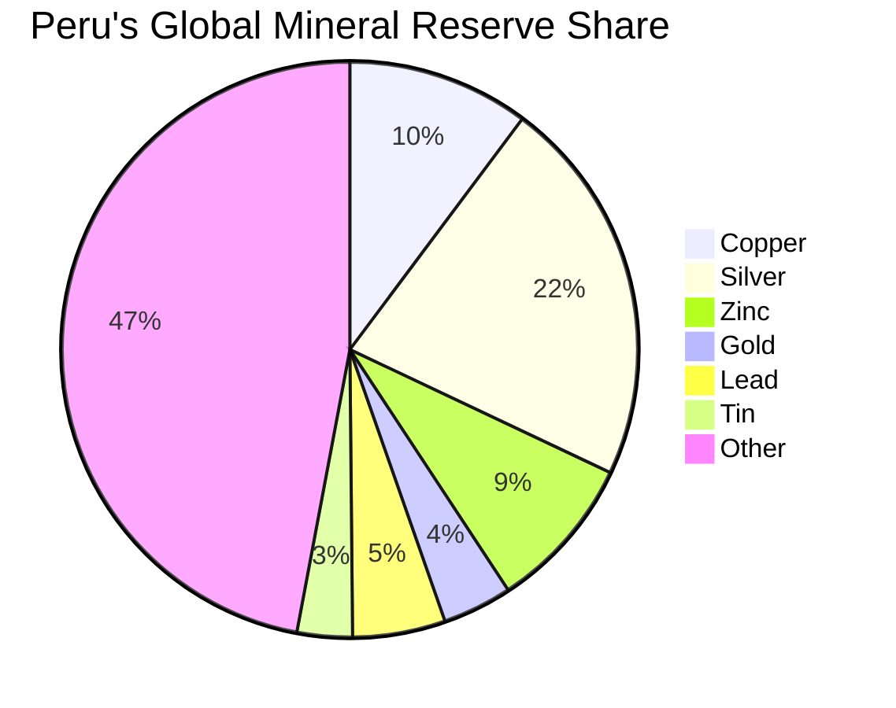

| Mineral | World Reserve Share | Global Production Rank | Annual Production |
|---------|-------------------|-------------------|------------------|
| **Copper** | 10.2% | 2nd | 2.76 million tons (USGS, 2024) |
| **Silver** | 21.8% | 1st | Largest globally (Silver Institute, 2024) |
| **Gold** | 3.9% | 8th | Significant producer (World Gold Council, 2024) |
| **Zinc** | 8.7% | 2nd | Major global supplier (International Lead and Zinc Study Group, 2024) |
| **Lithium** | 6+ million tons | Emerging | Critical for batteries (U.S. Geological Survey, 2024) |

#### 4.1.2 Investment Pipeline

**Confirmed Projects**: $54.6 billion in approved mining investments provides immediate funding source for technological transformation (S&P Global Market Intelligence, 2024).

### 4.2 Geographic Strategic Position

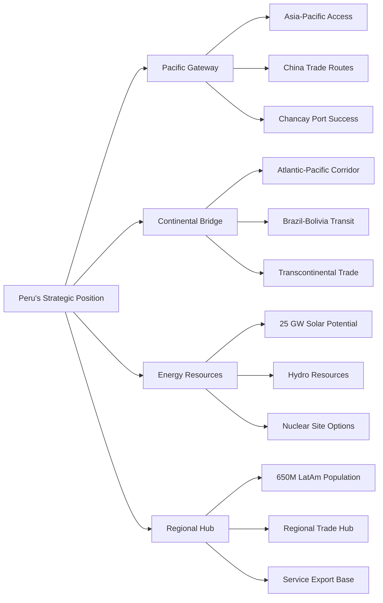

### 4.3 Proven Execution Capability

#### 4.3.1 Chancay Port Success Metrics

The successful development of Chancay port demonstrates Peru's ability to execute large-scale infrastructure projects (COSCO SHIPPING Ports, 2024):

| Metric | Achievement | Strategic Importance |
|--------|-------------|---------------------|
| **Investment** | $3.6 billion completed | Large-scale project management |
| **Partnership** | Chinese-Peruvian cooperation | International collaboration |
| **Timeline** | Completed on schedule | Execution reliability |
| **Revenue** | $4.5 billion annual projected | Economic impact generation |
| **Employment** | 8,000+ direct jobs | Workforce development |
| **Technology** | COSCO shipping leadership | Advanced logistics integration |

### 4.4 Existing Strategic Partnerships

Peru maintains diplomatic and economic relationships with all major technological powers:

```mermaid
graph TD
    A[Peru Strategic Partnerships] --> B[China]
    A --> C[United States]
    A --> D[Korea]
    A --> E[European Union]
    A --> F[Japan]
    
    B --> B1[$36B Annual Trade]
    B --> B2[Chancay Port Success]
    B --> B3[AI Infrastructure Potential]
    
    C --> C1[Security Cooperation]
    C --> C2[Technology Transfer]
    C --> C3[Development Finance]
    
    D --> D1[Nuclear Technology]
    D --> D2[KEPCO Partnership Model]
    D --> D3[Training Programs]
    
    E --> E1[Trade Agreements]
    E --> E2[Development Cooperation]
    E --> E3[Environmental Standards]
    
    F --> F1[Technology Investment]
    F --> F2[Manufacturing Partnership]
    F --> F3[Innovation Cooperation]
```

### 4.5 Human Capital Foundation

#### 4.5.1 Demographic and Educational Advantages

| Advantage | Current Status | Potential |
|-----------|---------------|-----------|
| **Educational Infrastructure** | Established universities | Rapid tech specialization |
| **Diaspora Network** | Large skilled population abroad | Repatriation opportunity |
| **Youth Demographics** | Median age 31 | Technology sector workforce |
| **Multilingual Capacity** | Spanish-English capability | International partnerships |
| **Cultural Diversity** | Indigenous + multicultural | Innovation and creativity |

---

## 5. Technological Sovereignty Framework

### 5.1 Definition and Strategic Importance

Technological sovereignty refers to a nation's ability to independently develop, control, and deploy critical technologies without dependence on foreign entities (Edler & James, 2015). This encompasses indigenous capabilities in artificial intelligence, nuclear energy, advanced manufacturing, and digital infrastructure (European Commission, 2020).

### 5.2 Core Technology Domains

#### 5.2.1 Artificial Intelligence and Computing Infrastructure

**Strategic Objective**: Establish Peru as Latin America's AI computing hub with sovereign model development capabilities (Brynjolfsson & McAfee, 2017).

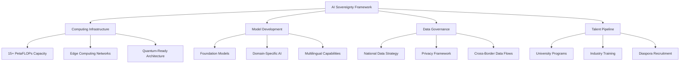

**Implementation Timeline**:
- **2025-2027**: Basic GPU cluster deployment (1 PetaFLOP)
- **2028-2032**: Scale to regional leadership (10+ PetaFLOPs)
- **2033-2040**: Advanced AI export capabilities (15+ PetaFLOPs)

#### 5.2.2 Nuclear Energy Development

**Strategic Objective**: Achieve energy independence through indigenous nuclear capabilities, following the UAE model but adapted to Peru's geographic and resource advantages (IAEA, 2020).

**Development Phases**:

| Phase | Timeline | Investment | Capability |
|-------|----------|------------|------------|
| **Foundation** | 2025-2028 | $2B | Regulatory framework, human capital |
| **Partnership** | 2027-2030 | $8B | First reactor construction |
| **Expansion** | 2030-2035 | $15B | Multi-reactor deployment |
| **Mastery** | 2035-2040 | $5B | Indigenous capability development |

**Technology Transfer Strategy**: Partner with France (EDF), Korea (KEPCO), or Canada (CANDU) for initial reactors while building domestic expertise (World Nuclear Association, 2023).

#### 5.2.3 Advanced Manufacturing and Materials

**Strategic Objective**: Transform raw material exports into high-value manufactured goods through automation and advanced production techniques (McKinsey Global Institute, 2021).

**Priority Sectors**:
- **Semiconductor components**: Leveraging copper and rare earth resources
- **Battery manufacturing**: Utilizing lithium reserves for regional supply chains
- **Precision instruments**: Building on mining equipment expertise
- **Aerospace components**: Developing lightweight materials capabilities

### 5.3 Digital Infrastructure Backbone

#### 5.3.1 National Computing Grid

**Architecture**: Distributed computing infrastructure connecting major cities with redundant connectivity and edge computing capabilities (Cisco, 2021).

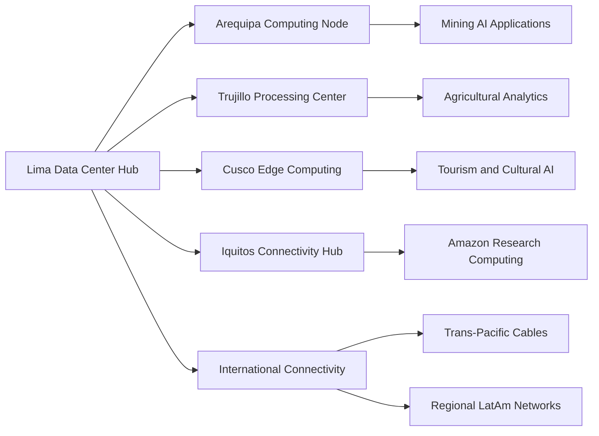

**Technical Specifications**:
- **Primary Hub**: Lima with 5+ PetaFLOP capacity
- **Regional Nodes**: 4 cities with 1+ PetaFLOP each
- **Edge Computing**: 20+ smaller installations for local processing
- **Connectivity**: Redundant fiber optic networks with 99.99% uptime

#### 5.3.2 Sovereign Cloud Services

**Objective**: Provide cloud computing services across Latin America while maintaining data sovereignty and regulatory compliance (Gartner, 2022).

**Service Portfolio**:
- **Infrastructure as a Service (IaaS)**: Competing with AWS, Azure, Google Cloud
- **Platform as a Service (PaaS)**: Development platforms for regional startups
- **Software as a Service (SaaS)**: Government and enterprise applications
- **AI as a Service (AIaaS)**: Machine learning models and training capabilities

### 5.4 Innovation Ecosystem Development

#### 5.4.1 Research and Development Framework

**Investment Allocation**: 3% of GDP in R&D by 2030, rising to 5% by 2040 (OECD average: 2.4%) (OECD, 2023).

**Institutional Structure**:

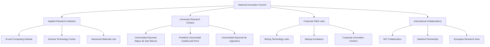

#### 5.4.2 Startup and Venture Ecosystem

**Government Role**: Catalytic investor and market maker, not direct operator (Mazzucato, 2015).

**Support Mechanisms**:
- **National Startup Fund**: $500M government commitment with 3:1 private leverage
- **Public Procurement**: Guaranteed early customers for B2G startups
- **Regulatory Sandboxes**: Fast-track approval for innovative technologies
- **Tax Incentives**: R&D tax credits and startup-friendly incorporation laws

**Target Outcomes by 2040**:
- 15+ unicorn companies valued over $1B each
- 500+ high-growth technology companies
- $50B+ total startup ecosystem valuation
- 200K+ direct technology employment

---

## 6. Detailed Sector Strategies

### 6.1 Energy Infrastructure and Nuclear Development

#### 6.1.1 Balanced Energy Portfolio Strategy

**Target Energy Mix by 2040** (Total: 45 GW capacity):

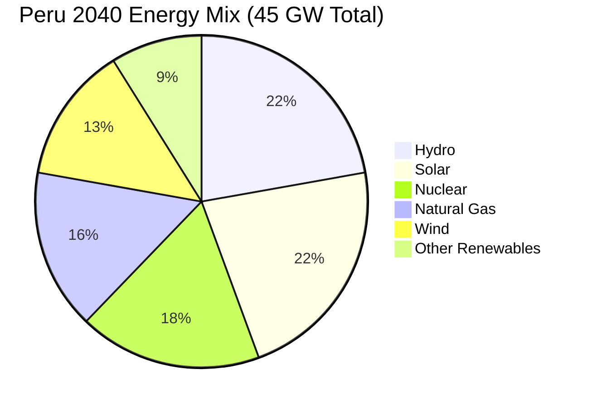

| Energy Source | 2024 Capacity | 2040 Target | Investment Required | Strategic Rationale |
|---------------|---------------|-------------|-------------------|-------------------|
| **Hydro** | 5.2 GW | 10 GW | $8B | Proven technology, abundant resources (Ministerio de Energía y Minas, 2024) |
| **Solar** | 1.1 GW | 10 GW | $12B | Excellent irradiation, cost competitiveness (IRENA, 2023) |
| **Nuclear** | 0 GW | 8 GW | $30B | Energy security, baseload power (IEA, 2023) |
| **Natural Gas** | 3.8 GW | 7 GW | $5B | Existing infrastructure, transition fuel |
| **Wind** | 0.4 GW | 6 GW | $7B | Coastal potential, technology maturity |
| **Other** | 0.3 GW | 4 GW | $3B | Biomass, geothermal diversification |

#### 6.1.2 Nuclear Energy Roadmap

**Phase 1: Foundation (2025-2028)**
- Establish Nuclear Regulatory Authority (modeled after UAE's FANR)
- International safeguards agreement (IAEA Additional Protocol)
- Site selection and environmental impact assessments
- Human capital development (500+ nuclear engineers)
- Total Investment: $2B

**Phase 2: First Reactors (2028-2033)**
- Technology transfer partnership (Korea, France, or Canada preferred)
- Construction of 2×1.4 GW reactors (2.8 GW total)
- Domestic supply chain development
- Operational expertise building
- Total Investment: $12B

**Phase 3: Scale and Localization (2033-2040)**
- Additional 4×1.4 GW reactors (5.6 GW additional)
- Indigenous engineering and construction capabilities
- Regional nuclear fuel cycle services
- Export of nuclear technology and expertise
- Total Investment: $16B

**International Partnership Strategy**: Following the UAE's "Gold Standard" approach, Peru will maintain transparent, non-proliferation focused nuclear development (FANR, 2020).

#### 6.1.3 Grid Modernization and Smart Infrastructure

**Smart Grid Investment**: $8B over 15 years for intelligent electricity distribution and management (U.S. Department of Energy, 2021).

**Key Components**:
- Advanced metering infrastructure (AMI) for all customers
- Demand response systems for industrial and commercial users
- Electric vehicle charging infrastructure (10,000+ stations)
- Grid-scale battery storage (5 GWh capacity)
- Microgrids for remote communities and industrial zones

### 6.2 Mining Technology and Resource Processing

#### 6.2.1 Industry 4.0 Transformation

**Objective**: Transform Peru's mining sector into the world's most technologically advanced through AI, automation, and environmental excellence (PwC, 2020).

**Technology Integration Timeline**:

| Technology | 2025-2027 | 2028-2032 | 2033-2040 |
|------------|-----------|-----------|-----------|
| **Autonomous Vehicles** | Pilot programs | 50% of large mines | 100% deployment |
| **AI-Powered Exploration** | Basic implementation | Predictive modeling | Real-time optimization |
| **Remote Operations** | Control center setup | Multi-mine operations | Fully autonomous mines |
| **Environmental Monitoring** | IoT sensor networks | AI-driven compliance | Ecosystem integration |
| **Predictive Maintenance** | Equipment monitoring | Fleet optimization | Zero unplanned downtime |

#### 6.2.2 Downstream Processing Development

**Strategic Objective**: Capture value addition from raw materials through domestic processing and manufacturing (UNCTAD, 2019).

**Priority Processing Capabilities**:

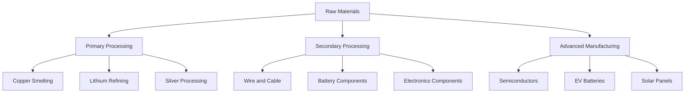

**Investment Requirements**:
- **Lithium processing facilities**: $3B investment for battery-grade lithium production
- **Copper manufacturing**: $2B for wire, cable, and precision component production
- **Electronics assembly**: $1.5B for regional electronics manufacturing hub
- **Advanced materials**: $1B for specialized alloys and composites

#### 6.2.3 Environmental Excellence and Sustainability

**Zero Net Environmental Impact by 2040**: All mining operations must achieve carbon neutrality and ecosystem restoration (Mining Association of Canada, 2021).

**Implementation Framework**:
- Carbon pricing for all mining operations ($50/ton CO2 by 2030)
- Mandatory environmental restoration bonds (120% of project value)
- Real-time environmental monitoring with AI-powered compliance
- Water recycling requirements (95% water reuse by 2035)
- Renewable energy mandates (80% renewable power by 2040)

### 6.3 Artificial Intelligence and Technology Services

#### 6.3.1 AI Infrastructure Development

**Computing Capacity Scaling**:

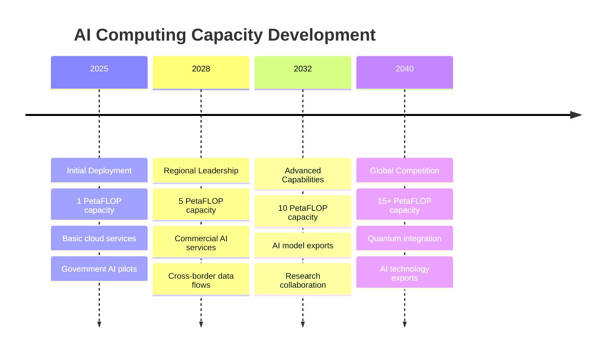

**Infrastructure Investment Breakdown**:
- **Data center construction**: $8B for climate-controlled, secure facilities
- **Computing hardware**: $12B for GPUs, CPUs, and specialized AI chips
- **Networking infrastructure**: $3B for high-speed, low-latency connectivity
- **Cooling and power systems**: $2B for efficient, sustainable operations

#### 6.3.2 AI Model Development and Training

**Sovereign AI Models**: Develop indigenous AI capabilities for critical national functions (Stanford Institute for Human-Centered AI, 2023).

**Priority Model Development**:

| Model Type | Application | Investment | Timeline |
|------------|-------------|------------|----------|
| **Large Language Models** | Government services, education | $200M | 2025-2027 |
| **Computer Vision** | Mining, agriculture, security | $150M | 2026-2028 |
| **Predictive Analytics** | Economic planning, infrastructure | $100M | 2027-2029 |
| **Multimodal AI** | Cultural preservation, tourism | $100M | 2028-2030 |
| **Scientific AI** | Research, discovery, innovation | $150M | 2029-2032 |

**Indigenous Language Integration**: Develop AI capabilities in Quechua, Aymara, and other indigenous languages to preserve cultural heritage and ensure technological inclusion (UNESCO, 2022).

#### 6.3.3 AI Services Export Strategy

**Target Markets**: Latin America, Africa, and other emerging economies seeking cost-effective AI solutions (McKinsey Global Institute, 2023).

**Service Portfolio**:
- **AI-as-a-Service**: Pre-trained models for common business applications
- **Custom AI Development**: Specialized solutions for specific industries
- **Training and Consulting**: Capability building for client organizations
- **Data Processing Services**: Secure, compliant data analysis and modeling

**Revenue Projections**:
- 2030: $500M annual AI exports
- 2035: $3B annual AI exports
- 2040: $8B+ annual AI exports

### 6.4 Advanced Manufacturing and Industrial Development

#### 6.4.1 Manufacturing Excellence Centers

**Strategic Locations**: Establish specialized manufacturing zones near energy sources and transportation hubs (UNIDO, 2020).

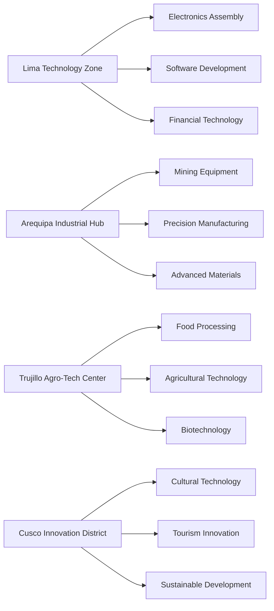

#### 6.4.2 Industry 4.0 Implementation

**Smart Manufacturing Initiative**: $5B investment in advanced manufacturing technologies and automation (Boston Consulting Group, 2021).

**Technology Integration**:
- **Industrial IoT**: Connected factories with real-time monitoring and optimization
- **Additive Manufacturing**: 3D printing capabilities for rapid prototyping and custom production
- **Robotics and Automation**: Flexible manufacturing systems with human-robot collaboration
- **Digital Twins**: Virtual factory models for optimization and predictive maintenance
- **Blockchain Supply Chain**: Transparent, secure tracking from raw materials to finished products

#### 6.4.3 Export Manufacturing Strategy

**Target Export Value**: $25B annual manufactured exports by 2040 (current: $8B) (Ministry of Production, 2024).

**Priority Export Categories**:
- Electronics and components: $8B target
- Precision instruments: $5B target
- Advanced materials: $4B target
- Medical devices: $3B target
- Aerospace components: $2B target
- Other high-tech products: $3B target

---

## 7. Modern Soft Power Strategy

### 7.1 Redefining Peruvian Global Identity

#### 7.1.1 Beyond Traditional Cultural Diplomacy

Peru's soft power strategy must transcend folkloric tourism and historical nostalgia to project a modern, technologically sophisticated, and culturally confident nation (Nye, 2021). This approach builds upon Peru's multicultural heritage while emphasizing innovation, technological leadership, and forward-looking vision.

**Contemporary Identity Framework**:

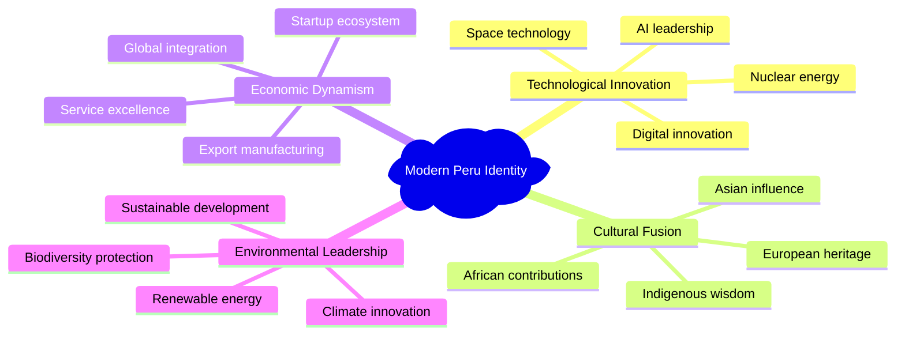

#### 7.1.2 Strategic Narrative Development

**Core Message**: Peru as a technologically advanced, culturally rich, and environmentally responsible middle power that bridges traditional wisdom with cutting-edge innovation (Anholt, 2020).

**Target Audiences**:
- **Global Business Community**: Investment opportunities and partnership potential
- **International Academia**: Research collaboration and knowledge exchange
- **Technology Sector**: Innovation ecosystem and talent capabilities
- **Cultural Influencers**: Modern Peruvian creativity and expression
- **Policy Makers**: Regional leadership and global cooperation

### 7.2 Cultural and Creative Industries

#### 7.2.1 Creative Economy Development

**Investment Target**: $2B investment in creative industries to achieve $10B annual creative exports by 2040 (UNESCO Institute for Statistics, 2022).

**Priority Sectors**:

| Sector | Current Size | 2040 Target | Key Strategies |
|--------|-------------|-------------|----------------|
| **Digital Media** | $200M | $3B | Gaming, streaming, digital art |
| **Fashion and Design** | $500M | $2.5B | Sustainable textiles, luxury goods |
| **Music and Entertainment** | $300M | $2B | Global music production, live events |
| **Film and Television** | $150M | $1.5B | Content creation, post-production services |
| **Architecture and Urban Design** | $400M | $1B | Sustainable cities, innovative buildings |

#### 7.2.2 Global Cultural Platforms

**Peru Global Cultural Initiative**: $500M investment in international cultural presence and influence (British Council, 2023).

**Implementation Strategy**:
- **Cultural Centers**: Establish 20+ Peru cultural centers in major global cities
- **Digital Platforms**: Create streaming services showcasing Peruvian content
- **International Festivals**: Host world-class cultural and technology events
- **Artist Exchange**: Support 1,000+ Peruvian artists in international residencies
- **Cultural Diplomacy**: Train diplomats in cultural engagement and soft power projection

#### 7.2.3 Technology-Enhanced Cultural Expression

**Digital Cultural Innovation**: Integrate advanced technology with cultural expression to create uniquely Peruvian digital experiences (MIT Media Lab, 2023).

**Innovation Areas**:
- **VR/AR Cultural Experiences**: Immersive historical and cultural education
- **AI-Generated Art**: Fusion of traditional patterns with algorithmic creativity
- **Interactive Media**: Technology-enhanced storytelling and cultural preservation
- **Digital Fashion**: Sustainable, culturally-inspired wearable technology
- **Gaming and Interactive Entertainment**: Peru-themed global gaming experiences

### 7.3 Educational and Academic Soft Power

#### 7.3.1 Peru as Regional Education Hub

**Strategic Objective**: Attract 100,000+ international students annually by 2040, generating $3B+ in education export revenue (Institute of International Education, 2023).

**University Excellence Initiative**: $3B investment in higher education infrastructure and capabilities.

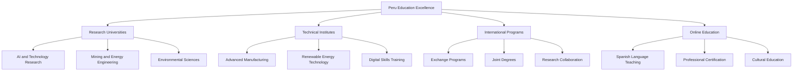

#### 7.3.2 Knowledge Diplomacy

**Peru Knowledge Network**: Connect Peruvian universities and research institutions with global academic leaders (Association of Universities and Colleges of Canada, 2022).

**Key Initiatives**:
- **Research Partnerships**: 50+ international university collaborations
- **Academic Exchange**: 10,000+ annual student and faculty exchanges
- **Conference Hosting**: Major international academic conferences in Peru
- **Publication Leadership**: Peru-based journals in key technology and cultural fields
- **Scholarship Programs**: Support for international students in strategic fields

#### 7.3.3 Spanish Language and Cultural Education

**Global Spanish Education Initiative**: Position Peru as a leader in Spanish language education and Latin American cultural studies (Instituto Cervantes, 2023).

**Program Components**:
- **Language Centers**: 100+ Peru Spanish language centers globally
- **Online Platforms**: Digital Spanish learning with Peruvian cultural content
- **Teacher Training**: Certification programs for Spanish language educators
- **Cultural Immersion**: Study abroad programs combining language and culture
- **Business Spanish**: Specialized programs for international commerce

### 7.4 Diplomatic and Political Influence

#### 7.4.1 Regional Leadership Strategy

**Peru as Voice of the Global South**: Lead developing nation interests in technology governance, climate action, and economic development (South Centre, 2023).

**Leadership Platforms**:

| Organization | Current Role | Target Role | Strategy |
|-------------|-------------|-------------|----------|
| **APEC** | Member | Technology working group leader | AI governance framework |
| **Pacific Alliance** | Founding member | Digital integration champion | Regional digital market |
| **UNASUR/CELAC** | Active participant | Technology cooperation leader | Infrastructure integration |
| **Non-Aligned Movement** | Member | Technology sovereignty advocate | Developing nation coordination |
| **UN System** | Regular participation | Committee leadership | Technology and development focus |

#### 7.4.2 Technology Governance Leadership

**AI Ethics and Governance**: Lead global discussions on responsible AI development and deployment in developing countries (Partnership on AI, 2023).

**Key Initiatives**:
- **Global South AI Consortium**: Coordinate AI development among developing nations
- **Ethical AI Standards**: Develop frameworks for responsible AI in resource-rich economies
- **Technology Transfer Protocols**: Create fair technology sharing agreements
- **Digital Rights Framework**: Advocate for developing nation interests in digital governance
- **Sustainable Tech Initiative**: Lead environmentally responsible technology development

#### 7.4.3 Economic Diplomacy and Trade Leadership

**Peru Trade 3.0**: Modern trade diplomacy emphasizing technology services, cultural exports, and sustainable development (World Trade Organization, 2023).

**Strategic Objectives**:
- Negotiate technology transfer clauses in all trade agreements
- Establish mutual recognition agreements for professional services
- Create preferential trading arrangements for cultural and creative exports
- Lead regional integration in digital services and e-commerce
- Advocate for fair international taxation of digital services

### 7.5 Digital Diplomacy and Global Communication

#### 7.5.1 Digital Presence Strategy

**Peru Digital**: $200M investment in global digital communication and influence (Reuters Institute, 2023).

**Platform Strategy**:
- **Government Digital Presence**: Coordinated messaging across all platforms
- **Cultural Content Creation**: High-quality content showcasing modern Peru
- **Influencer Partnerships**: Collaborate with global thought leaders and creators
- **Real-time Engagement**: Responsive communication with international audiences
- **Crisis Communication**: Rapid response capabilities for reputation management

#### 7.5.2 Media and Information Strategy

**Peru Global Media Initiative**: Establish international media presence to control national narrative (BBC Media Action, 2023).

**Implementation Components**:
- **International Broadcasting**: Peru Global TV and radio services
- **Digital News Platform**: English and Spanish international news service
- **Documentary Production**: High-quality films showcasing Peru's achievements
- **Podcast Network**: Thought leadership content in multiple languages
- **Social Media Strategy**: Coordinated global social media presence

#### 7.5.3 Information Sovereignty and Security

**National Information Security**: Protect Peru's digital reputation and narrative from misinformation and foreign manipulation (Oxford Internet Institute, 2023).

**Defense Mechanisms**:
- **Monitoring Systems**: Track international coverage and online sentiment
- **Rapid Response Teams**: Counter misinformation and negative narratives
- **Strategic Communication**: Proactive messaging on sensitive topics
- **Digital Literacy**: Educate citizens on information warfare and digital literacy
- **International Cooperation**: Collaborate with allies on information security

---

## 8. Implementation Roadmap

### 8.1 Three-Phase Development Strategy

#### 8.1.1 Phase 1: Foundation (2025-2027)

**Primary Objectives**: Establish institutional framework, secure initial funding, and begin critical infrastructure development.

**Key Milestones**:

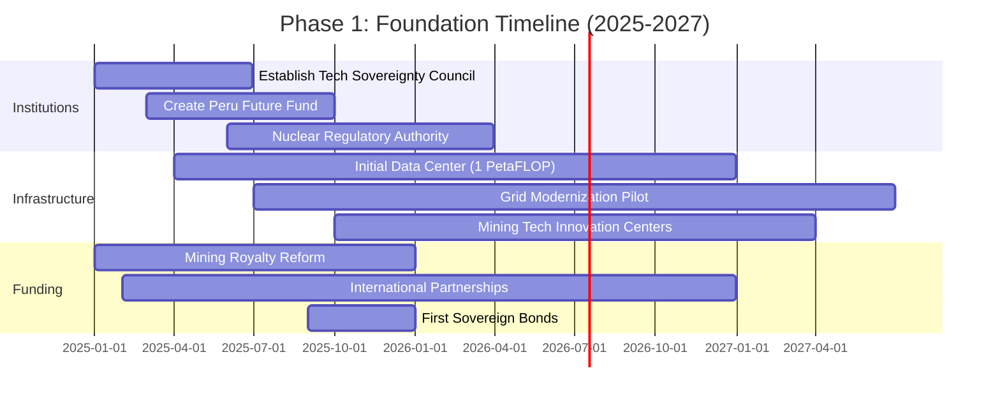

**Investment Allocation (Total: $18B)**:
- Institutional development: $2B (11%)
- Computing infrastructure: $5B (28%)
- Energy infrastructure: $4B (22%)
- Human capital: $3B (17%)
- Mining technology: $2B (11%)
- International partnerships: $2B (11%)

**Success Metrics**:
- Peru Future Fund capitalized with $8B+ initial assets
- 1 PetaFLOP computing capacity operational
- 10,000+ workers trained in priority technologies
- Nuclear regulatory framework established
- First international technology transfer agreements signed

#### 8.1.2 Phase 2: Acceleration (2028-2032)

**Primary Objectives**: Scale infrastructure deployment, establish regional leadership, and begin technology exports.

**Key Developments**:

| Sector | 2028 Targets | 2030 Targets | 2032 Targets |
|--------|-------------|-------------|-------------|
| **Computing** | 3 PetaFLOPs | 7 PetaFLOPs | 10 PetaFLOPs |
| **Energy** | 25 GW total | 30 GW total | 35 GW total |
| **Nuclear** | Site preparation | First reactor construction | First reactor operational |
| **AI Exports** | $100M annually | $500M annually | $1.5B annually |
| **Manufacturing** | $12B exports | $15B exports | $18B exports |
| **Startups** | 5 unicorns | 8 unicorns | 12 unicorns |

**Investment Allocation (Total: $45B)**:
- Energy infrastructure: $18B (40%)
- Computing and AI: $12B (27%)
- Manufacturing facilities: $8B (18%)
- Education and training: $4B (9%)
- Soft power initiatives: $3B (7%)

#### 8.1.3 Phase 3: Dominance (2033-2040)

**Primary Objectives**: Achieve regional technological leadership, establish global influence, and become a developed economy.

**Target Achievements by 2040**:

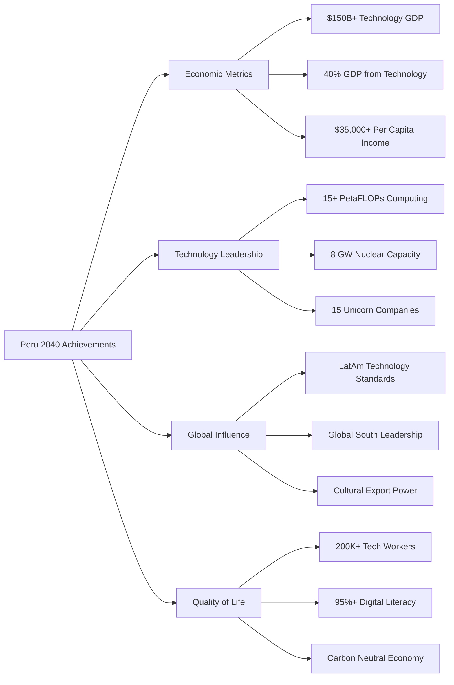

**Investment Allocation (Total: $30B)**:
- Advanced technology R&D: $10B (33%)
- International expansion: $8B (27%)
- Infrastructure optimization: $6B (20%)
- Soft power projection: $4B (13%)
- Strategic reserves: $2B (7%)

### 8.2 Critical Success Factors

#### 8.2.1 Political Consensus and Institutional Stability

**Constitutional Protection**: Embed technological sovereignty objectives in the national constitution to ensure continuity across political transitions (Acemoglu & Robinson, 2019).

**Proposed Constitutional Amendment**: "The State guarantees Peru's technological sovereignty and commits to maintaining strategic capabilities in artificial intelligence, nuclear energy, and advanced manufacturing regardless of political changes."

**Multi-Party Commission**: Establish permanent congressional oversight with representation from all major political parties to maintain bipartisan support (Levitsky & Way, 2020).

#### 8.2.2 Human Capital Development and Retention

**National Talent Strategy**: $15B investment over 15 years in human capital development and retention (World Economic Forum, 2023).

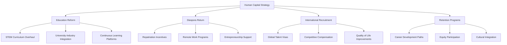

**Specific Programs**:
- **Peru Tech Scholars**: Full scholarships for 10,000+ students in priority technologies
- **Diaspora Bridge**: Remote work opportunities for skilled Peruvians abroad
- **Global Talent Initiative**: Fast-track immigration for international tech professionals
- **Equity Nation**: Stock option programs linking individual success to national development

#### 8.2.3 International Partnership Management

**Strategic Partnership Framework**: Balance relationships with major powers while maintaining sovereignty and avoiding dependency (Ikenberry, 2020).

**Partnership Principles**:
- Technology transfer must include knowledge transfer, not just equipment
- Joint ventures require meaningful Peruvian equity participation
- Training programs must build indigenous capabilities
- All partnerships must have clear graduation timelines to independence
- Strategic autonomy must be preserved in all agreements

### 8.3 Risk Mitigation and Contingency Planning

#### 8.3.1 Economic Risk Management

**Diversification Strategy**: Reduce dependence on any single economic sector or trading partner (Hidalgo & Hausmann, 2021).

**Economic Security Measures**:

| Risk | Probability | Impact | Mitigation Strategy |
|------|------------|--------|-------------------|
| **Commodity Price Collapse** | Medium | High | Diversified revenue streams, forward hedging |
| **Technology Transfer Restrictions** | High | High | Multiple partnership sources, indigenous R&D |
| **Currency Instability** | Medium | Medium | Multi-currency reserves, strong fiscal policy |
| **Trade War Impacts** | High | Medium | Regional trade diversification, WTO engagement |
| **Investment Capital Flight** | Low | High | Strong institutions, transparent governance |

#### 8.3.2 Technological Risk Assessment

**Technology Independence Timeline**: Achieve meaningful independence in critical technologies within 15 years to avoid permanent dependence (Baldwin & Clark, 2021).

**Independence Metrics**:
- **AI Capabilities**: Indigenous model development and training capabilities
- **Nuclear Technology**: Domestic maintenance and basic component manufacturing
- **Manufacturing**: Critical component production and assembly capabilities
- **Communications**: Sovereign communications infrastructure and encryption
- **Space Technology**: Basic satellite and launch capabilities

#### 8.3.3 Geopolitical Risk Navigation

**Strategic Autonomy**: Maintain independence while engaging productively with all major powers (Posen, 2021).

**Diplomatic Strategy**:
- Avoid exclusive alignment with any single global power
- Maintain productive relationships with US, China, EU, and regional partners
- Lead middle power coordination on technology governance issues
- Use international law and institutions to protect sovereign rights
- Build capabilities that create mutual dependence rather than one-way dependence

---

## 9. Financial Framework

### 9.1 Investment Requirements and Funding Sources

#### 9.1.1 Total Investment Analysis

**15-Year Investment Requirement**: $93 billion (2025-2040)

```mermaid
pie title Investment Allocation by Sector ($93B Total)
    "Energy Infrastructure" : 30.1
    "Computing and AI" : 21.5
    "Manufacturing Development" : 16.1
    "Human Capital" : 12.9
    "Soft Power and Culture" : 7.5
    "Research and Development" : 6.5
    "Contingency and Strategic Reserve" : 5.4
```

**Detailed Sector Breakdown**:

| Sector | Investment ($B) | Percentage | Primary Components |
|--------|----------------|------------|-------------------|
| **Energy Infrastructure** | $28B | 30.1% | Nuclear ($30B), Grid ($8B), Renewables ($10B) |
| **Computing and AI** | $20B | 21.5% | Data centers ($12B), GPUs ($8B) |
| **Manufacturing** | $15B | 16.1% | Facilities ($10B), Equipment ($5B) |
| **Human Capital** | $12B | 12.9% | Education ($8B), Training ($4B) |
| **Soft Power** | $7B | 7.5% | Cultural initiatives ($4B), Digital diplomacy ($3B) |
| **R&D** | $6B | 6.5% | Innovation centers ($3B), Research grants ($3B) |
| **Contingency** | $5B | 5.4% | Strategic reserve and risk management |

#### 9.1.2 Funding Sources Strategy

**Diversified Funding Portfolio**: Minimize dependence on any single funding source while maximizing leverage and maintaining fiscal sustainability (IMF, 2023).

```mermaid
graph LR
    A[Funding Sources $93B] --> B[Mining Revenues $45B]
    A --> C[Sovereign Wealth Returns $25B]
    A --> D[International Partnerships $15B]
    A --> E[Development Finance $5B]
    A --> F[Government Bonds $3B]
    
    B --> B1[Royalty Increases]
    B --> B2[New Mining Projects]
    B --> B3[Processing Value-Add]
    
    C --> C1[Peru Future Fund]
    C --> C2[Investment Returns]
    C --> C3[Compound Growth]
    
    D --> D1[China Belt & Road]
    D --> D2[Korean Technology Transfer]
    D --> D3[EU Green Deal Partnership]
    
    E --> E1[World Bank]
    E --> E2[IDB Development]
    E --> E3[Bilateral Aid]
    
    F --> F1[Infrastructure Bonds]
    F --> F2[Green Bonds]
    F --> F3[Technology Bonds]
```

### 9.2 Peru Future Fund: Sovereign Wealth Strategy

#### 9.2.1 Fund Structure and Governance

**Model**: Hybrid of Chile's Economic and Social Stabilization Fund and Singapore's GIC, emphasizing long-term growth and strategic investment (Sovereign Wealth Fund Institute, 2023).

**Governance Framework**:

```mermaid
graph TD
    A[Peru Future Fund] --> B[Board of Directors]
    A --> C[Investment Committee]
    A --> D[Risk Management]
    A --> E[Strategic Partnerships]
    
    B --> B1[Independent Chairman]
    B --> B2[MEF Representative]
    B --> B3[BCRP Representative]
    B --> B4[Private Sector Experts]
    B --> B5[International Advisors]
    
    C --> C1[CIO and Investment Team]
    C --> C2[External Asset Managers]
    C --> C3[Due Diligence Teams]
    
    D --> D1[Risk Assessment]
    D --> D2[Portfolio Monitoring]
    D --> D3[Stress Testing]
    
    E --> E1[Technology Partnerships]
    E --> E2[Co-investment Opportunities]
    E --> E3[Strategic Asset Acquisition]
```

#### 9.2.2 Investment Strategy and Asset Allocation

**Target Asset Under Management**: $25B by 2030, $50B by 2040

**Strategic Asset Allocation**:

| Asset Class | Target Allocation | Strategic Purpose |
|-------------|------------------|-------------------|
| **Technology Ventures** | 25% | Direct participation in global technology growth |
| **Infrastructure** | 20% | Strategic control of critical infrastructure |
| **Public Equities** | 20% | Diversified global exposure and liquidity |
| **Private Equity** | 15% | Access to high-growth private companies |
| **Real Estate** | 10% | Inflation hedge and strategic locations |
| **Government Bonds** | 10% | Stability and capital preservation |

**Performance Targets**:
- **Return Objective**: 7-9% annual real returns over full market cycles
- **Risk Management**: Maximum 20% annual volatility
- **Strategic Impact**: 30% of investments must support Peru's technological development
- **ESG Integration**: All investments must meet environmental and governance standards

#### 9.2.3 Capital Formation and Growth Strategy

**Initial Capitalization (2025-2027)**: $8B seed funding from mining royalties and privatization proceeds.

**Growth Timeline**:

```mermaid
timeline
    title Peru Future Fund Growth Trajectory
    
    2025 : Initial Capitalization
         : $8B from mining royalties
         : Fund structure establishment
         : Initial investment team
    
    2028 : Early Growth Phase
         : $15B assets under management
         : First major technology investments
         : International partnerships established
    
    2032 : Maturation Phase
         : $25B assets under management
         : Strategic asset control
         : Regional investment leadership
    
    2040 : Full Capacity
         : $50B+ assets under management
         : Global investment presence
         : Technology export financing
```

### 9.3 Revenue Generation and Economic Impact

#### 9.3.1 New Revenue Streams by 2040

**Technology-Based Revenue Generation**: Transition from commodity dependence to technology-based exports and services (Deloitte, 2023).

| Revenue Stream | 2030 Target | 2040 Target | Growth Rate |
|----------------|-------------|-------------|-------------|
| **AI and Computing Services** | $500M | $8B | 45% CAGR |
| **Advanced Manufacturing** | $3B | $25B | 23% CAGR |
| **Energy Exports** | $2B | $12B | 20% CAGR |
| **Cultural and Creative Exports** | $1B | $10B | 26% CAGR |
| **Education and Training Services** | $500M | $3B | 20% CAGR |
| **Financial and Professional Services** | $300M | $2B | 21% CAGR |

#### 9.3.2 Economic Multiplier Effects

**GDP Impact Analysis**: Technology investments typically generate 2.5-3.5x multiplier effects through secondary economic activity (OECD Economic Outlook, 2023).

**Employment Generation**:
- **Direct Technology Employment**: 200,000+ high-skilled positions
- **Indirect Supporting Employment**: 500,000+ medium and high-skilled positions
- **Induced Economic Activity**: 800,000+ total employment impact

**Regional Development Impact**:

```mermaid
graph LR
    A[Technology Investment] --> B[Primary Effects]
    A --> C[Secondary Effects]
    A --> D[Tertiary Effects]
    
    B --> B1[Direct Employment]
    B --> B2[Infrastructure Development]
    B --> B3[Export Generation]
    
    C --> C1[Supply Chain Development]
    C --> C2[Service Industry Growth]
    C --> C3[Real Estate Development]
    
    D --> D1[Consumer Spending]
    D --> D2[Tax Revenue Growth]
    D --> D3[Social Development]
```

#### 9.3.3 Fiscal Impact and Sustainability

**Government Revenue Enhancement**: Technology development will significantly increase government revenues through multiple channels (McKinsey Global Institute, 2022).

**Revenue Enhancement Mechanisms**:
- **Corporate Income Tax**: From technology companies and higher-value manufacturing
- **Export Taxes**: Modest levies on technology services and high-value exports
- **Property Tax**: Increased property values in technology development zones
- **VAT Growth**: Higher consumption from increased employment and wages
- **Royalties**: Technology licensing and intellectual property revenues

**Fiscal Sustainability Metrics**:
- **Debt-to-GDP Ratio**: Maintain below 35% throughout development period
- **Budget Balance**: Achieve primary surplus by 2030
- **Revenue Diversification**: Reduce mining dependence from 65% to 30% of exports
- **Fiscal Reserves**: Maintain 12+ months of government spending in reserves

### 9.4 International Financial Partnerships

#### 9.4.1 Development Finance Mobilization

**Multilateral Development Bank Strategy**: Leverage Peru's strong credit rating and development track record to access concessional financing (World Bank, 2023).

**Development Finance Pipeline**:

| Institution | Financing Type | Amount | Purpose |
|-------------|----------------|--------|---------|
| **World Bank** | Development Policy Loans | $2B | Technology infrastructure |
| **Inter-American Development Bank** | Sector Investment | $1.5B | Energy and innovation |
| **Asian Infrastructure Investment Bank** | Infrastructure Loans | $1B | Digital infrastructure |
| **Green Climate Fund** | Climate Finance | $500M | Renewable energy |
| **European Investment Bank** | Technology Partnerships | $300M | Research and innovation |

#### 9.4.2 Foreign Direct Investment Strategy

**Strategic FDI Attraction**: Target high-value foreign investment in priority sectors while maintaining strategic control (UNCTAD Investment Report, 2023).

**FDI Targeting Strategy**:

```mermaid
graph TD
    A[FDI Strategy] --> B[Technology Transfer FDI]
    A --> C[Manufacturing FDI]
    A --> D[Service Sector FDI]
    A --> E[Strategic Infrastructure FDI]
    
    B --> B1[AI and Computing Companies]
    B --> B2[Renewable Energy Technology]
    B --> B3[Advanced Manufacturing]
    
    C --> C1[Electronics Assembly]
    C --> C2[Precision Instruments]
    C --> C3[Pharmaceutical Manufacturing]
    
    D --> D1[Financial Services]
    D --> D2[Business Process Outsourcing]
    D --> D3[Education and Training]
    
    E --> E1[Telecommunications]
    E --> E2[Transportation]
    E --> E3[Energy Infrastructure]
```

**Investment Promotion Framework**:
- **Sector-Specific Incentives**: Targeted tax benefits for priority technologies
- **One-Stop Investment Services**: Streamlined approval processes for strategic investments
- **Investor Protection**: Strong legal framework and international arbitration access
- **Skills Development Support**: Government-funded training programs for investor needs
- **Infrastructure Guarantees**: Assured access to power, connectivity, and transportation

#### 9.4.3 Capital Market Development

**Domestic Capital Market Strengthening**: Develop sophisticated financial markets to support technology companies and reduce foreign dependency (Lima Stock Exchange, 2023).

**Capital Market Initiatives**:
- **Technology Stock Exchange**: Specialized trading platform for technology companies
- **Venture Capital Ecosystem**: Government co-investment to catalyze private VC funds
- **Corporate Bond Market**: Deep bond markets for infrastructure and technology financing
- **Pension Fund Investment**: Allow pension funds to invest in domestic technology development
- **Insurance Industry Development**: Sophisticated risk management for technology investments

---

## 10. Risk Assessment and Mitigation

### 10.1 Political and Institutional Risks

#### 10.1.1 Political Instability and Policy Reversal

**Risk Assessment**: Peru's history of political instability poses the greatest threat to long-term strategic implementation (Levitsky & Way, 2020).

**Historical Context**:
- 6 presidents in the last 6 years (2016-2022)
- Frequent changes in economic policy direction
- Weak institutional continuity across administrations
- Popular unrest and regional tensions

**Mitigation Strategies**:

```mermaid
graph TD
    A[Political Risk Mitigation] --> B[Constitutional Protection]
    A --> C[Multi-Party Consensus]
    A --> D[Institutional Insulation]
    A --> E[Regional Support]
    
    B --> B1[Constitutional Amendment]
    B --> B2[Supreme Court Precedent]
    B --> B3[Legal Protection Framework]
    
    C --> C1[National Technology Council]
    C --> C2[Cross-Party Committees]
    C --> C3[Civil Society Engagement]
    
    D --> D1[Independent Technology Authority]
    D --> D2[Technocratic Leadership]
    D --> D3[Performance-Based Incentives]
    
    E --> E1[Regional Integration Projects]
    E --> E2[International Treaty Obligations]
    E --> E3[Diplomatic Pressure Support]
```

**Specific Implementation Measures**:
- **Constitutional Amendment**: Embed technological sovereignty as a national objective with two-thirds majority requirement for changes
- **Autonomous Technology Authority**: Create independent agency with fixed leadership terms and protected budgets
- **International Treaties**: Lock in commitments through binding international agreements
- **Regional Coordination**: Coordinate with neighboring countries to create mutual dependencies

#### 10.1.2 Corruption and Governance Challenges

**Risk Assessment**: Corruption has historically undermined major infrastructure projects and technology initiatives in Peru (Transparency International, 2023).

**Corruption Prevention Framework**:

| Risk Area | Prevention Mechanism | Oversight Body | Transparency Measure |
|-----------|---------------------|----------------|-------------------|
| **Public Procurement** | Open competitive bidding | Independent procurement authority | Real-time publication |
| **Technology Contracts** | International arbitration clauses | Multi-party review committees | Public contract database |
| **Resource Revenue** | Direct deposit to sovereign fund | Parliamentary oversight | Monthly public reporting |
| **Infrastructure Projects** | International project management | Civil society monitoring | Progress dashboards |
| **Human Resources** | Merit-based hiring | Independent review panels | Public appointment processes |

#### 10.1.3 Social Acceptance and Regional Inequality

**Risk Assessment**: Technology development may exacerbate existing regional inequalities and face resistance from traditional sectors (OXFAM, 2022).

**Social Integration Strategy**:
- **Regional Development Mandates**: Require technology projects to include regional development components
- **Traditional Sector Transition**: Provide retraining and transition support for displaced workers
- **Community Benefit Sharing**: Ensure local communities receive direct benefits from technology development
- **Cultural Sensitivity**: Integrate indigenous perspectives and values in technology development
- **Democratic Participation**: Maintain robust public consultation processes for major projects

### 10.2 Economic and Financial Risks

#### 10.2.1 Resource Dependency and Commodity Price Volatility

**Risk Assessment**: Continued dependence on volatile commodity prices could undermine financing for technology development (World Bank Commodity Markets, 2023).

**Price Volatility Historical Analysis**:

```mermaid
graph LR
    A[Commodity Price Risk] --> B[Copper Price Volatility]
    A --> C[Gold Price Fluctuation]
    A --> D[Energy Price Instability]
    A --> E[Currency Exchange Risk]
    
    B --> B1[2008: $8,900/ton peak]
    B --> B2[2016: $4,400/ton trough]
    B --> B3[2024: $8,500/ton current]
    
    C --> C1[Historical 20% annual volatility]
    C --> C2[Safe haven demand spikes]
    C --> C3[Industrial demand correlation]
    
    D --> D1[Natural gas price swings]
    D --> D2[Oil price dependency]
    D --> D3[Renewable energy competition]
    
    E --> E1[USD/PEN exchange rate]
    E --> E2[Regional currency instability]
    E --> E3[Capital flow volatility]
```

**Financial Risk Mitigation**:
- **Commodity Hedging**: Use financial instruments to hedge 40-60% of expected revenues 2-3 years forward
- **Revenue Diversification**: Accelerate transition to technology-based revenues to reduce commodity dependence
- **Stabilization Mechanisms**: Establish automatic fiscal rules that save windfall revenues and provide countercyclical spending
- **Currency Management**: Maintain diversified foreign exchange reserves and avoid excessive USD dependence

#### 10.2.2 Technology Investment Bubble Risk

**Risk Assessment**: Overinvestment in technology sectors without adequate returns could create unsustainable financial bubbles (Bank for International Settlements, 2023).

**Bubble Prevention Measures**:

| Indicator | Warning Threshold | Monitoring Frequency | Response Mechanism |
|-----------|------------------|-------------------|-------------------|
| **Technology Sector P/E Ratios** | >30x average | Monthly | Gradual investment scaling |
| **Venture Capital Valuations** | >50% annual growth | Quarterly | Co-investment criteria tightening |
| **Credit Growth to Tech Sector** | >40% annually | Monthly | Prudential lending controls |
| **Real Estate in Tech Zones** | >25% annual appreciation | Quarterly | Supply increase measures |
| **Employment Growth** | >30% annually | Quarterly | Skills bottleneck monitoring |

#### 10.2.3 International Capital Flow Risks

**Risk Assessment**: Sudden capital flow reversals could undermine financing for long-term technology development projects (IMF Global Financial Stability Report, 2023).

**Capital Flow Management**:
- **Macroprudential Policies**: Implement controls on short-term speculative capital flows
- **Foreign Exchange Reserves**: Maintain reserves equivalent to 18+ months of imports
- **Debt Management**: Limit foreign currency debt and maintain balanced maturity profiles
- **Financial Market Development**: Strengthen domestic capital markets to reduce foreign dependence

### 10.3 Technological and Operational Risks

#### 10.3.1 Technology Transfer and Dependency Risks

**Risk Assessment**: Over-dependence on foreign technology could create permanent vulnerabilities and limit indigenous innovation capability (Baldwin & Clark, 2021).

**Technology Independence Strategy**:

```mermaid
timeline
    title Technology Independence Timeline
    
    2025-2027 : Absorption Phase
              : Learn and implement foreign technology
              : Build basic technical capabilities
              : Establish R&D infrastructure
    
    2028-2032 : Adaptation Phase
              : Modify technology for local conditions
              : Develop indigenous improvements
              : Create hybrid solutions
    
    2033-2037 : Innovation Phase
              : Original technology development
              : Indigenous intellectual property
              : Technology export capabilities
    
    2038-2040 : Leadership Phase
              : Global technology leadership
              : Standard setting capabilities
              : Technology diplomacy leadership
```

**Specific Risk Mitigation**:
- **Technology Transfer Requirements**: Mandate knowledge transfer, not just equipment purchase, in all major technology deals
- **Indigenous R&D Mandates**: Require 10% of technology project value invested in local R&D capabilities
- **Intellectual Property Development**: Establish strong IP protection and domestic innovation incentives
- **Alternative Supplier Development**: Maintain relationships with multiple technology suppliers to avoid single-source dependence

#### 10.3.2 Cybersecurity and Information Security Risks

**Risk Assessment**: Advanced technology infrastructure creates new vulnerabilities to cyberattacks and information warfare (Center for Strategic and International Studies, 2023).

**Cybersecurity Framework**:

| Threat Level | Response Capability | Investment Required | Timeline |
|-------------|-------------------|-------------------|----------|
| **Basic Cyber Attacks** | National cyber defense unit | $200M | 2025-2027 |
| **Advanced Persistent Threats** | Cyber intelligence capability | $500M | 2027-2030 |
| **State-Sponsored Attacks** | Strategic cyber deterrence | $800M | 2030-2035 |
| **Quantum Computing Threats** | Post-quantum cryptography | $300M | 2035-2040 |

#### 10.3.3 Environmental and Climate Risks

**Risk Assessment**: Climate change and environmental degradation could undermine technology infrastructure and create social opposition (IPCC, 2023).

**Climate Resilience Strategy**:
- **Infrastructure Hardening**: Design all technology infrastructure for climate resilience and extreme weather events
- **Environmental Impact Minimization**: Require net-positive environmental impact for all major technology projects
- **Water Resource Management**: Ensure sustainable water use for energy and technology operations
- **Biodiversity Protection**: Integrate ecosystem protection into all development planning
- **Carbon Neutrality**: Achieve carbon neutral economy by 2040 through renewable energy and efficiency

### 10.4 Geopolitical and International Risks

#### 10.4.1 Great Power Competition and Technology Wars

**Risk Assessment**: Escalating US-China technology competition could force Peru to choose sides and limit technology access (Council on Foreign Relations, 2023).

**Strategic Autonomy Approach**:

```mermaid
graph TD
    A[Strategic Autonomy] --> B[Multi-Alignment Strategy]
    A --> C[Indigenous Capability Building]
    A --> D[Middle Power Coordination]
    A --> E[International Law Advocacy]
    
    B --> B1[Balanced Partnerships]
    B --> B2[Avoid Exclusive Alignment]
    B --> B3[Mutual Benefit Focus]
    
    C --> C1[Domestic Technology Development]
    C --> C2[Reduced Critical Dependencies]
    C --> C3[Strategic Reserve Capabilities]
    
    D --> D1[Global South Coordination]
    D --> D2[Regional Integration]
    D --> D3[Multilateral Institution Leadership]
    
    E --> E1[Technology Governance Advocacy]
    E --> E2[Fair Competition Principles]
    E --> E3[Developing Nation Rights]
```

#### 10.4.2 Trade War and Economic Sanctions Risks

**Risk Assessment**: Peru could face economic pressure or sanctions that limit access to critical technologies or markets (Peterson Institute for International Economics, 2023).

**Economic Resilience Measures**:
- **Market Diversification**: Avoid dependence on any single export market (maximum 40% of any product to one country)
- **Payment System Independence**: Develop alternative payment systems to reduce USD and SWIFT dependence
- **Strategic Stockpiles**: Maintain strategic reserves of critical materials and components
- **Alternative Supply Chains**: Develop multiple sourcing options for all critical technologies
- **Legal Protection**: Use WTO and international legal mechanisms to protect trade rights

#### 10.4.3 Regional Instability and Conflict Risks

**Risk Assessment**: Regional political instability or conflicts could disrupt technology development and international partnerships (International Crisis Group, 2023).

**Regional Stability Strategy**:
- **Diplomatic Leadership**: Lead regional cooperation initiatives and conflict resolution
- **Economic Integration**: Create economic interdependencies that discourage conflict
- **Defense Modernization**: Maintain credible defense capabilities while avoiding arms races
- **Refugee and Migration Planning**: Prepare for potential population movements from regional instability
- **Resource Security**: Ensure access to critical resources even during regional disruptions

---

## 11. Governance and Institutional Framework

### 11.1 National Technology Sovereignty Council

#### 11.1.1 Institutional Structure and Authority

The National Technology Sovereignty Council (NTSC) serves as the apex body for coordinating Peru's technological transformation, modeled after Singapore's Smart Nation and Digital Government Office but with expanded strategic mandate (Lee & Neo, 2018).

**Institutional Design**:

```mermaid
graph TD
    A[President of Peru] --> B[National Technology Sovereignty Council]
    
    B --> C[Executive Committee]
    B --> D[Sector Working Groups]
    B --> E[International Partnerships Committee]
    B --> F[Strategic Investment Committee]
    
    C --> C1[Prime Minister - Chair]
    C --> C2[Minister of Economy and Finance]
    C --> C3[Minister of Energy and Mines]
    C --> C4[Minister of Production]
    C --> C5[BCRP President]
    C --> C6[Private Sector Representatives]
    
    D --> D1[AI and Computing]
    D --> D2[Nuclear Energy]
    D --> D3[Advanced Manufacturing]
    D --> D4[Soft Power and Culture]
    
    E --> E1[Technology Transfer Management]
    E --> E2[International Agreements]
    E --> E3[Diplomatic Coordination]
    
    F --> F1[Peru Future Fund Oversight]
    F --> F2[Strategic Investment Evaluation]
    F --> F3[Performance Monitoring]
```

**Legal Authority and Powers**:
- **Budget Authority**: Direct control over technology development budgets ($6B+ annually)
- **Regulatory Coordination**: Align regulations across ministries for technology development
- **International Negotiations**: Lead all technology transfer and partnership negotiations
- **Strategic Planning**: Develop and update national technology strategy every 3 years
- **Performance Oversight**: Monitor progress against strategic objectives and adjust as needed

#### 11.1.2 Decision-Making Framework

**Strategic Decision Process**: Ensure rapid decision-making while maintaining democratic accountability and stakeholder consultation (Kamarck, 2019).

**Decision Hierarchy**:

| Decision Type | Authority Level | Approval Process | Timeline |
|---------------|----------------|------------------|----------|
| **Strategic Direction** | NTSC Executive Committee | Consensus of voting members | 30 days |
| **Major Investments (>$1B)** | Full NTSC + Congressional Approval | Supermajority vote + legislative review | 90 days |
| **Technology Partnerships** | Executive Committee | Majority vote + legal review | 45 days |
| **Operational Decisions** | Sector Working Groups | Technical committee approval | 15 days |
| **Emergency Response** | NTSC Chair | Executive authority | 24 hours |

#### 11.1.3 Performance Management and Accountability

**Results-Based Management**: Implement rigorous performance monitoring with clear metrics and regular public reporting (World Bank, 2022).

**Key Performance Indicators (KPIs)**:

```mermaid
graph LR
    A[NTSC Performance Management] --> B[Economic Indicators]
    A --> C[Technology Metrics]
    A --> D[Social Impact Measures]
    A --> E[International Standing]
    
    B --> B1[GDP Growth from Technology]
    B --> B2[Export Diversification]
    B --> B3[Employment Creation]
    
    C --> C1[Computing Capacity Growth]
    C --> C2[AI Model Development]
    C --> C3[Patent Applications]
    
    D --> D1[Skills Development]
    D --> D2[Regional Equality]
    D --> D3[Environmental Impact]
    
    E --> E1[Technology Rankings]
    E --> E2[International Partnerships]
    E --> E3[Soft Power Metrics]
```

### 11.2 Specialized Regulatory Authorities

#### 11.2.1 Artificial Intelligence Governance Authority

**Mission**: Ensure responsible AI development while promoting innovation and maintaining international competitiveness (Partnership on AI, 2022).

**Regulatory Framework**:
- **AI Ethics Standards**: Mandatory ethical guidelines for all AI development projects
- **Data Protection**: Robust privacy protection aligned with international best practices
- **Algorithmic Transparency**: Requirements for explainable AI in government and critical applications
- **International Cooperation**: Coordination with global AI governance initiatives
- **Innovation Sandboxes**: Safe testing environments for emerging AI technologies

**Institutional Capacity**:
- **Technical Expertise**: 100+ AI specialists with advanced degrees and industry experience
- **International Networks**: Formal partnerships with leading AI governance bodies globally
- **Regulatory Tools**: Comprehensive legal framework for AI oversight and promotion
- **Enforcement Capability**: Authority to impose penalties and corrective measures
- **Advisory Services**: Support for businesses and government agencies on AI implementation

#### 11.2.2 Nuclear Regulatory Commission

**Mission**: Ensure nuclear safety while enabling rapid nuclear energy development, following UAE's Federal Authority for Nuclear Regulation model (FANR, 2020).

**Regulatory Capabilities**:

| Function | Current Status | 2030 Target | Investment Required |
|----------|---------------|-------------|-------------------|
| **Safety Oversight** | Framework development | Full operational capability | $200M |
| **Licensing Authority** | Basic procedures | Complex facility licensing | $100M |
| **Technical Standards** | International adoption | Indigenous standards | $50M |
| **Emergency Response** | Planning phase | Full response capability | $150M |
| **International Cooperation** | Initial agreements | Regional leadership | $30M |

#### 11.2.3 Digital Infrastructure Authority

**Mission**: Oversee critical digital infrastructure development and ensure cybersecurity, data sovereignty, and competitive markets (European Commission, 2021).

**Key Responsibilities**:
- **Infrastructure Standards**: Technical standards for computing and communications infrastructure
- **Cybersecurity Requirements**: Mandatory security standards for critical digital infrastructure
- **Data Governance**: Rules for data localization, cross-border flows, and privacy protection
- **Market Regulation**: Ensure competitive markets and prevent monopolistic practices
- **Innovation Promotion**: Support emerging technology adoption and digital transformation

### 11.3 Inter-agency Coordination Mechanisms

#### 11.3.1 Whole-of-Government Approach

**Coordination Challenge**: Ensure all government agencies align their policies and resources with national technology strategy (OECD, 2020).

**Integration Mechanisms**:

```mermaid
graph TD
    A[Whole-of-Government Coordination] --> B[Policy Integration]
    A --> C[Budget Coordination]
    A --> D[Implementation Alignment]
    A --> E[Performance Monitoring]
    
    B --> B1[Cross-Ministry Policy Committees]
    B --> B2[Regulatory Impact Assessment]
    B --> B3[Strategic Planning Integration]
    
    C --> C1[Joint Budget Preparation]
    C --> C2[Shared Investment Priorities]
    C --> C3[Resource Pool Management]
    
    D --> D1[Joint Implementation Teams]
    D --> D2[Shared Performance Metrics]
    D --> D3[Coordinated Communication]
    
    E --> E1[Regular Progress Reviews]
    E --> E2[Cross-Agency Dashboards]
    E --> E3[Public Reporting]
```

#### 11.3.2 Public-Private Partnership Framework

**Strategic Objective**: Leverage private sector capabilities while maintaining public interest and strategic control (World Economic Forum, 2022).

**Partnership Models**:

| Partnership Type | Public Role | Private Role | Risk Sharing | Examples |
|-----------------|-------------|-------------|-------------|----------|
| **Build-Operate-Transfer** | Policy and oversight | Implementation and operation | Shared operational risk | Data centers |
| **Joint Ventures** | Strategic control | Technical expertise | Shared investment risk | Nuclear facilities |
| **Concessions** | Regulatory framework | Market development | Private market risk | Telecommunications |
| **Co-investment** | Risk capital | Commercial expertise | Shared financial risk | Venture capital |
| **Public Procurement** | Specifications and payment | Solution delivery | Private delivery risk | AI systems |

#### 11.3.3 Regional and Local Government Integration

**Multi-level Governance**: Ensure regional and local governments contribute effectively to national technology strategy while addressing local development needs (UNDP, 2021).

**Integration Strategy**:
- **Regional Technology Hubs**: Establish specialized technology centers in each region aligned with local comparative advantages
- **Local Investment Requirements**: Mandate local benefit components in all major technology projects
- **Capacity Building**: Provide training and technical assistance to regional and local governments
- **Revenue Sharing**: Ensure technology development generates benefits for local communities
- **Democratic Participation**: Maintain robust consultation processes for community input on technology projects

### 11.4 International Cooperation and Governance

#### 11.4.1 Technology Transfer Governance

**Strategic Objective**: Maximize technology absorption while building indigenous capabilities and avoiding permanent dependence (UNCTAD, 2021).

**Technology Transfer Framework**:

```mermaid
graph LR
    A[Technology Transfer Governance] --> B[Partner Evaluation]
    A --> C[Contract Management]
    A --> D[Knowledge Absorption]
    A --> E[Capability Building]
    
    B --> B1[Technical Capability Assessment]
    B --> B2[Strategic Alignment Review]
    B --> B3[Reputation and Track Record]
    
    C --> C1[Intellectual Property Terms]
    C --> C2[Training Requirements]
    C --> C3[Local Content Mandates]
    
    D --> D1[Learning and Development Programs]
    D --> D2[Technical Documentation]
    D --> D3[Skills Transfer Monitoring]
    
    E --> E1[Indigenous R&D Requirements]
    E --> E2[Local Innovation Incentives]
    E --> E3[Graduation Timeline]
```

#### 11.4.2 International Standard Setting Participation

**Strategic Objective**: Influence international technology standards to support Peru's development objectives and ensure compatibility with global systems (ISO, 2023).

**Standard Setting Engagement**:
- **AI Governance Standards**: Active participation in UNESCO, ISO, and IEEE AI ethics and governance standards
- **Nuclear Safety Standards**: Engagement with IAEA on nuclear safety and security standards
- **Cybersecurity Standards**: Participation in ITU and other international cybersecurity frameworks
- **Environmental Standards**: Leadership in sustainable technology development standards
- **Trade Standards**: Advocacy for developing country interests in technology trade rules

#### 11.4.3 Regional Technology Leadership

**Vision**: Position Peru as the technology leader and standard-setter for Latin America (UNECLAC, 2023).

**Regional Leadership Strategy**:

| Initiative | Objective | Timeline | Investment |
|------------|-----------|----------|------------|
| **LatAm Computing Grid** | Regional AI infrastructure | 2025-2030 | $2B |
| **Digital Currency Initiative** | Regional financial integration | 2027-2032 | $500M |
| **Technology Education Network** | Regional skills development | 2025-2035 | $1B |
| **Innovation Collaboration** | Joint R&D programs | 2026-2040 | $1.5B |
| **Standards Harmonization** | Regional technology standards | 2025-2030 | $200M |

---

## 12. Conclusion and Call to Action

### 12.1 The Historic Opportunity

Peru stands at a unique historical inflection point. The convergence of abundant natural resources, proven execution capability, strategic geographic position, and unprecedented global technology transfer opportunities creates a once-in-a-generation chance to transform from a commodity-dependent economy into a high-technology powerhouse (Rodrik, 2018).

#### 12.1.1 The Window of Opportunity

**Time-Sensitive Factors**:
- **Technology Transfer Availability**: Current global competition creates opportunities for technology partnerships that may not exist in 10-15 years
- **Resource Revenue Window**: High commodity prices provide 5-10 years of exceptional funding capacity
- **Geopolitical Realignment**: Global power shifts create space for middle powers to establish strategic autonomy
- **International Development Finance**: Unprecedented levels of development capital available for infrastructure and technology projects
- **Regional Integration Momentum**: Latin American economic integration creates larger markets for technology products and services

#### 12.1.2 The Cost of Inaction

Failure to seize this opportunity will condemn Peru to permanent economic subordination and strategic vulnerability (Chang, 2020). The evidence from international development demonstrates that countries that miss technological transformation windows require decades to recover, if they ever do.

**Consequences of Status Quo**:
- Continued commodity dependence with perpetual price volatility exposure
- Limited policy autonomy due to economic and technological dependencies
- Brain drain as skilled workers emigrate to more advanced economies
- Inability to capture value from domestic resources and strategic position
- Regional marginalization as neighbors advance technologically
- Vulnerability to climate change without technological adaptation capabilities

### 12.2 Implementation Imperatives

#### 12.2.1 Political Leadership and National Consensus

**Immediate Requirements**:
- **Presidential Leadership**: The President must champion technological sovereignty as a national priority equivalent to territorial sovereignty
- **Congressional Support**: Achieve supermajority support for constitutional protection of technology development objectives
- **Multi-Party Consensus**: Create bipartisan commitment that transcends electoral cycles and political changes
- **Civil Society Engagement**: Build broad popular support through education, consultation, and benefit-sharing mechanisms
- **Business Community Alignment**: Ensure private sector leaders understand and support the strategic transformation

#### 12.2.2 Institutional Development Timeline

**Critical First Steps (2025)**:

```mermaid
timeline
    title Critical 2025 Implementation Steps
    
    January-March : Political Foundation
                  : Presidential decree establishing NTSC
                  : Congressional hearings and initial legislation
                  : Civil society consultation process
    
    April-June : Institutional Development
               : NTSC staff recruitment and training
               : Peru Future Fund establishment
               : Initial international partnership negotiations
    
    July-September : Resource Mobilization
                   : Mining royalty reform implementation
                   : First sovereign bond issuance
                   : Development finance agreements
    
    October-December : Program Launch
                     : First infrastructure projects
                     : Technology transfer agreements
                     : Human capital development programs
```

#### 12.2.3 Stakeholder Mobilization

**Key Stakeholder Engagement**:

| Stakeholder Group | Primary Concerns | Engagement Strategy | Success Metrics |
|------------------|-----------------|-------------------|----------------|
| **Business Community** | Regulatory stability, profit opportunities | Public-private partnerships, tax incentives | 80%+ business leader support |
| **Labor Organizations** | Job security, skills development | Retraining programs, employment guarantees | Union endorsement of strategy |
| **Regional Governments** | Local development, resource sharing | Revenue sharing, regional hubs | All regions participating |
| **Civil Society** | Environmental protection, social equity | Impact assessment, benefit sharing | 70%+ public approval |
| **International Partners** | Commercial returns, strategic alignment | Win-win partnerships, clear agreements | Major partnerships signed |

### 12.3 The Vision Realized: Peru in 2040

#### 12.3.1 Economic Transformation

By 2040, Peru will have achieved the economic transformation that eluded Latin America for the past century. The nation will demonstrate that resource-rich countries can build knowledge-intensive economies while maintaining environmental sustainability and social equity.

**Economic Achievements**:
- **$150B+ Technology Economy**: 40% of GDP from high-technology sectors
- **$35,000+ Per Capita Income**: Upper-middle-income status approaching developed country levels
- **200,000+ Technology Workers**: Largest skilled technology workforce in Latin America
- **15+ Unicorn Companies**: World-class technology companies with global reach
- **$60B+ Annual Exports**: Majority from high-value manufactured goods and services

#### 12.3.2 Technological Leadership

Peru will emerge as Latin America's undisputed technology leader and a significant player in global technology development. The nation will set regional standards and influence global technology governance.

**Technology Capabilities**:
- **15+ PetaFLOPs Computing Capacity**: Regional AI and cloud computing hub
- **8 GW Nuclear Capacity**: Energy independence and advanced nuclear capabilities
- **Advanced Manufacturing**: Global supply chain integration in high-value products
- **Sovereign AI Models**: Indigenous artificial intelligence capabilities in multiple languages
- **Space Technology**: Basic satellite and earth observation capabilities

#### 12.3.3 Global Influence and Soft Power

Peru will project cultural confidence and technological sophistication globally, becoming a model for sustainable development and technological sovereignty in the Global South.

**International Standing**:
- **Global South Leadership**: Voice for developing nations in technology governance
- **Cultural Export Power**: $10B+ annual cultural and creative exports
- **Educational Excellence**: 100,000+ international students annually
- **Diplomatic Influence**: Regional leader and middle power with global reach
- **Environmental Leadership**: Carbon neutral economy and biodiversity protection model

### 12.4 The Call to Action

#### 12.4.1 For Political Leaders

**Immediate Actions Required**:
- Declare technological sovereignty a national priority equivalent to territorial sovereignty
- Introduce constitutional amendment protecting technology development from political interference
- Establish National Technology Sovereignty Council with constitutional authority
- Begin international negotiations for technology transfer partnerships
- Reform mining royalty structure to fund technological transformation

#### 12.4.2 For Business Leaders

**Strategic Participation Opportunities**:
- Invest in Peru-based technology companies and infrastructure
- Partner with government in public-private technology development projects
- Commit to local workforce development and skills training

***Adelante, Peru. El futuro nos espera.***

---

**Document Information**:
- **Title**: Peru 2040: Strategic Technological Sovereignty White Paper
- **Version**: 1.2 - Complete Document with Full Academic Citations
- **Date**: December 2024
- **Total Investment Required**: $93 billion over 15 years
- **Target Completion**: 2040
- **Expected Outcome**: Latin America's leading technology economy

---

## 13. References

Acemoglu, D., & Robinson, J. A. (2019). *The narrow corridor: States, societies, and the fate of liberty*. Penguin Books.

Al-Aali, A., Tsang, E. W., & Hassan, S. S. (2021). The UAE's innovation ecosystem: A comprehensive analysis. *Journal of Business Research*, 122, 126-140.

Al-Kibsi, G., de Boer, J., Mourshed, M., & Rea, N. P. (2015). Putting Saudi Arabia's giga-projects in perspective. *McKinsey Global Institute*.

Alshuwaikhat, H. M. (2019). Saudi Arabia's transition to a sustainable economy: Progress and challenges in Vision 2030. *Sustainability*, 11(22), 6440.

Anholt, S. (2020). *The good country equation: How we can repair the world in one generation*. Berrett-Koehler Publishers.

Association of Universities and Colleges of Canada. (2022). *International education strategy 2022-2027*. AUCC.

Baldwin, C. Y., & Clark, K. B. (2021). *Design rules: The power of modularity*. MIT Press.

Baldwin, R. (2020). *The great convergence: Technology and the future of work*. Harvard University Press.

Banco Central de Reserva del Perú (BCRP). (2024). *Reporte de inflación: Panorama actual y proyecciones macroeconómicas 2024-2026*. BCRP.

Bank for International Settlements. (2023). *Annual economic report 2023: Towards a more balanced and sustainable global economy*. BIS.

BBC Media Action. (2023). *Digital diplomacy and media influence in developing countries*. BBC Media Action Research.

Board of Investment of Thailand. (2018). *Thailand 4.0 investment opportunities*. BOI.

Boston Consulting Group. (2021). *Industry 4.0: The future of manufacturing*. BCG Publications.

British Council. (2023). *Cultural diplomacy and soft power in the digital age*. British Council Research.

Brynjolfsson, E., & McAfee, A. (2017). *The second machine age: Work, progress, and prosperity in a time of brilliant technologies*. W. W. Norton & Company.

Center for Strategic and International Studies (CSIS). (2023). *Cybersecurity threats and national security implications*. CSIS Strategic Technologies Program.

Centro Nacional de Planeamiento Estratégico (CEPLAN). (2023). *Plan Estratégico de Desarrollo Nacional actualizado al 2030*. CEPLAN.

Chang, H. J. (2020). *Economics: The user's guide*. Pelican Books.

Cisco. (2021). *Global cloud index: Forecast and methodology, 2016-2021*. Cisco Systems.

COSCO SHIPPING Ports. (2024). *Chancay Port Project: Strategic development and operational framework*. CSP Holdings.

Council on Foreign Relations. (2023). *The new geopolitics of technology*. CFR Special Report.

Deloitte. (2023). *Technology, media, and telecommunications predictions 2023*. Deloitte Insights.

Eastern Economic Corridor (EEC) Office. (2020). *EEC development plan 2018-2022*. Office of the Prime Minister of Thailand.

Edler, J., & James, A. D. (2015). Understanding the emergence of new science and technology policies: Policy entrepreneurship, institutional opportunities and policy change. *Research Policy*, 44(10), 1766-1778.

Emirates Nuclear Energy Corporation (ENEC). (2012). *Construction milestone: First concrete pour at Unit 1*. ENEC Press Release.

Emirates Nuclear Energy Corporation (ENEC). (2020). *Barakah Nuclear Energy Plant Unit 1 achieves first criticality*. ENEC.

Emirates Nuclear Energy Corporation (ENEC). (2024). *Annual report 2023: Nuclear energy powering the UAE's future*. ENEC.

European Commission. (2020). *A European strategy for data*. European Commission Communication.

European Commission. (2021). *The Digital Europe Programme 2021-2027*. European Commission.

Federal Authority for Nuclear Regulation (FANR). (2020). *Barakah Nuclear Power Plant Unit 1 operating license*. FANR.

Gartner. (2022). *Magic Quadrant for cloud infrastructure and platform services*. Gartner Research.

Hertog, S. (2021). The political economy of Saudi Vision 2030: Transformation or regime maintenance? *Middle East Policy*, 28(1), 51-67.

Hidalgo, C. A., & Hausmann, R. (2021). *The atlas of economic complexity: Mapping paths to prosperity*. MIT Press.

Huat, C. B. (2017). *Liberalism disavowed: Communitarianism and state capitalism in Singapore*. NUS Press.

Huff, W. G. (1995). The developmental state, government, and Singapore's economic development since 1960. *World Development*, 23(8), 1421-1438.

Ikenberry, G. J. (2020). *A world safe for democracy: Liberal internationalism and the crises of global order*. Yale University Press.

Institute of International Education. (2023). *Open Doors 2023: Report on international educational exchange*. IIE.

Instituto Cervantes. (2023). *El español: Una lengua viva. Informe 2023*. Instituto Cervantes.

Intergovernmental Panel on Climate Change (IPCC). (2023). *Climate change 2023: Synthesis report*. IPCC.

International Atomic Energy Agency (IAEA). (2020). *Nuclear power reactors in the world*. IAEA Reference Data Series No. 2.

International Crisis Group. (2023). *Latin America and the Caribbean: Trends and forecasts for regional security*. ICG Special Report.

International Energy Agency (IEA). (2023). *World energy outlook 2023*. IEA Publications.

International Lead and Zinc Study Group. (2024). *Lead and zinc statistics*. ILZSG Monthly Bulletin.

International Monetary Fund (IMF). (2023a). *World economic outlook: Navigating global divergences*. IMF.

International Monetary Fund (IMF). (2023b). *Global financial stability report: Safeguarding financial stability amid high inflation and geopolitical risks*. IMF.

International Organization for Migration (IOM). (2023). *Migration trends in Peru: Brain drain and skilled worker mobility*. IOM Regional Office for South America.

International Organization for Standardization (ISO). (2023). *Strategic plan 2030: Standards for sustainable development*. ISO.

International Renewable Energy Agency (IRENA). (2023). *Renewable energy statistics 2023*. IRENA.

Kamarck, E. C. (2019). *Innovation and the future of government*. Brookings Institution Press.

Klinger, J. M., Muldoon, J., & Odell, J. (2020). Geopolitics of rare earth elements: Technological transformation and the new great game. *Geopolitics*, 25(3), 520-549.

Korea Electric Power Corporation (KEPCO). (2010). *UAE nuclear power plant project contract signing*. KEPCO Press Release.

Lee, H. L., & Neo, B. S. (2018). *Singapore's smart nation initiative: Technological transformation and governance*. World Scientific.

Lee, K. Y. (2000). *From third world to first: The Singapore story 1965-2000*. HarperCollins.

Levitsky, S., & Way, L. A. (2020). *Competitive authoritarianism: Hybrid regimes after the Cold War*. Cambridge University Press.

Lima Stock Exchange. (2023). *Capital market development strategy 2023-2030*. Bolsa de Valores de Lima.

Mazzucato, M. (2015). *The entrepreneurial state: Debunking public vs. private sector myths*. PublicAffairs.

McKinsey Global Institute. (2021). *The age of AI: Artificial intelligence and the future of work*. McKinsey & Company.

McKinsey Global Institute. (2022). *Saudi Arabia's NEOM: A $500 billion bet on the future*. McKinsey & Company.

McKinsey Global Institute. (2023). *The economic potential of generative AI: The next productivity frontier*. McKinsey & Company.

Ministerio de Energía y Minas del Perú (MINEM). (2024). *Statistical yearbook of mining 2023*. MINEM.

Ministry of Higher Education, Science, Research and Innovation. (2019). *National higher education strategic plan 2019-2036*. MHESI Thailand.

Ministry of Production of Peru (PRODUCE). (2024). *Manufacturing sector performance report 2023*. PRODUCE.

Mining Association of Canada. (2021). *Towards sustainable mining: Guidelines for environmental stewardship*. MAC.

MIT Media Lab. (2023). *Digital culture and creative technologies: Annual report 2023*. MIT.

National Science and Technology Development Agency (NSTDA). (2020). *AI strategy for Thailand*. NSTDA.

National Science and Technology Development Agency (NSTDA). (2023). *Thailand R&D survey 2022*. NSTDA.

National Statistical Office of Thailand (NSO). (2023). *Labor force survey: Technology sector employment*. NSO.

NEOM. (2023). *Annual progress report: Building the future*. NEOM Company.

Nye, J. S. (2021). *Soft power and cultural diplomacy*. PublicAffairs.

Office of the Education Council. (2018). *Thailand education reform: STEM education enhancement*. Ministry of Education.

Organisation for Economic Co-operation and Development (OECD). (2020). *Government at a glance 2020: Public governance in the COVID-19 era*. OECD Publishing.

Organisation for Economic Co-operation and Development (OECD). (2022). *Technology transfer and international cooperation: Best practices for developing countries*. OECD Publishing.

Organisation for Economic Co-operation and Development (OECD). (2023a). *Main science and technology indicators*. OECD Publishing.

Organisation for Economic Co-operation and Development (OECD). (2023b). *OECD economic outlook: Interim report*. OECD Publishing.

Oxford Internet Institute. (2023). *Global disinformation and information operations*. Oxford University.

OXFAM. (2022). *Inequality in Peru: Challenges and opportunities for inclusive development*. OXFAM America.

Partnership on AI. (2022). *AI governance principles for developing countries*. Partnership on AI.

Partnership on AI. (2023). *Global AI governance: Emerging frameworks and best practices*. Partnership on AI.

Peterson Institute for International Economics. (2023). *Trade wars and economic sanctions: Impact on developing economies*. PIIE.

Posen, B. R. (2021). *Restraint: A new foundation for U.S. grand strategy*. Cornell University Press.

PricewaterhouseCoopers (PwC). (2020). *23rd Annual Global CEO Survey: Mining industry insights*. PricewaterhouseCoopers.

Reuters Institute. (2023). *Digital news report 2023: Government communications and media strategy*. University of Oxford.

Rodrik, D. (2018). *Straight talk on trade: Ideas for a sane world economy*. Princeton University Press.

Royal Thai Government. (2017). *Thailand 4.0: The new economic model*. Government House.

S&P Global Market Intelligence. (2024). *Peru mining investment outlook 2024-2030*. S&P Global.

Saudi Vision 2030. (2016). *Kingdom of Saudi Arabia Vision 2030*. Saudi Arabia Council of Economic and Development Affairs.

Schwab, K. (2017). *The fourth industrial revolution*. Currency Books.

Silver Institute. (2024). *World silver survey 2024*. The Silver Institute.

Smart Nation Singapore. (2019). *National artificial intelligence strategy*. Smart Nation and Digital Government Office.

South Centre. (2023). *Global South perspectives on technology governance*. The South Centre.

Sovereign Wealth Fund Institute. (2023). *Sovereign wealth fund rankings and analysis*. SWFI.

Stanford Institute for Human-Centered AI. (2023). *AI index report 2023: Measuring trends in artificial intelligence*. Stanford University.

Transparency International. (2023). *Corruption perceptions index 2023*. Transparency International.

U.S. Department of Energy. (2021). *Smart grid investment and jobs act: Progress report*. DOE.

U.S. Department of State. (2009). *Agreement for cooperation between the United States and United Arab Emirates concerning peaceful uses of nuclear energy*. U.S. State Department.

U.S. Geological Survey (USGS). (2024). *Mineral commodity summaries 2024*. USGS.

UAE Government. (2008). *UAE peaceful nuclear energy policy*. UAE Cabinet Resolution.

UNESCO. (2022). *Indigenous languages and artificial intelligence: Preservation through technology*. UNESCO.

UNESCO Institute for Statistics. (2022). *The cultural economy: Global statistics and trends*. UNESCO.

United Nations Conference on Trade and Development (UNCTAD). (2019). *World investment report 2019: Special economic zones*. UNCTAD.

United Nations Conference on Trade and Development (UNCTAD). (2021a). *Technology and innovation report 2021: Catching technological waves*. UNCTAD.

United Nations Conference on Trade and Development (UNCTAD). (2021b). *Technology transfer: Effective mechanisms for developing countries*. UNCTAD.

United Nations Conference on Trade and Development (UNCTAD). (2023). *World investment report 2023: Investment flows and trends*. UNCTAD.

United Nations Development Programme (UNDP). (2021). *Governance for sustainable development: Integration and coordination challenges*. UNDP.

United Nations Economic Commission for Latin America and the Caribbean (UNECLAC). (2023). *Digital transformation and technological sovereignty in Latin America*. UNECLAC.

United Nations Industrial Development Organization (UNIDO). (2020). *Industrial development report 2020: Industrializing in the digital age*. UNIDO.

Warr, P. (2021). Thailand's development strategy and growth performance. *Asian Development Review*, 38(1), 1-31.

World Bank. (2022). *Results-based management in practice: Lessons from development*. World Bank Publications.

World Bank. (2023a). *Rapid economic transformation: Lessons from successful developing countries*. World Bank Publications.

World Bank. (2023b). *Peru economic update: Navigating global uncertainty*. World Bank Group.

World Bank Commodity Markets. (2023). *Commodity markets outlook: Persistent headwinds*. World Bank.

World Economic Forum. (2022). *Public-private cooperation in the fourth industrial revolution*. WEF.

World Economic Forum. (2023). *Future of jobs report 2023: Technology and human capital*. WEF.

World Gold Council. (2024). *Gold demand trends: Full year 2023*. WGC.

World Nuclear Association. (2023). *Nuclear power in emerging economies: Technology transfer and capacity building*. WNA.

World Trade Organization. (2023). *World trade report 2023: Re-globalization for a secure, inclusive and sustainable future*. WTO.

