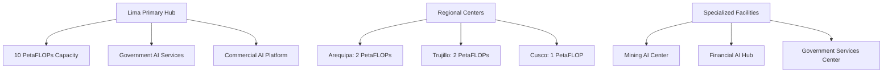
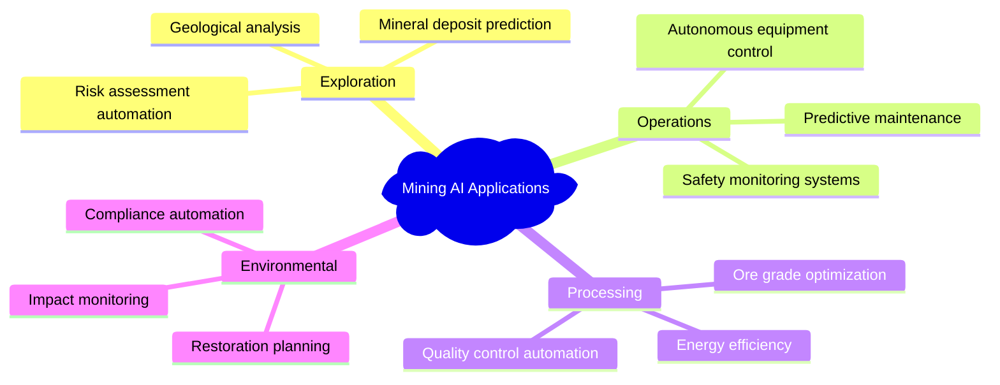
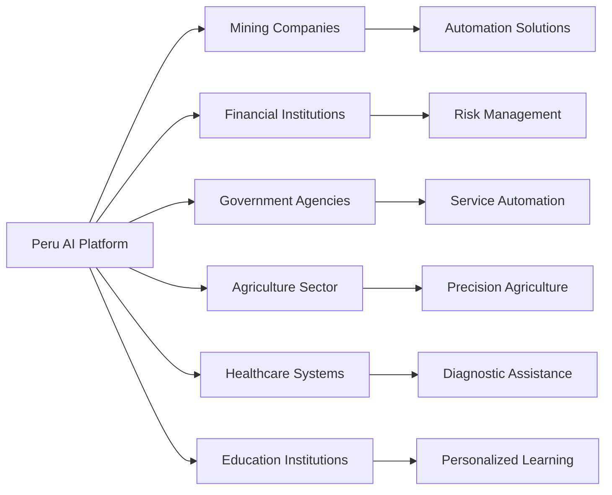
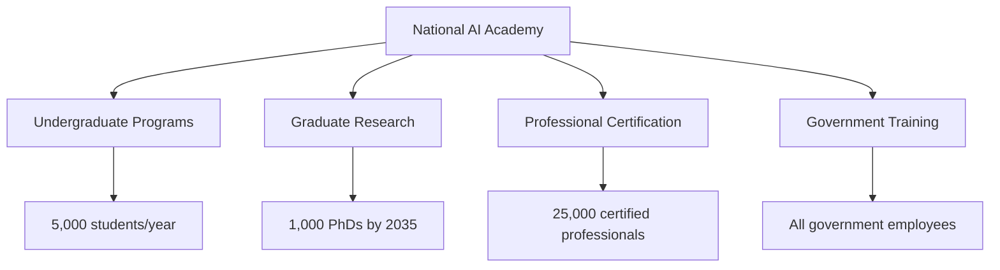
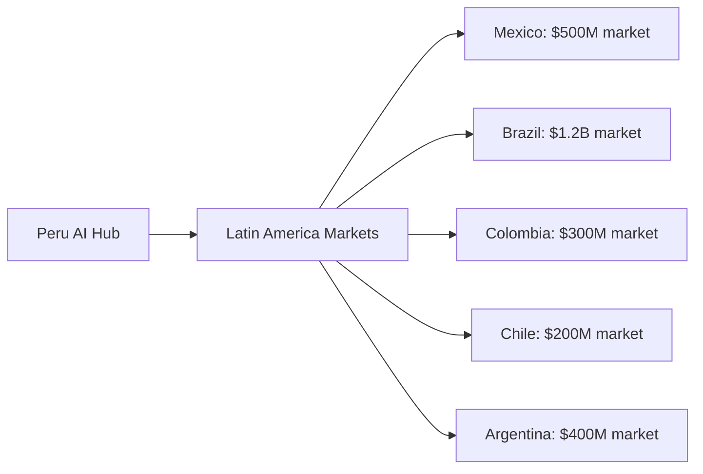

# AI and Computing Infrastructure Strategy

This document outlines Peru's comprehensive artificial intelligence and computing infrastructure development strategy to achieve regional technological leadership.

## Strategic Vision

Transform Peru into Latin America's dominant AI and computing hub through massive infrastructure investment, strategic talent acquisition, and sovereign capability development.

## Core Objectives

### Primary Goals
- **Regional Leadership**: Become Latin America's AI services provider
- **Sovereign Capabilities**: Indigenous AI development and computing infrastructure
- **Export Revenue**: $8+ billion annual AI services exports by 2040
- **Technology Independence**: Reduced dependence on foreign AI systems

### Computing Infrastructure Targets

| Phase | Timeframe | Capacity Target | Investment | Key Milestones |
|-------|-----------|-----------------|------------|----------------|
| Foundation | 2025-2027 | 1 PetaFLOP | $5B | First data center operational |
| Acceleration | 2028-2032 | 5 PetaFLOPs | $10B | Commercial AI services launch |
| Dominance | 2033-2040 | 15+ PetaFLOPs | $5B | Regional standard-setting |

## Infrastructure Development Strategy

### Data Center Network

### Computing Hardware Strategy
- **GPU Procurement**: The strategy centers on acquiring cutting-edge hardware, including NVIDIA's H200 series GPUs. These processors are specifically designed for large-scale generative AI and high-performance computing (HPC), offering significant advances in memory capacity and bandwidth essential for training and deploying large language models (NVIDIA, 2023).
- **Storage Systems**: High-performance parallel storage
- **Networking**: 400Gbps+ interconnects
- **Power Infrastructure**: Direct renewable energy connections
- **Cooling**: Advanced liquid cooling systems

## Sovereign AI Development

### Multilingual AI Capabilities

#### Spanish Language Models
- **Market Focus**: The global Spanish-speaking population represents a significant market of nearly 500 million native speakers, making it the world's second-most spoken native language (Instituto Cervantes, 2023).
- **Applications**: Business, education, government, creative content
- **Competitive Advantage**: Cultural context and regional dialects
- **Revenue Potential**: $3B+ annual exports

#### Quechua Language Models
- **Strategic Importance**: Developing advanced AI models for Quechua aligns with global efforts to leverage technology for the preservation and revitalization of indigenous and low-resource languages. This initiative represents a significant contribution to digital inclusion and cultural heritage, supported by organizations like UNESCO (UNESCO, 2025).
- **Cultural Significance**: Preservation and promotion of indigenous heritage
- **Technical Innovation**: Low-resource language AI development
- **International Interest**: Global research and cultural partnerships

#### Multilingual Integration
- **Spanish-English-Quechua**: Tri-lingual AI systems
- **Real-time Translation**: Government and business applications
- **Cultural Bridge**: Indigenous knowledge integration with modern AI

### Sector-Specific AI Applications

#### Mining Technology AI

**Market Potential**: $2B+ regional mining AI market
**Competitive Advantage**: Deep mining expertise + AI capability
**Export Opportunities**: Global mining companies, developing nations

#### Agricultural AI Systems
- **Precision Farming**: Crop optimization, yield prediction
- **Climate Adaptation**: Weather pattern analysis, resilience planning
- **Supply Chain**: Logistics optimization, market prediction
- **Export Markets**: $1B+ Latin American agtech market

#### Financial AI Services
- **Payment Systems**: Digital transaction processing
- **Risk Assessment**: Credit scoring, fraud detection
- **Regulatory Compliance**: Automated reporting, monitoring
- **Regional Expansion**: $3B+ Latin American fintech market

### Government AI Integration

#### Digital Government Services
- **Citizen Services**: AI chatbots in Spanish, Quechua, English
- **Administrative Automation**: Document processing, permit systems
- **Transparency Tools**: Automated reporting, public data analysis
- **Service Delivery**: 24/7 AI-powered government assistance

#### Policy and Governance AI
- **Policy Analysis**: Impact assessment, regulatory analysis
- **Economic Modeling**: Macroeconomic simulation, forecasting
- **Social Services**: Benefit distribution optimization
- **Emergency Response**: Disaster prediction and coordination

## Commercial AI Services Platform

### B2B AI Services

### Revenue Streams

| Service Category | 2030 Revenue | 2035 Revenue | 2040 Revenue |
|------------------|--------------|--------------|--------------|
| **Mining AI** | $500M | $1.2B | $2.0B |
| **Financial AI** | $300M | $800M | $1.5B |
| **Government AI** | $200M | $600M | $1.0B |
| **Agriculture AI** | $150M | $400M | $800M |
| **Other Sectors** | $350M | $1.0B | $2.7B |
| **Total** | **$1.5B** | **$4.0B** | **$8.0B+** |

## Research and Development Framework

### Peru AI Research Institute
- **Mission**: Advance AI research, develop indigenous capabilities
- **Structure**: Government-university-industry collaboration
- **Focus Areas**: Multilingual AI, low-resource languages, applied AI
- **International Partnerships**: The institute will forge partnerships with world-leading research universities, including MIT, Stanford, Oxford, and ETH Zurich, which are consistently ranked among the top institutions globally for computer science and AI research (CSRankings.org, 2024).

### University Integration Program
- **Universidad Nacional Mayor de San Marcos**: AI research center
- **Pontificia Universidad Católica del Perú**: Applied AI lab
- **Universidad de Ingeniería y Tecnología**: Technical development
- **Regional Universities**: Distributed research network

### Startup Acceleration Program
- **AI-focused Incubators**: 10 facilities across regions
- **Venture Capital Fund**: $2B government co-investment
- **International Mentorship**: Silicon Valley, London, Tel Aviv connections
- **Talent Pipeline**: University-to-startup pathways

## Human Capital Development

### Talent Acquisition Strategy

#### International Recruitment
- **Target**: 2,000 international AI experts by 2030
- **Compensation**: Competitive with Singapore, UAE levels
- **Incentives**: Tax advantages, research funding, equity participation
- **Focus Countries**: US, Canada, UK, Germany, Israel, India, China

#### Diaspora Repatriation
- **Target**: 5,000 Peruvian AI experts return by 2035
- **Program**: Fast-track visas, housing assistance, career development
- **Network Activation**: Global Peruvian tech professional database
- **Incentive Package**: Relocation support, research opportunities

### Domestic Training Programs

#### National AI Academy

#### Training Targets by 2040
- **AI Engineers**: 50,000 trained professionals
- **Government AI Users**: 100,000 civil servants
- **Business AI Leaders**: 25,000 private sector experts
- **Research Scientists**: 5,000 PhD-level researchers

## Technology Infrastructure

### Computing Architecture
- **Hybrid Cloud**: Government + commercial cloud services
- **Edge Computing**: Distributed processing for real-time applications
- **Quantum Readiness**: Preparation for quantum computing integration
- **Security**: Advanced cybersecurity and encryption

### Data Infrastructure
- **Government Data Lake**: Centralized public data repository
- **Privacy Protection**: Data handling will adhere to international standards for data privacy and protection, such as the General Data Protection Regulation (GDPR) in Europe, to ensure user trust and facilitate international data-sharing agreements (European Parliament, 2016).
- **Open Data Initiative**: Public datasets for research and innovation
- **Cross-border Data**: Regional data sharing agreements

## International Partnerships

### Technology Transfer Agreements

#### China AI Infrastructure Partnership
- **Investment**: $4B Chinese infrastructure investment
- **Technology**: Computing hardware, data center construction
- **Knowledge Transfer**: Manufacturing, operations management
- **Market Access**: Chinese AI companies Peru operations

#### US AI Research Collaboration
- **Focus**: Responsible AI development, safety research, and ethical guidelines, aligning with frameworks proposed by leading US institutions and government initiatives.
- **Institutions**: MIT, Stanford, Carnegie Mellon partnerships
- **Funding**: $500M joint research programs
- **Talent Exchange**: Researcher mobility programs

#### European AI Governance Partnership
- **Focus**: AI ethics, regulatory frameworks
- **Partners**: EU institutions, national governments, guided by frameworks like the EU's AI Act, which sets a global standard for AI regulation and ethics (European Commission, 2021).
- **Programs**: Regulatory harmonization, standards development
- **Benefits**: Market access, credibility enhancement

## Market Development Strategy

### Regional Expansion

### Competitive Positioning
- **Cost Advantage**: 30-50% lower costs than US/European providers
- **Cultural Alignment**: Spanish-speaking markets, cultural understanding. The strategy targets a Latin American AI market projected to grow significantly, leveraging shared language and cultural context to provide tailored solutions (Mordor Intelligence, 2023).
- **Time Zone**: Favorable for North/South American collaboration
- **Quality**: International standard AI capabilities

## Risk Mitigation

### Technology Risks
- **Talent Shortage**: Aggressive recruitment, training programs
- **Rapid Change**: Flexible infrastructure, continuous learning
- **Competition**: First-mover advantage, unique value propositions
- **Cybersecurity**: Advanced security, international cooperation

### Economic Risks
- **Investment Requirements**: Phased development, international partnerships
- **Market Competition**: Differentiation through specialization
- **Currency Risk**: Multi-currency operations, natural hedging

## Success Metrics and KPIs

### Technical Metrics
- **Computing Capacity**: PetaFLOPs operational
- **AI Models**: Number and quality of deployed models
- **Performance**: Benchmarks vs. international standards
- **Innovation**: Patents, publications, breakthrough achievements

### Economic Metrics
- **Revenue Growth**: Annual AI services exports
- **Employment**: High-skilled job creation
- **Investment**: Private sector investment attraction
- **GDP Contribution**: Technology sector percentage

### Strategic Metrics
- **Regional Leadership**: Market share in Latin America
- **Sovereignty**: Reduced foreign AI dependence
- **Innovation**: Global AI research ranking
- **Influence**: International AI governance participation

---

## References

CSRankings.org. (2024). _Computer Science Rankings_. Retrieved from <https://csrankings.org/>

European Commission. (2021). _Proposal for a Regulation laying down harmonised rules on artificial intelligence (Artificial Intelligence Act)_. <https://digital-strategy.ec.europa.eu/en/library/proposal-regulation-laying-down-harmonised-rules-artificial-intelligence-artificial-intelligence-act>

European Parliament and Council of the European Union. (2016). _Regulation (EU) 2016/679 of the European Parliament and of the Council of 27 April 2016 on the protection of natural persons with regard to the processing of personal data and on the free movement of such data, and repealing Directive 95/46/EC (General Data Protection Regulation)_. <https://eur-lex.europa.eu/eli/reg/2016/679/oj>

Instituto Cervantes. (2023). _El español: una lengua viva. Informe 2023_. <https://cvc.cervantes.es/lengua/anuario/anuario_23/informes_ic/p01.htm>

Mordor Intelligence. (2023). _Latin America Artificial Intelligence (AI) Market Size & Share Analysis_. <https://www.mordorintelligence.com/industry-reports/latin-america-artificial-intelligence-market>

NVIDIA. (2023, November 13). _NVIDIA Supercharges Hopper, the World's Leading AI Computing Platform_. NVIDIA Newsroom. <https://nvidianews.nvidia.com/news/nvidia-supercharges-hopper-the-worlds-leading-ai-computing-platform>

UNESCO. (2025, March 13). _National Consultation on Indigenous Languages: A Call for Preservation and Technology Integration_. <https://www.unesco.org/en/articles/national-consultation-indigenous-languages-call-preservation-and-technology-integration>

*This document is part of the Peru 2040 strategic framework. Implementation requires coordination with energy infrastructure, financial planning, and international partnership development.*
