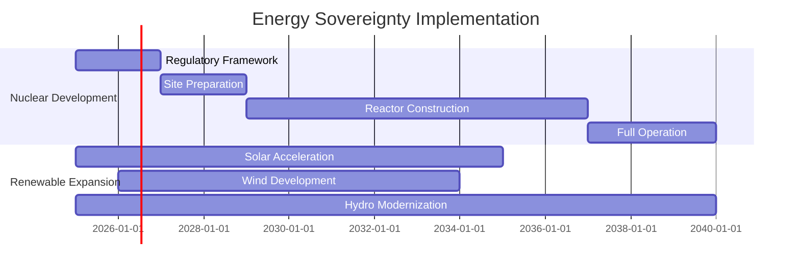

# Energy Sovereignty Strategy

This document outlines Peru's comprehensive energy sovereignty strategy, focusing on nuclear power development and renewable energy acceleration.

## Overview

Energy independence represents the foundation of technological sovereignty. Peru's strategy combines rapid renewable energy expansion with strategic nuclear capability development to achieve energy security and support technological transformation.

## Nuclear Power Development

### Strategic Framework
- **Target Capacity**: 8 GW by 2040
- **Technology Partner**: Korea (KEPCO model)
- **Investment**: $25 billion over 15 years
- **Timeline**: First reactor operational by 2033

### Implementation Phases

#### Phase 1: Regulatory Foundation (2025-2027)
- Establish Nuclear Regulatory Authority (FANR model)
- International agreements and safety frameworks
- Site selection and preparation
- Human capital development

#### Phase 2: Construction (2028-2035)
- First reactor construction (2 GW)
- Second reactor construction (2 GW)
- Grid integration infrastructure
- Fuel cycle development

#### Phase 3: Expansion (2035-2040)
- Third and fourth reactor construction (4 GW)
- Export capability development
- Advanced technology integration
- Regional cooperation initiatives

### Safety and Security Framework
- International Atomic Energy Agency (IAEA) compliance
- Non-proliferation treaty adherence
- Advanced safety systems
- Cybersecurity protection
- Emergency response protocols

## Renewable Energy Acceleration

### Solar Energy Development
- **Target**: 25 GW potential capacity
- **Focus Areas**: Industrial zones, mining operations, export development
- **Technology**: Chinese partnership for manufacturing localization
- **Timeline**: 10 GW operational by 2030

### Wind Energy Development
- **Target**: 5+ GW coastal wind resources
- **Technology Partners**: European companies (Vestas, Siemens)
- **Integration**: Smart grid management systems
- **Focus**: Coastal and highland installations

### Hydroelectric Optimization
- **Current**: 12 GW operational
- **Target**: 20 GW by 2040
- **Strategy**: Modernization + small-scale Andean development
- **Innovation**: Pumped storage for grid stability

## Energy Mix Targets by 2040

| Source | Capacity (GW) | Percentage | Purpose |
|--------|---------------|------------|---------|
| Nuclear | 8 | 18% | Baseload, industrial |
| Hydro | 20 | 44% | Grid backbone |
| Solar | 12 | 27% | Data centers, industry |
| Wind | 5 | 11% | Coastal augmentation |
| **Total** | **45** | **100%** | **Energy independence** |

## Economic Impact

### Investment Requirements
- Nuclear development: $25 billion
- Renewable expansion: $8 billion
- Grid modernization: $2 billion
- **Total energy investment**: $35 billion

### Revenue Generation
- Domestic energy independence: $3 billion annual savings
- Regional energy exports: $2 billion potential
- Technology services: $1 billion consulting/engineering
- Manufacturing support: Industrial competitiveness

## International Partnerships

### Korea Nuclear Partnership
- Technology transfer for reactor construction
- Training programs for nuclear engineers
- Regulatory assistance and expertise
- Long-term operational support

### Regional Energy Cooperation
- Brazil: Grid interconnection possibilities
- Chile: Mining energy requirements
- Colombia: Technology sharing
- Ecuador: Cross-border energy trade

## Risk Mitigation

### Nuclear Risks
- **Safety**: International standards, redundant systems
- **Security**: Advanced cybersecurity, physical protection
- **Waste**: Long-term storage solutions, international cooperation
- **Political**: Constitutional protection, cross-party consensus

### Economic Risks
- **Cost overruns**: Fixed-price contracts, international oversight
- **Financing**: Sovereign wealth fund, international development finance
- **Technology**: Multiple supplier relationships, domestic capability building

## Environmental Considerations

### Environmental Excellence
- Carbon neutrality by 2035
- Environmental impact assessments
- Biodiversity protection measures
- Community consultation processes

### Sustainability Metrics
- 90% carbon-free electricity by 2040
- Zero environmental incidents target
- Community benefit sharing programs
- Ecosystem restoration initiatives

## Implementation Timeline

## Success Metrics

### 2030 Targets
- Nuclear construction 50% complete
- 15 GW renewable capacity operational
- Energy import dependence reduced by 40%
- 10,000 energy sector jobs created

### 2035 Targets
- First nuclear reactor operational
- 30 GW renewable capacity
- Energy independence achieved
- Regional energy export capabilities

### 2040 Targets
- 8 GW nuclear capacity fully operational
- 45 GW total energy capacity
- Regional energy hub status
- Technology export leadership

---

*This document is part of the Peru 2040 strategic framework. For implementation details, see the corresponding sections in the financial and governance documentation.*
