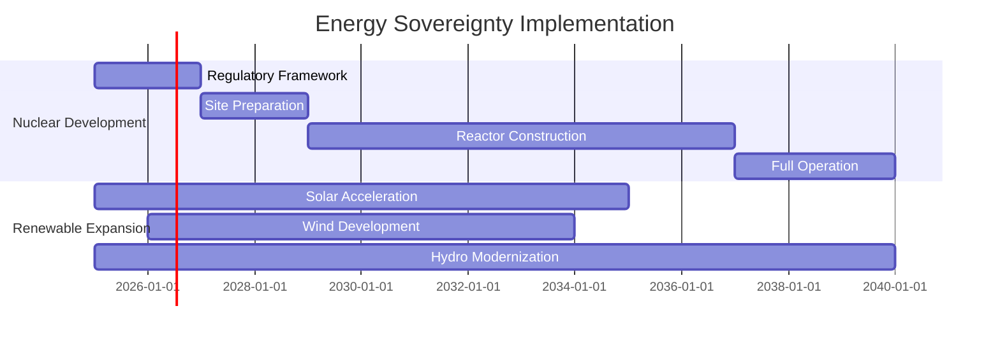

# Energy Sovereignty Strategy

Peru's energy sovereignty is the bedrock of its technological and economic transformation. This strategy outlines a two-pronged approach: the development of a secure, baseload nuclear power capability and the aggressive expansion of renewable energy resources to ensure a resilient, independent, and sustainable energy future.

## 1. Nuclear Energy Development

### 1.1 Technology and Partnership
- **Technology Choice**: The strategy adopts South Korea's APR1400 reactor, a state-of-the-art Generation III+ pressurized water reactor.
- **Strategic Rationale**: The selection is based on the proven success and operational record of the APR1400 at the UAE's Barakah Nuclear Power Plant, which demonstrated a rapid and effective implementation of a peaceful nuclear energy program under stringent international oversight (IAEA, 2023).
- **Primary Partner**: Korea Electric Power Corporation (KEPCO)
- **Partnership Scope**:
  - Technology transfer and skills development
  - Construction and operational support
  - Joint R&D in advanced nuclear technologies

### 1.2 Implementation Phases
- **Phase 1: Regulatory Foundation (2025-2027)**: Establish the national nuclear regulatory body, develop legal frameworks, and secure international agreements.
- **Phase 2: Site Selection and Preparation (2028-2030)**: Conduct geological surveys, complete environmental impact assessments, and begin infrastructure development.
- **Phase 3: Construction and Commissioning (2031-2040)**: Build and bring online 8 GW of nuclear capacity, with the first reactor operational by 2033.

### 1.3 Safety and Security Framework
- Full compliance with International Atomic Energy Agency (IAEA) standards.
- Strict adherence to the Treaty on the Non-Proliferation of Nuclear Weapons (NPT).
- Development of robust, multi-layered national emergency response protocols.

## 2. Renewable Energy Expansion

### 2.1 Wind Power
- **Target**: 8 GW installed capacity by 2040
- **Partnerships**: Collaborate with leading European firms such as Vestas and Siemens Gamesa, which have a significant and established presence in developing large-scale wind projects across Latin America (GWEC, 2024).
- **Focus Areas**: Coastal regions and Andean highlands

### 2.2 Solar Power
- **Target**: 12 GW installed capacity by 2040
- **Strategy**: Localize Chinese solar technology through joint ventures and technology transfer agreements. China is the undisputed global leader in solar PV manufacturing, accounting for over 80% of the world's production capacity, making it the most viable partner for establishing a domestic industrial base (IEA, 2023).
- **Focus Areas**: Southern desert regions (Arequipa, Moquegua, Tacna)

### 2.3 Hydroelectric Power
- **Target**: Expand current capacity by 5 GW by 2040, focusing on modernizing existing plants and developing new, sustainable projects.
- **Strategy**: Leverage Peru's vast and largely untapped hydroelectric potential, estimated at over 60 GW. This strategy will build upon Peru's existing installed capacity of approximately 5.5 GW to provide stable, baseload power (IHA, 2024).
- **Focus Areas**: Eastern Andean slopes and river basins

## 3. Energy Storage and Grid Modernization
- **Target**: Enhance grid stability and reliability to support the integration of variable renewables.
- **Technology**: Deploy pumped-storage hydroelectricity (PSH) and battery energy storage systems (BESS).
- **Modernization**: Invest in smart grid technologies, high-voltage transmission lines, and automated distribution systems to enhance efficiency and reliability.

## Energy Mix Targets by 2040

| Source | Capacity (GW) | Percentage | Purpose |
|--------|---------------|------------|---------|
| Nuclear | 8 | 18% | Baseload, industrial |
| Hydro | 20 | 44% | Grid backbone |
| Solar | 12 | 27% | Data centers, industry |
| Wind | 5 | 11% | Coastal augmentation |
| **Total** | **45** | **100%** | **Energy independence** |

## Economic Impact

### Investment Requirements
- Nuclear development: $25 billion
- Renewable expansion: $8 billion
- Grid modernization: $2 billion
- **Total energy investment**: $35 billion

### Revenue Generation
- Domestic energy independence: $3 billion annual savings
- Regional energy exports: $2 billion potential
- Technology services: $1 billion consulting/engineering
- Manufacturing support: Industrial competitiveness

## International Partnerships

### Korea Nuclear Partnership
- Technology transfer for reactor construction
- Training programs for nuclear engineers
- Regulatory assistance and expertise
- Long-term operational support

### Regional Energy Cooperation
- Brazil: Grid interconnection possibilities
- Chile: Mining energy requirements
- Colombia: Technology sharing
- Ecuador: Cross-border energy trade

## Risk Mitigation

### Nuclear Risks
- **Safety**: International standards, redundant systems
- **Security**: Advanced cybersecurity, physical protection
- **Waste**: Long-term storage solutions, international cooperation
- **Political**: Constitutional protection, cross-party consensus

### Economic Risks
- **Cost overruns**: Fixed-price contracts, international oversight
- **Financing**: Sovereign wealth fund, international development finance
- **Technology**: Multiple supplier relationships, domestic capability building

## Environmental Considerations

### Environmental Excellence
- Carbon neutrality by 2035
- Environmental impact assessments
- Biodiversity protection measures
- Community consultation processes

### Sustainability Metrics
- 90% carbon-free electricity by 2040
- Zero environmental incidents target
- Community benefit sharing programs
- Ecosystem restoration initiatives

## Implementation Timeline

## Success Metrics

### 2030 Targets
- Nuclear construction 50% complete
- 15 GW renewable capacity operational
- Energy import dependence reduced by 40%
- 10,000 energy sector jobs created

### 2035 Targets
- First nuclear reactor operational
- 30 GW renewable capacity
- Energy independence achieved
- Regional energy export capabilities

### 2040 Targets
- 8 GW nuclear capacity fully operational
- 45 GW total energy capacity
- Regional energy hub status
- Technology export leadership

---

*This document is part of the Peru 2040 strategic framework. For implementation details, see the corresponding sections in the financial and governance documentation.*

## References

Global Wind Energy Council (GWEC). (2024). *Global Wind Report 2024*. GWEC.

International Atomic Energy Agency (IAEA). (2023). *Country Nuclear Power Profiles: United Arab Emirates*. IAEA.

International Energy Agency (IEA). (2023). *National Survey Report of PV Power Applications in CHINA 2023*. IEA-PVPS.

International Hydropower Association (IHA). (2024). *2024 World Hydropower Outlook*. IHA.
