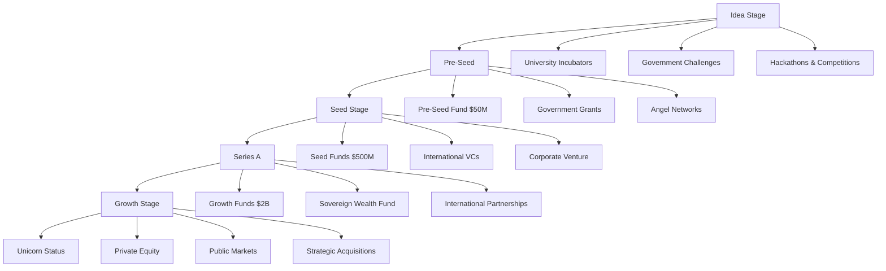
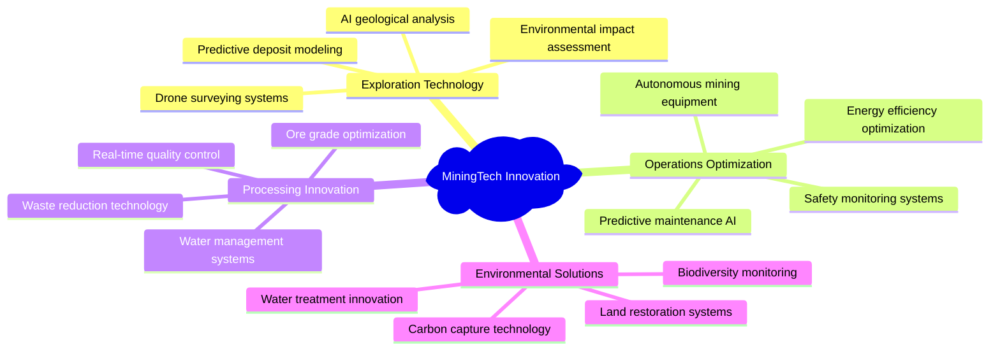
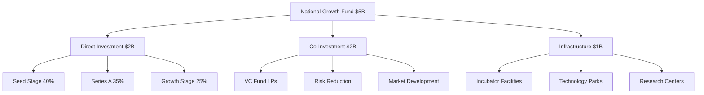
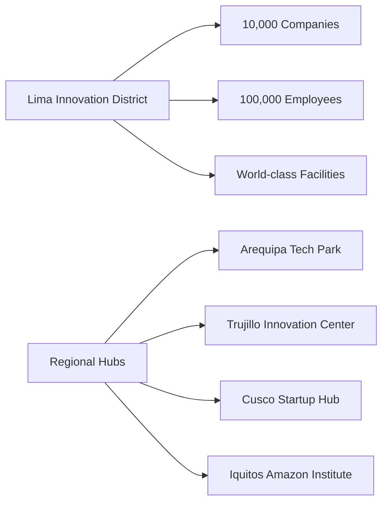
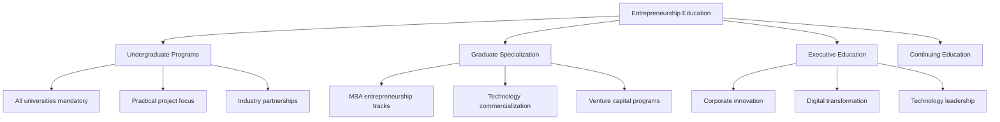
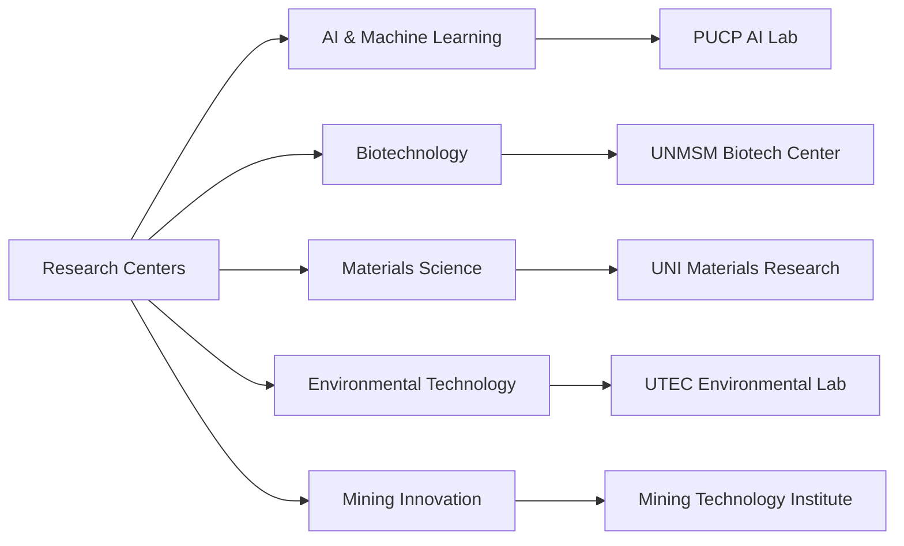
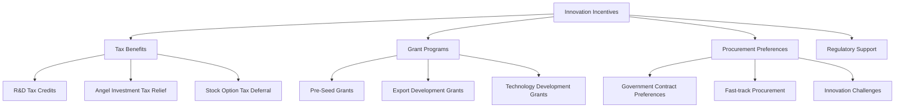
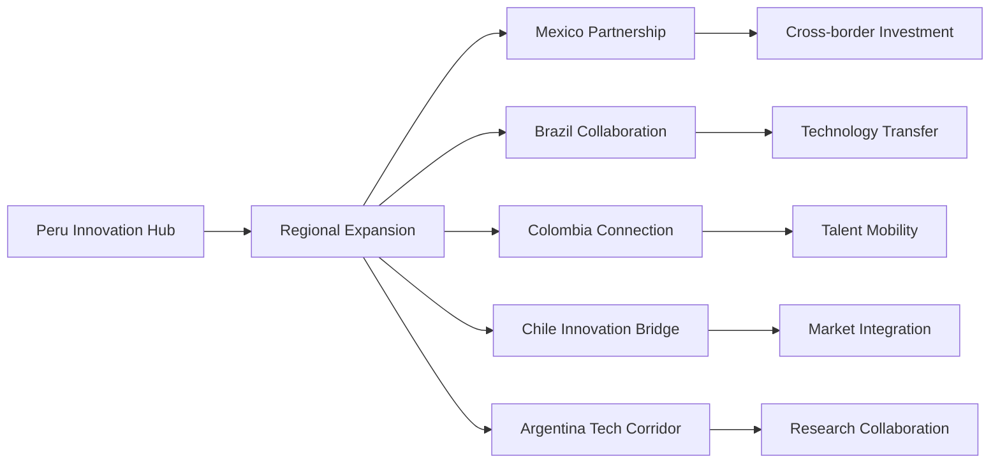
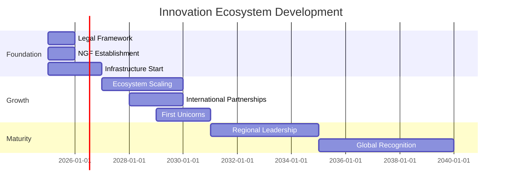

# Innovation Ecosystem Development Strategy

This document outlines Peru's comprehensive strategy for building a world-class innovation ecosystem that supports technological sovereignty and economic transformation.

## Strategic Vision

Create Latin America's most dynamic and successful innovation ecosystem, generating 15 unicorn companies and 200,000 technology jobs by 2040 through strategic government enablement and private sector leadership.

## Ecosystem Components

### Startup Development Pipeline

### Quantitative Targets by 2040

| Metric | 2025 | 2030 | 2035 | 2040 |
|--------|------|------|------|------|
| **Active Startups** | 500 | 2,000 | 3,500 | 5,000 |
| **Unicorn Companies** | 0 | 3 | 8 | 15 |
| **VC Funds Operational** | 5 | 15 | 25 | 40 |
| **Ecosystem Valuation** | $2B | $15B | $35B | $50B |
| **Employment** | 25K | 75K | 125K | 200K |
| **Average Salary** | $15K | $20K | $25K | $30K |

## Sector Focus Areas

### Primary Innovation Sectors

#### MiningTech: Global Leadership

**Market Opportunity**: Peru's position as a global mining powerhouse provides a unique foundation for developing a world-class Mining Technology (MiningTech) sector. The global market for connected mining is projected to exceed $16 billion by 2030, presenting a significant opportunity for specialized Peruvian startups to develop and export solutions in automation, safety, and environmental management (Fortune Business Insights, 2024).
**Competitive Advantage**: Deep mining expertise + proximity to major operations
**Target Companies**: 500 MiningTech startups by 2040

#### AgroTech: Regional Excellence
- **Precision Agriculture**: IoT sensors, satellite monitoring, AI crop optimization
- **Climate Adaptation**: Resilient crop varieties, weather prediction, water management
- **Supply Chain**: Cold chain technology, logistics optimization, export facilitation
- **Market Size**: Peru's diverse agricultural landscape creates a natural laboratory for innovation in Agriculture Technology (AgroTech). The Latin American AgriTech market, valued at over $2 billion, is rapidly expanding, with opportunities in sustainable farming, crop efficiency, and supply chain logistics (IMARC Group, 2024).

#### FinTech: Financial Innovation
- **Digital Payments**: Mobile payment systems, cryptocurrency platforms
- **Microfinance**: AI-powered credit scoring, small business lending
- **Remittances**: Cross-border payment optimization
- **RegTech**: Compliance automation, risk management systems

#### LogisticsTech: Trade Optimization
- **Port Technology**: Automated cargo handling, predictive maintenance
- **Supply Chain**: End-to-end visibility, optimization algorithms
- **Last-Mile Delivery**: Urban logistics, drone delivery systems
- **Trade Facilitation**: Digital customs, documentation automation

### Emerging Innovation Areas

#### CleanTech Development
- **Energy Storage**: Battery technology, grid storage systems
- **Renewable Manufacturing**: Solar panel production, wind turbine components
- **Electric Vehicles**: Battery systems, charging infrastructure
- **Environmental Monitoring**: Air quality, water systems, biodiversity tracking

#### HealthTech Innovation
- **Telemedicine**: Remote healthcare delivery, AI diagnostics
- **Digital Health**: Health monitoring devices, preventive care systems
- **Pharmaceutical**: Drug discovery, clinical trial technology
- **Medical Devices**: Diagnostic equipment, surgical robotics

## Financial Framework

### National Growth Fund Structure

### Investment Strategy by Stage

| Stage | Fund Allocation | Typical Investment | Target Companies |
|-------|----------------|-------------------|------------------|
| **Pre-Seed** | $200M | $50K-$150K | 2,000 companies |
| **Seed** | $800M | $200K-$1M | 1,000 companies |
| **Series A** | $1.5B | $2M-$10M | 300 companies |
| **Growth** | $2.5B | $10M-$50M | 100 companies |

### Private Sector Engagement

#### Corporate Venture Capital
- **Mining Companies**: Technology development partnerships
- **Financial Institutions**: FinTech investment and collaboration
- **Telecommunications**: Digital infrastructure and services
- **Energy Companies**: CleanTech and efficiency solutions

#### International VC Partnerships
- **Silicon Valley Funds**: Establish formal partnerships with world-class firms like Sequoia Capital and Andreessen Horowitz (a16z). These firms are noted for providing deep operational support to their portfolio companies beyond mere capital injection, a model Peru's national fund will emulate (Sequoia Capital, n.d.; Andreessen Horowitz, n.d.).
- **European VCs**: Technology transfer and market access
- **Asian Investment**: Chinese and Korean technology funds
- **Regional Expansion**: Latin American cross-border investment

## Infrastructure Development

### Physical Infrastructure

#### Technology Parks Network

#### Incubator and Accelerator Network
- **University Incubators**: 20 facilities across major universities
- **Corporate Accelerators**: Industry-specific programs
- **International Partnerships**: Foster the creation of "Venture Builders" or "Startup Factories." These organizations systematically build companies from the ground up by providing ideas, shared operational resources, and initial capital, drawing on successful international examples like Germany's Rocket Internet and New York's Betaworks (Diallo, 2015; García-Luengo, 2017).
- **Specialized Programs**: Women entrepreneurs, indigenous innovation

### Digital Infrastructure

#### Innovation Support Platforms
- **Startup Registration**: 24-hour company incorporation
- **IP Protection**: Fast-track patent and trademark systems
- **Regulatory Sandbox**: Testing environment for new technologies
- **Government Procurement**: Startup-friendly public contracts

#### Data and Analytics Infrastructure
- **Market Intelligence**: Startup ecosystem analytics
- **Performance Tracking**: KPI dashboards and reporting
- **Investment Matching**: Startup-investor connection platforms
- **International Benchmarking**: Global ecosystem comparisons

## Human Capital Development

### Entrepreneurship Education

#### University Integration

#### Skills Development Programs
- **Technical Skills**: Programming, data science, AI/ML, cybersecurity
- **Business Skills**: Finance, marketing, operations, strategy
- **Soft Skills**: Leadership, communication, negotiation, networking
- **Specialized Programs**: Women in tech, indigenous entrepreneurs

### Talent Acquisition and Retention

#### International Talent Attraction
- **Startup Visas**: Launch a competitive "Digital Nomad Visa" to attract skilled international tech talent. Such programs have proven effective in boosting local economies by attracting high-income remote workers who contribute to local spending without taking local jobs (Choudhury, 2022). A streamlined startup visa will also be created for international founders who wish to establish their companies in Peru.
- **Tax Incentives**: Reduced personal and corporate tax rates
- **Quality of Life**: Modern infrastructure, international schools, healthcare
- **Professional Networks**: Mentorship and peer support systems

#### Diaspora Engagement
- **Return Programs**: Incentives for Peruvian entrepreneurs abroad
- **Virtual Participation**: Remote involvement in ecosystem development
- **Investment Attraction**: Diaspora angel investment and mentorship
- **Knowledge Transfer**: Technology and business model sharing

## Research and Development Framework

### University-Industry Collaboration

#### Research Commercialization
- **Technology Transfer Offices**: Professional IP and licensing management
- **Spin-off Support**: University-based startup development
- **Industry Partnerships**: Joint research and development programs
- **IP Sharing**: Clear frameworks for collaborative innovation

#### Innovation Research Centers

### International Research Partnerships
- **MIT, Stanford, Cambridge, ETH Zurich**: To accelerate research and development, Peru will establish formal partnerships with the world's leading technology universities, including MIT, Stanford, the University of Cambridge, and ETH Zurich. These institutions are consistently ranked at the top for computer science and AI, providing access to elite talent and cutting-edge research (QS World University Rankings, 2024).

## Government Policy Framework

### Regulatory Innovation

#### Startup-Friendly Regulations
- **Company Formation**: 24-hour incorporation process
- **Tax Structure**: Progressive taxation, R&D incentives
- **Employment Law**: Flexible hiring for startups
- **Bankruptcy Law**: Second-chance entrepreneurship protection

#### Innovation Incentives

### Public Procurement Innovation
- **Innovation Challenges**: Government problems solved by startups
- **Pilot Programs**: Small-scale testing of innovative solutions
- **Preferred Supplier Status**: Benefits for innovative companies
- **Performance-based Contracts**: Results-oriented agreements

## International Ecosystem Integration

### Global Startup Ecosystem Connections

#### Silicon Valley Partnerships
- **Acceleration Programs**: Peru startups in Silicon Valley programs
- **Venture Capital**: Access to US investment capital
- **Market Expansion**: US market entry support
- **Talent Exchange**: Engineer and entrepreneur mobility

#### European Innovation Cooperation
- **Horizon Europe**: Research and innovation program participation
- **EIT Digital**: European Institute of Innovation and Technology partnerships
- **Market Access**: European market entry facilitation
- **Technology Transfer**: European technology acquisition

#### Asian Technology Partnerships
- **Korean Innovation**: Startup exchange and investment programs
- **Japanese Technology**: Corporate partnership and investment
- **Chinese Market**: Access to Chinese technology and markets
- **Singapore Hub**: Regional Asia-Pacific expansion base

### Regional Leadership Strategy

#### Latin American Innovation Network

## Success Metrics and KPIs

### Ecosystem Health Metrics
- **Startup Density**: Companies per capita, per GDP
- **Funding Velocity**: Time from idea to investment
- **Success Rate**: Percentage of startups reaching Series A
- **Exit Activity**: IPOs, acquisitions, successful exits

### Economic Impact Metrics
- **Job Creation**: Direct and indirect employment
- **Revenue Generation**: Startup revenue and exports
- **Investment Attraction**: Domestic and foreign investment
- **GDP Contribution**: Technology sector economic impact

### Innovation Metrics
- **Patent Activity**: Patents filed and granted
- **Research Output**: Publications, citations, breakthroughs
- **Technology Transfer**: University-industry collaboration
- **International Recognition**: Global rankings and awards

### Competitiveness Metrics
- **Global Rankings**: Startup ecosystem global position
- **Regional Leadership**: Latin American market share
- **Talent Attraction**: International talent acquisition
- **Investment Flow**: Capital attraction and deployment

## Risk Mitigation Strategy

### Market Risks
- **Competition**: Differentiation through specialization
- **Economic Cycles**: Diversified funding sources
- **Technology Changes**: Flexible, adaptive ecosystem
- **Brain Drain**: Competitive retention packages

### Policy Risks
- **Political Stability**: Cross-party consensus building
- **Regulatory Changes**: Constitutional protection of innovation
- **International Relations**: Diversified partnerships
- **Economic Policy**: Integration with national strategy

## Implementation Timeline

---

## References

Andreessen Horowitz. (n.d.). *About a16z*. a16z. Retrieved from https://a16z.com/about/

Choudhury, P. (2022, May 27). How "Digital Nomad" Visas Can Boost Local Economies. *Harvard Business Review*. Retrieved from https://hbr.org/2022/05/how-digital-nomad-visas-can-boost-local-economies

Diallo, A. (2015, January 18). How 'venture builders' are changing the startup model. *VentureBeat*. Retrieved from https://venturebeat.com/business/how-venture-builders-are-changing-the-startup-model/

Fortune Business Insights. (2024). *Connected Mining Market Size, Share, Growth & Report*. Retrieved from https://www.fortunebusinessinsights.com/connected-mining-market-102

García-Luengo, J. (2017, August 29). Venture Building, a new model for entrepreneurship and innovation. *LinkedIn*. Retrieved from https://www.linkedin.com/pulse/venture-building-new-model-entrepreneurship-jorge-garcía-luengo

IMARC Group. (2024). *Latin America Agriculture Technology (AgriTech) Market Report 2024-2032*. Retrieved from https://www.imarcgroup.com/latin-america-agriculture-technology-market

QS World University Rankings. (2024). *QS World University Rankings by Subject 2024: Computer Science and Information Systems*. Retrieved from https://www.topuniversities.com/university-rankings/university-subject-rankings/2024/computer-science-information-systems

Sequoia Capital. (n.d.). *Our Companies*. Sequoia Capital. Retrieved from https://www.sequoiacap.com/companies/

---

*This document is part of the Peru 2040 strategic framework. Success requires coordination with AI/computing development, financial planning, and international partnership strategies.*
