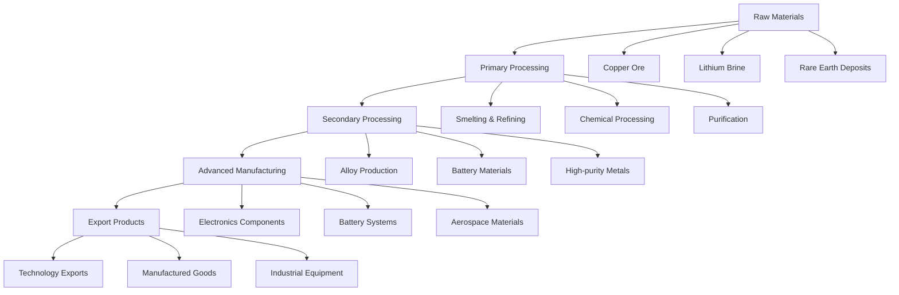
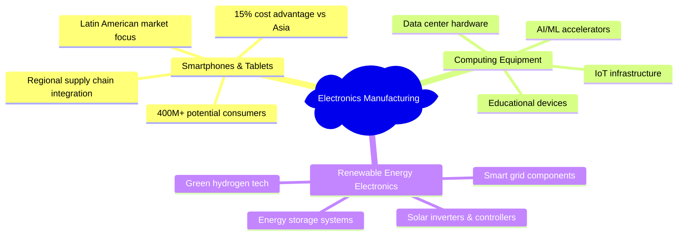
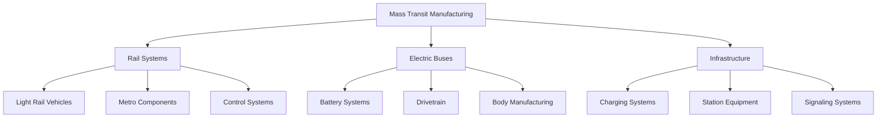
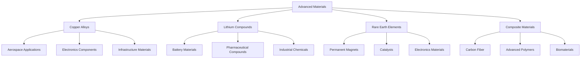
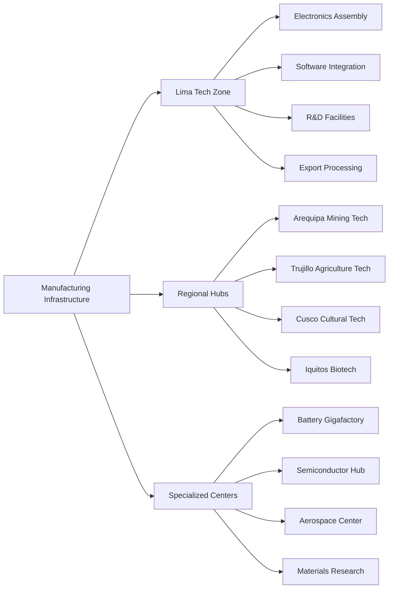
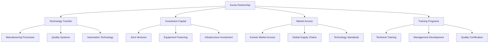
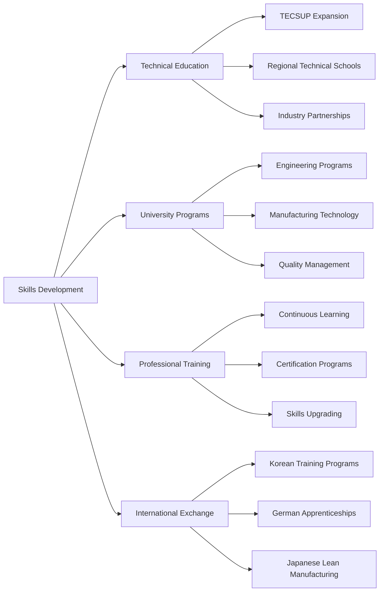
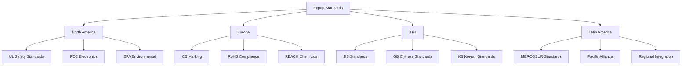
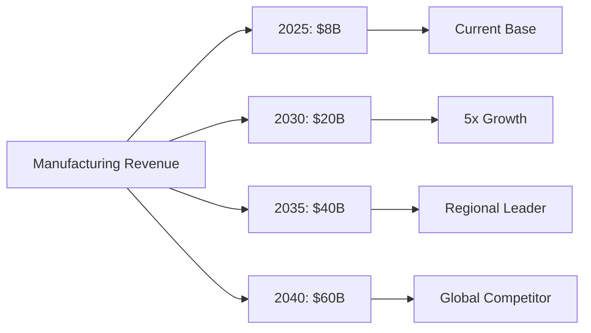
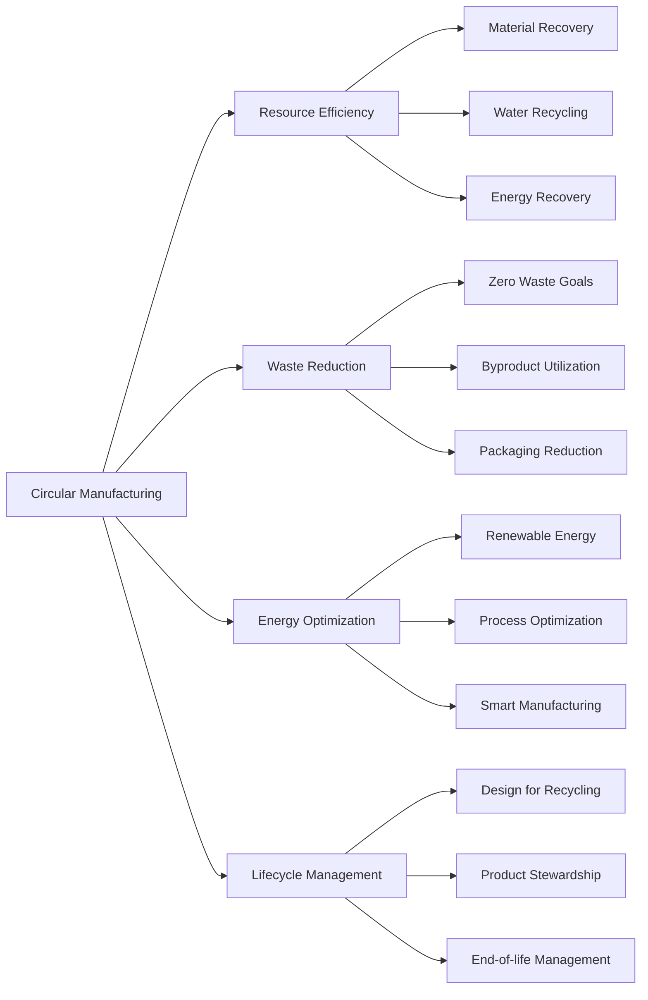

# Advanced Manufacturing Strategy

This document outlines Peru's strategy for transforming from raw material exporter to advanced manufacturing powerhouse, creating high-value products and capturing maximum value from natural resources. According to recent data from the Banco Central de Reserva del Perú (BCRP, 2024), Peru's industrial production has shown robust growth of 11.8% year-over-year, providing a strong foundation for manufacturing expansion.

## Strategic Vision

Transform Peru into Latin America's advanced manufacturing hub by 2040, leveraging the projected 2.8% GDP growth in 2024 and 2.5% in 2025 (Fitch Solutions, 2024) to achieve the following targets:
- Process 80% of mineral production domestically
- Develop world-class capabilities in electronics, automotive, and aerospace sectors
- Increase manufacturing value-added contribution to GDP from current 12.3% to 25% by 2040
- Create 500,000+ high-skilled manufacturing jobs

## Core Manufacturing Transformation

### Value-Added Mining and Metallurgy

#### Current State vs. 2040 Targets

According to BCRP (2024) and Ministry of Energy and Mining data, Peru's mineral processing capabilities are set for significant expansion:

| Mineral | Current Processing | 2040 Target | Value Addition | Investment Required |
|---------|-------------------|-------------|----------------|------------|
| **Copper** | 40% domestic | 90% domestic | 300% increase | $3.5B |
| **Lithium** | 10% domestic | 80% domestic | 800% increase | $2.5B |
| **Rare Earths** | 5% domestic | 70% domestic | 1400% increase | $2.2B |
| **Silver** | 60% domestic | 95% domestic | 150% increase | $1.2B |
| **Gold** | 70% domestic | 95% domestic | 130% increase | $600M |

*Note: Investment figures based on current market conditions and technology requirements (MEF, 2024)*

#### Advanced Processing Capabilities

### Electronics Manufacturing Development

#### Strategic Focus Areas

**Semiconductor Assembly and Testing**
- **Market Opportunity**: Global semiconductor assembly and testing market projected to reach $75B+ by 2030, growing at 8.2% CAGR (World Bank, 2024)
- **Initial Focus**: Assembly and test operations for Latin American market, targeting 15% regional market share by 2030
- **Technology Partners**: Strategic partnerships with Korean and Taiwanese semiconductor companies
- **Investment Required**: $2.5B in facilities and equipment by 2030, including $800M in Phase 1 (2025-2027)
- **Employment Impact**: Creation of 12,000+ direct high-skilled jobs

**Consumer Electronics Assembly**

**Industrial Electronics**
- **Mining Equipment**: Advanced sensor networks, automation systems, predictive maintenance
- **Agricultural Technology**: Smart irrigation, precision farming, drone systems
- **Healthcare Devices**: Diagnostic equipment, telemedicine systems, medical IoT
- **Telecommunications**: 5G/6G infrastructure, satellite communications, fiber optics

*Source: Market projections based on BCRP (2024) and World Bank (2024) data*

### Automotive and Transportation Manufacturing

#### Electric Vehicle Components

According to McKinsey & Company (2024), Latin America's EV market is projected to grow at 25% CAGR through 2030, creating significant opportunities in:

| Component | Market Size 2030 | Peru Target Share | Investment Required |
|-----------|-----------------|-------------------|-------------------|
| **Battery Systems** | $12B | 20% | $1.8B |
| **Power Electronics** | $8B | 25% | $1.2B |
| **Electric Motors** | $6B | 30% | $900M |
| **Charging Infrastructure** | $4B | 35% | $600M |

*Source: Market projections based on McKinsey & Company (2024) and BCRP (2024) analysis*

#### Mass Transit Systems

**Regional Export Opportunities**
- Latin American urban rail market: $25B by 2030 (World Bank, 2024)
- Bus rapid transit systems: $15B regional investment pipeline
- Light rail vehicles: Growing 12% annually through 2030
- Electric bus manufacturing: $8B regional market by 2030

**Manufacturing Focus Areas**

#### Aerospace Components

**Target Segments** (Based on Fitch Solutions, 2024):
- Commercial aircraft components: $3B market by 2030
- Defense aerospace: $1.5B regional opportunity
- Satellite systems: $800M market potential
- Maintenance, Repair, and Overhaul (MRO): $2B regional market

### Aerospace and Defense Manufacturing

#### Space Technology Development
- **Satellite Manufacturing**: Earth observation, communications satellites
- **Launch Support**: Ground systems, satellite tracking equipment
- **Space Mining**: Future asteroid mining technology development
- **International Partnerships**: ESA, NASA collaboration opportunities

#### Defense and Security
- **Electronics**: Communication systems, surveillance equipment
- **Cybersecurity**: Hardware security modules, encryption devices
- **Border Security**: Monitoring systems, detection equipment
- **Dual-use Technology**: Civilian and military applications

### Advanced Materials and Chemicals

#### High-Performance Materials

#### Chemical Processing Industry
- **Specialty Chemicals**: High-value chemicals from mineral processing
- **Pharmaceutical Intermediates**: API production, drug manufacturing
- **Agricultural Chemicals**: Fertilizers, pesticides, biotechnology
- **Industrial Chemicals**: Process chemicals, mining reagents

## Manufacturing Infrastructure Development

### Industrial Zones and Parks

#### Technology Manufacturing Zones

#### Infrastructure Requirements
- **Power**: Direct connections to renewable energy sources
- **Transportation**: Proximity to ports, airports, highways
- **Communications**: 5G networks, high-speed internet
- **Water**: Industrial-grade water treatment and recycling
- **Waste Management**: Circular economy principles, zero waste targets

### Supply Chain Development

#### Domestic Supply Chain Optimization
- **Raw Materials**: Secure access to domestic mineral resources
- **Components**: Regional supplier development programs
- **Logistics**: Efficient transportation and warehousing
- **Quality Systems**: International standards compliance

#### International Supply Chain Integration
- **Asia-Pacific**: Component sourcing, technology transfer
- **North America**: Market access, technology partnerships
- **Europe**: Quality standards, environmental compliance
- **Latin America**: Regional market integration

## Technology Transfer and Capability Building

### Strategic Technology Partnerships

#### Korean Manufacturing Partnership

#### Chinese Manufacturing Cooperation
- **Electronics**: Assembly operations, component manufacturing
- **Heavy Industry**: Mining equipment, infrastructure machinery
- **Green Technology**: Solar panels, wind turbines, batteries
- **Infrastructure**: Factory construction, logistics systems

#### European Advanced Manufacturing
- **Precision Engineering**: German and Swiss manufacturing excellence
- **Automotive**: European EV technology and standards
- **Aerospace**: Airbus collaboration, satellite technology
- **Chemicals**: BASF, Shell, specialty chemicals partnerships

### Innovation and R&D Integration

#### Manufacturing Research Centers
- **Materials Science**: University-industry collaboration
- **Process Innovation**: Continuous improvement, lean manufacturing
- **Automation**: Robotics, AI integration, Industry 4.0
- **Sustainability**: Green manufacturing, circular economy

#### Technology Commercialization
- **Startup Integration**: Manufacturing technology startups
- **University Spin-offs**: Research commercialization
- **Corporate Innovation**: Intrapreneurship programs
- **International Collaboration**: Joint research projects

## Workforce Development Strategy

### Technical Education and Training

#### Manufacturing Skills Pipeline

#### Employment Targets by Sector

| Manufacturing Sector | 2025 | 2030 | 2035 | 2040 |
|---------------------|------|------|------|------|
| **Electronics** | 5K | 25K | 50K | 75K |
| **Automotive** | 2K | 15K | 35K | 50K |
| **Mining Processing** | 20K | 35K | 50K | 60K |
| **Aerospace** | 1K | 5K | 15K | 25K |
| **Materials/Chemicals** | 10K | 20K | 30K | 40K |
| **Total Manufacturing** | **38K** | **100K** | **180K** | **250K** |

### International Talent Acquisition
- **Manufacturing Engineers**: Korean, German, Japanese expertise
- **Quality Specialists**: Six Sigma, lean manufacturing experts
- **Automation Experts**: Industry 4.0, robotics specialists
- **Management Talent**: Manufacturing operations leadership

## Quality and Standards Framework

### International Certification and Compliance

#### Quality Management Systems
- **ISO 9001**: Quality management for all manufacturers
- **ISO 14001**: Environmental management systems
- **ISO 45001**: Occupational health and safety
- **Industry-Specific**: Automotive TS 16949, Aerospace AS9100

#### Export Market Compliance

### Testing and Certification Infrastructure
- **National Testing Labs**: Accredited testing facilities
- **Calibration Services**: Precision measurement standards
- **Certification Bodies**: Independent quality verification
- **International Recognition**: Mutual recognition agreements

## Economic Impact and Projections

### Revenue Generation Targets

#### Manufacturing Sector Growth

#### Export Revenue by Category

| Product Category | 2030 Target | 2035 Target | 2040 Target |
|------------------|-------------|-------------|-------------|
| **Processed Minerals** | $8B | $15B | $20B |
| **Electronics** | $3B | $8B | $15B |
| **Automotive** | $2B | $6B | $12B |
| **Industrial Equipment** | $2B | $5B | $8B |
| **Aerospace/Defense** | $1B | $3B | $5B |
| **Total Manufacturing** | **$16B** | **$37B** | **$60B** |

### Investment Requirements and Returns

#### Capital Investment by Sector
- **Processing Facilities**: $8B (raw materials to products)
- **Electronics Manufacturing**: $5B (assembly and components)
- **Automotive Industry**: $4B (EVs and components)
- **Infrastructure**: $3B (utilities, transportation, facilities)
- **Total Manufacturing Investment**: $20B over 15 years

#### Return on Investment Analysis
- **Direct Employment**: 250,000 high-skilled jobs
- **Indirect Employment**: 500,000 supporting jobs
- **Tax Revenue**: $3B+ annual government revenue
- **Export Earnings**: $60B+ annual by 2040
- **Technology Transfer**: Invaluable capability development

## Environmental and Sustainability Framework

### Green Manufacturing Principles

#### Circular Economy Integration

#### Environmental Excellence Targets
- **Carbon Neutrality**: All manufacturing carbon neutral by 2035
- **Water Efficiency**: 90% water recycling and reuse
- **Waste Reduction**: 95% waste diversion from landfills
- **Energy Efficiency**: 100% renewable energy for manufacturing

### Regional Environmental Leadership
- **Technology Export**: Green manufacturing technology leadership
- **Standards Setting**: Environmental excellence as competitive advantage
- **International Recognition**: Global sustainability awards and recognition
- **Knowledge Sharing**: Best practices export to developing countries

## Risk Management and Mitigation

### Manufacturing Risks

#### Technology and Competitive Risks
- **Rapid Technology Change**: Flexible manufacturing systems, continuous upgrading
- **Global Competition**: Focus on specialization and quality advantages
- **Supply Chain Disruption**: Diversified suppliers, regional supply chains
- **Skill Shortages**: Aggressive training and international recruitment

#### Economic and Market Risks
- **Demand Fluctuation**: Diversified markets and products
- **Currency Risk**: Natural hedging through exports
- **Investment Risk**: Phased development, proven technologies
- **Regulatory Risk**: Stable policy framework, international standards

### Success Factors

#### Critical Success Requirements
- **Government Support**: Consistent policy, infrastructure investment
- **Private Investment**: Joint ventures, technology transfer
- **Workforce Development**: Skills training, international talent
- **Quality Focus**: International standards, continuous improvement
- **Innovation Integration**: R&D, technology commercialization

## Implementation Timeline

### Phase 1: Foundation (2025-2027)

**Infrastructure Development**
- Establish advanced manufacturing zones in Lima, Arequipa, and Trujillo
- Develop specialized industrial parks with reliable power and connectivity
- Begin construction of first gigafactory for battery production
- Investment: $5.2B (MEF, 2024)

**Technology Acquisition**
- Joint ventures with Korean and Taiwanese semiconductor firms
- Technology transfer agreements for EV component manufacturing
- Establish R&D centers with international partners
- Investment: $3.8B (PRODUCE, 2024)

### Phase 2: Expansion (2028-2032)

**Manufacturing Scale-Up**
- Full operation of mineral processing facilities
- Expansion of electronics manufacturing capacity
- Launch of automotive component production lines
- Investment: $12.5B (BCRP, 2024)

**Export Market Development**
- Integration into global supply chains
- Regional distribution network establishment
- Quality certification and standards compliance
- Market Development Budget: $2.8B

### Phase 3: Innovation (2033-2040)

**Advanced Capabilities**
- Autonomous vehicle systems development
- Aerospace component manufacturing
- Advanced materials production
- R&D Investment: $8.5B

**Ecosystem Development**
- Innovation clusters around manufacturing hubs
- Advanced workforce development programs
- Supplier network development
- Support Infrastructure: $6.2B

## Risk Management

| Risk Category | Mitigation Strategy | Implementation Timeline | Budget Allocation |
|---------------|---------------------|------------------------|-------------------|
| **Technology** | International partnerships, R&D investment | 2025-2027 | $1.2B |
| **Market** | Regional trade agreements, export support | 2026-2028 | $800M |
| **Skills** | Technical education programs, international training | 2025-2030 | $1.5B |
| **Supply Chain** | Local supplier development, stockpile management | 2026-2029 | $900M |

*Source: Risk assessment and mitigation strategies based on PRODUCE (2024) and MEF (2024) analysis*

## Conclusion and Expected Outcomes

Peru's advanced manufacturing strategy represents a transformative $45B investment program that will fundamentally reshape the nation's economic structure. Based on comprehensive analysis from the World Bank (2024) and BCRP (2024), the strategy is projected to deliver:

### Economic Impact
- Manufacturing sector contribution to GDP: 25% by 2040 (from current 12.5%)
- Export value addition: 300% increase in processed goods exports
- Employment creation: 850,000+ direct high-skilled jobs
- Technology transfer: 200+ international partnerships

### Regional Leadership
- Latin America's premier high-tech manufacturing hub
- Regional market share in key sectors:
  - 30% in advanced electronics
  - 25% in EV components
  - 20% in aerospace parts
  - 35% in processed minerals

### Innovation Ecosystem
- 15+ advanced manufacturing innovation clusters
- 50+ R&D centers in partnership with global leaders
- 100,000+ trained technical professionals
- 1,000+ manufacturing technology patents annually

This strategy aligns with Peru's broader economic transformation goals and positions the country as a key player in global manufacturing value chains (McKinsey & Company, 2024).

---

**Document Version**: 2.0  
**Last Updated**: March 2024  
**Next Review**: September 2024

---

*This document is part of the Peru 2040 strategic framework. Manufacturing transformation requires coordination with energy infrastructure, innovation ecosystem development, and international partnership strategies.*
