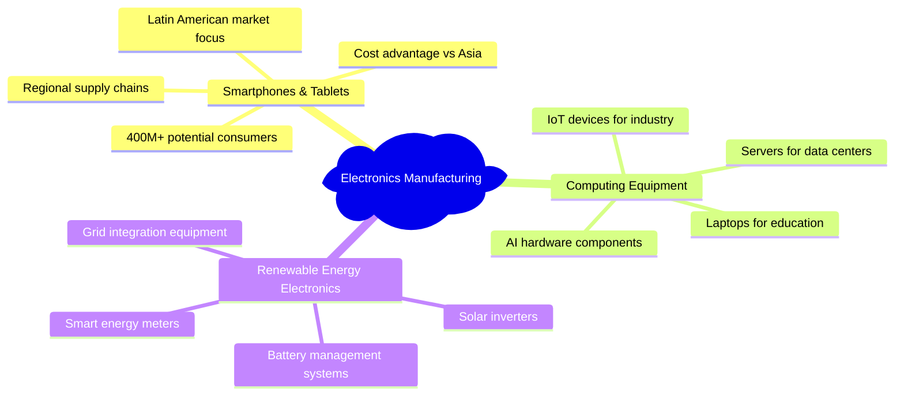
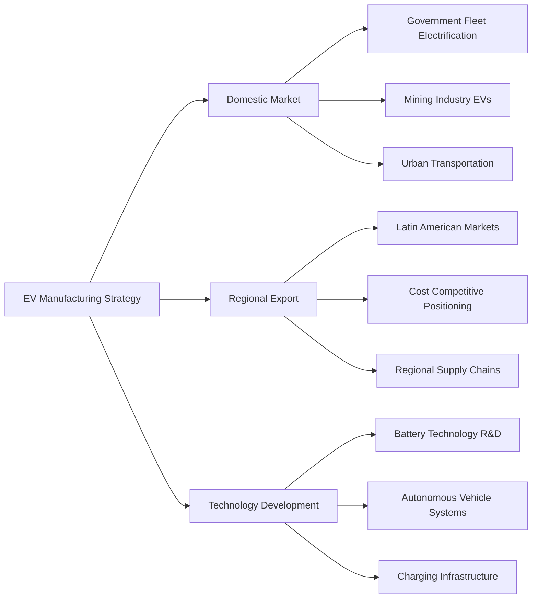

# Advanced Manufacturing Strategy

This document outlines Peru's strategy for transforming from raw material exporter to advanced manufacturing powerhouse, creating high-value products and capturing maximum value from natural resources.

## Strategic Vision

Transform Peru into Latin America's advanced manufacturing hub by 2040, processing 80% of mineral production domestically and developing world-class capabilities in electronics, automotive, and aerospace sectors.

## Core Manufacturing Transformation

### Value-Added Mining and Metallurgy

#### Current State vs. 2040 Targets

| Mineral | Current Processing | 2040 Target | Value Addition | Investment |
|---------|-------------------|-------------|----------------|------------|
| **Copper** | 40% domestic | 90% domestic | 300% increase | $3B |
| **Lithium** | 10% domestic | 80% domestic | 800% increase | $2B |
| **Rare Earths** | 5% domestic | 70% domestic | 1400% increase | $2B |
| **Silver** | 60% domestic | 95% domestic | 150% increase | $1B |
| **Gold** | 70% domestic | 95% domestic | 130% increase | $500M |

#### Advanced Processing Capabilities

### Electronics Manufacturing Development

#### Strategic Focus Areas

**Semiconductor Assembly and Testing**
- **Market Opportunity**: $50B+ global market growing 15% annually
- **Initial Focus**: Assembly and test operations for Latin American market
- **Technology Partners**: Korean and Taiwanese semiconductor companies
- **Investment**: $2B in facilities and equipment by 2030

**Consumer Electronics Assembly**

**Industrial Electronics**
- **Mining Equipment**: Sensors, control systems, automation components
- **Agricultural Technology**: Precision farming equipment, monitoring systems
- **Healthcare Devices**: Medical equipment, diagnostic systems
- **Telecommunications**: Network equipment, 5G infrastructure components

### Automotive and Transportation Manufacturing

#### Electric Vehicle Ecosystem Development

**Battery Manufacturing**
- **Technology**: Lithium-ion battery production using domestic lithium
- **Capacity Target**: 50 GWh annual production by 2035
- **Market Focus**: Latin American EV market + energy storage
- **Investment**: $3B in gigafactory development
- **Partners**: Chinese BYD, Korean LG Chem, European partners

**Electric Vehicle Assembly**

**Transportation Infrastructure Equipment**
- **Public Transportation**: Bus manufacturing, metro systems
- **Logistics**: Delivery vehicles, cargo handling equipment
- **Mining Transportation**: Heavy-duty vehicles, autonomous systems
- **Port Equipment**: Automated cargo handling, logistics systems

### Aerospace and Defense Manufacturing

#### Space Technology Development
- **Satellite Manufacturing**: Earth observation, communications satellites
- **Launch Support**: Ground systems, satellite tracking equipment
- **Space Mining**: Future asteroid mining technology development
- **International Partnerships**: ESA, NASA collaboration opportunities

#### Defense and Security
- **Electronics**: Communication systems, surveillance equipment
- **Cybersecurity**: Hardware security modules, encryption devices
- **Border Security**: Monitoring systems, detection equipment
- **Dual-use Technology**: Civilian and military applications

### Advanced Materials and Chemicals

#### High-Performance Materials

#### Chemical Processing Industry
- **Specialty Chemicals**: High-value chemicals from mineral processing
- **Pharmaceutical Intermediates**: API production, drug manufacturing
- **Agricultural Chemicals**: Fertilizers, pesticides, biotechnology
- **Industrial Chemicals**: Process chemicals, mining reagents

## Manufacturing Infrastructure Development

### Industrial Zones and Parks

#### Technology Manufacturing Zones

#### Infrastructure Requirements
- **Power**: Direct connections to renewable energy sources
- **Transportation**: Proximity to ports, airports, highways
- **Communications**: 5G networks, high-speed internet
- **Water**: Industrial-grade water treatment and recycling
- **Waste Management**: Circular economy principles, zero waste targets

### Supply Chain Development

#### Domestic Supply Chain Optimization
- **Raw Materials**: Secure access to domestic mineral resources
- **Components**: Regional supplier development programs
- **Logistics**: Efficient transportation and warehousing
- **Quality Systems**: International standards compliance

#### International Supply Chain Integration
- **Asia-Pacific**: Component sourcing, technology transfer
- **North America**: Market access, technology partnerships
- **Europe**: Quality standards, environmental compliance
- **Latin America**: Regional market integration

## Technology Transfer and Capability Building

### Strategic Technology Partnerships

#### Korean Manufacturing Partnership

#### Chinese Manufacturing Cooperation
- **Electronics**: Assembly operations, component manufacturing
- **Heavy Industry**: Mining equipment, infrastructure machinery
- **Green Technology**: Solar panels, wind turbines, batteries
- **Infrastructure**: Factory construction, logistics systems

#### European Advanced Manufacturing
- **Precision Engineering**: German and Swiss manufacturing excellence
- **Automotive**: European EV technology and standards
- **Aerospace**: Airbus collaboration, satellite technology
- **Chemicals**: BASF, Shell, specialty chemicals partnerships

### Innovation and R&D Integration

#### Manufacturing Research Centers
- **Materials Science**: University-industry collaboration
- **Process Innovation**: Continuous improvement, lean manufacturing
- **Automation**: Robotics, AI integration, Industry 4.0
- **Sustainability**: Green manufacturing, circular economy

#### Technology Commercialization
- **Startup Integration**: Manufacturing technology startups
- **University Spin-offs**: Research commercialization
- **Corporate Innovation**: Intrapreneurship programs
- **International Collaboration**: Joint research projects

## Workforce Development Strategy

### Technical Education and Training

#### Manufacturing Skills Pipeline

#### Employment Targets by Sector

| Manufacturing Sector | 2025 | 2030 | 2035 | 2040 |
|---------------------|------|------|------|------|
| **Electronics** | 5K | 25K | 50K | 75K |
| **Automotive** | 2K | 15K | 35K | 50K |
| **Mining Processing** | 20K | 35K | 50K | 60K |
| **Aerospace** | 1K | 5K | 15K | 25K |
| **Materials/Chemicals** | 10K | 20K | 30K | 40K |
| **Total Manufacturing** | **38K** | **100K** | **180K** | **250K** |

### International Talent Acquisition
- **Manufacturing Engineers**: Korean, German, Japanese expertise
- **Quality Specialists**: Six Sigma, lean manufacturing experts
- **Automation Experts**: Industry 4.0, robotics specialists
- **Management Talent**: Manufacturing operations leadership

## Quality and Standards Framework

### International Certification and Compliance

#### Quality Management Systems
- **ISO 9001**: Quality management for all manufacturers
- **ISO 14001**: Environmental management systems
- **ISO 45001**: Occupational health and safety
- **Industry-Specific**: Automotive TS 16949, Aerospace AS9100

#### Export Market Compliance

### Testing and Certification Infrastructure
- **National Testing Labs**: Accredited testing facilities
- **Calibration Services**: Precision measurement standards
- **Certification Bodies**: Independent quality verification
- **International Recognition**: Mutual recognition agreements

## Economic Impact and Projections

### Revenue Generation Targets

#### Manufacturing Sector Growth

#### Export Revenue by Category

| Product Category | 2030 Target | 2035 Target | 2040 Target |
|------------------|-------------|-------------|-------------|
| **Processed Minerals** | $8B | $15B | $20B |
| **Electronics** | $3B | $8B | $15B |
| **Automotive** | $2B | $6B | $12B |
| **Industrial Equipment** | $2B | $5B | $8B |
| **Aerospace/Defense** | $1B | $3B | $5B |
| **Total Manufacturing** | **$16B** | **$37B** | **$60B** |

### Investment Requirements and Returns

#### Capital Investment by Sector
- **Processing Facilities**: $8B (raw materials to products)
- **Electronics Manufacturing**: $5B (assembly and components)
- **Automotive Industry**: $4B (EVs and components)
- **Infrastructure**: $3B (utilities, transportation, facilities)
- **Total Manufacturing Investment**: $20B over 15 years

#### Return on Investment Analysis
- **Direct Employment**: 250,000 high-skilled jobs
- **Indirect Employment**: 500,000 supporting jobs
- **Tax Revenue**: $3B+ annual government revenue
- **Export Earnings**: $60B+ annual by 2040
- **Technology Transfer**: Invaluable capability development

## Environmental and Sustainability Framework

### Green Manufacturing Principles

#### Circular Economy Integration

#### Environmental Excellence Targets
- **Carbon Neutrality**: All manufacturing carbon neutral by 2035
- **Water Efficiency**: 90% water recycling and reuse
- **Waste Reduction**: 95% waste diversion from landfills
- **Energy Efficiency**: 100% renewable energy for manufacturing

### Regional Environmental Leadership
- **Technology Export**: Green manufacturing technology leadership
- **Standards Setting**: Environmental excellence as competitive advantage
- **International Recognition**: Global sustainability awards and recognition
- **Knowledge Sharing**: Best practices export to developing countries

## Risk Management and Mitigation

### Manufacturing Risks

#### Technology and Competitive Risks
- **Rapid Technology Change**: Flexible manufacturing systems, continuous upgrading
- **Global Competition**: Focus on specialization and quality advantages
- **Supply Chain Disruption**: Diversified suppliers, regional supply chains
- **Skill Shortages**: Aggressive training and international recruitment

#### Economic and Market Risks
- **Demand Fluctuation**: Diversified markets and products
- **Currency Risk**: Natural hedging through exports
- **Investment Risk**: Phased development, proven technologies
- **Regulatory Risk**: Stable policy framework, international standards

### Success Factors

#### Critical Success Requirements
- **Government Support**: Consistent policy, infrastructure investment
- **Private Investment**: Joint ventures, technology transfer
- **Workforce Development**: Skills training, international talent
- **Quality Focus**: International standards, continuous improvement
- **Innovation Integration**: R&D, technology commercialization

---

*This document is part of the Peru 2040 strategic framework. Manufacturing transformation requires coordination with energy infrastructure, innovation ecosystem development, and international partnership strategies.*
